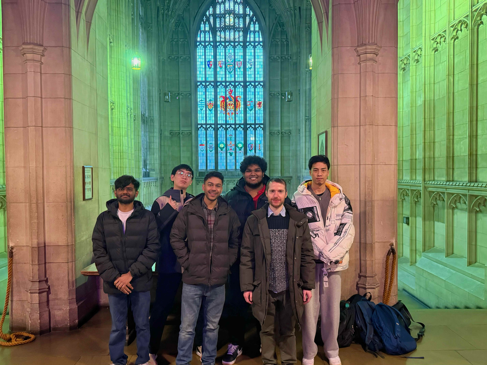

# 2026-group-10
2026 COMSM0166 group 10

# COMSM0166 Project Template
A project template for the Software Engineering Discipline and Practice module (COMSM0166).

## Info

This is the template for your group project repo/report. We'll be setting up your repo and assigning you to it after the group forming activity. You can delete this info section, but please keep the rest of the repo structure intact.

You will be developing your game using [P5.js](https://p5js.org) a javascript library that provides you will all the tools you need to make your game. However, we won't be teaching you javascript, this is a chance for you and your team to learn a (friendly) new language and framework quickly, something you will almost certainly have to do with your summer project and in future. There is a lot of documentation online, you can start with:

- [P5.js tutorials](https://p5js.org/tutorials/) 
- [Coding Train P5.js](https://thecodingtrain.com/tracks/code-programming-with-p5-js) course - go here for enthusiastic video tutorials from Dan Shiffman (recommended!)

## Your Game (change to title of your game)

STRAPLINE. Add an exciting one sentence description of your game here.

IMAGE. Add an image of your game here, keep this updated with a snapshot of your latest development.

LINK. Add a link here to your deployed game, you can also make the image above link to your game if you wish. Your game lives in the [/docs](/docs) folder, and is published using Github pages. 

VIDEO. Include a demo video of your game here (you don't have to wait until the end, you can insert a work in progress video)

## Development Team
----
### Team Photo 

### Group Members 
-----

| Name                 | Email                 | Github Username       |
| -------------------- | --------------------- | --------------------- |
| Dhanitha Rajapaksa   | we25139@bristol.ac.uk | dhanitha-26           |
| Cenarius Lu          | ig25518@bristol.ac.uk | Shadow-Song           |
| Rajmugundhan nagappan| je25549@bristol.ac.uk | Rajmugundhan2002-tech |
| Ayush Raizada        | ff25412@bristol.ac.uk | Raizada8              |
| James Crossley       | qe25280@bristol.ac.uk | jamescr1              |
| Jinhao Han           | bt25224@bristol.ac.uk | memoryzea             |

## 📚 Project Report

### Introduction

- 5% ~250 words 
- Describe your game, what is based on, what makes it novel? (what's the "twist"?) 

### Requirements 

**Ideation Process** 

In the early stages of our project, we began by exploring what inspired us. Each team member brought one or two games to an in-person meeting, sharing what captivated them whilst considering the practical constraints of developing from scratch. After an initial round of ideas shared via our team group chat, we met to pitch specific inspirations. This resulted in a split between three very distinct genres: tower defence, RPG, and arcade. 

After analysing the strengths of each, the team identified a unique opportunity to create a hybrid mechanic. Rather than replicating existing titles, we decided to integrate the management strategy of _Kingdom Rush_ with the hero-centric mechanics of Diablo 2. Tower defence games offered proven engagement through strategic placement and resource management, whilst action RPGs provided the visceral satisfaction of character progression and skill-based combat.

With this direction established, we divided the research effort. Each team member investigated specific game rules, dynamics, and development challenges to ensure our hybrid concept remained feasible within our technical constraints and timeline. 

  
<strong>Game ideas and analysis</strong>

| Game                    | Game Description                                                                                                                                                                                                                                                                                                                              | Twist Potential                                                                                                                                                                                                                      | Implementation Challenges                                                                                                                                                                                     |
| ----------------------- | --------------------------------------------------------------------------------------------------------------------------------------------------------------------------------------------------------------------------------------------------------------------------------------------------------------------------------------------- | ------------------------------------------------------------------------------------------------------------------------------------------------------------------------------------------------------------------------------------ | ------------------------------------------------------------------------------------------------------------------------------------------------------------------------------------------------------------- |
| **Super Mario**         | Classic side-scrolling platformer where players jump on enemies, collect coins and power-ups, and reach the end flag.                                                                                                                                                                                                                         | • Power-ups transform Mario into different forms with unique abilities  • Hidden blocks, warp zones, and secret areas  • Progressive level design that teaches mechanics through gameplay                                      | • Collision detection and sprite management  • Jump physics consistency  • Level design iteration and pacing  • Differentiation from generic platformer                                              |
| **Smashy Road: Wanted** | Top-down driving game where players escape police by hijacking new vehicles when destroyed. The longer you survive, the more aggressive the pursuit becomes.                                                                                                                                                                                  | • Wanted level escalates from police to SWAT to tanks to helicopters  • Vehicle types with different speed and durability stats  • Safe zones where wanted level decreases if player hides                                     | • Adaptive AI pathfinding with escalating aggression  • Vehicle collision physics and damage system  • Map generation with obstacles  • Smooth hijacking transitions                                 |
| **Airplane Survival**   | Top-down plane game where players steer to dodge homing missiles. Survive longer to unlock faster planes and earn higher scores.                                                                                                                                                                                                              | • Missiles with different behaviours like fast, slow, or cluster splits  • Bonus points for making missiles collide  • Terrain obstacles that block missiles  • Unlockable planes with different speeds                     | • Missile homing AI balancing difficulty  • Collision detection for missile interactions  • Score-based unlock progression  • Visual and audio feedback systems                                      |
| **Tank Trouble**        | Top-down maze combat where players fire bouncing shells to destroy opponents while avoiding their own ricochets.                                                                                                                                                                                                                              | • Maze walls regenerate on timers forcing position changes  • Arena shrinks over time for closer combat  • Energy system where firing consumes regenerating resource  • Directional shields and terrain effects             | • Bounce physics for shell reflections  • Safe maze regeneration without trapping players  • Multiplayer input handling  • Wall regeneration preview system                                          |
| **Kingdom Rush**        | Kingdom Rush is a fixed-path tower defence game where players strategically place and upgrade towers along enemy routes to survive waves. What makes it interesting is the tower upgrade tree system where each tower branches into specialised forms, plus the addition of a player-controlled hero unit that adds an active tactical layer. | • Towers branch into specialised upgrade paths  • Combine adjacent towers into hybrid forms  • Enemies evolve if they survive too long  • Player-controlled hero unit with abilities                                        | • Enemy pathfinding along set routes  • Tower upgrade tree logic and UI  • Wave spawning with difficulty scaling  • Balance across multiple tower types                                              |
| **Frogger**             | Frogger is a classic grid-based navigation game where players guide frogs across roads with moving cars and rivers with moving logs to reach lily pads safely. The game's appeal lies in its simple timing-based challenge and clear visual feedback on the grid.                                                                             | • Frog evolution system unlocking new forms with abilities  • Dynamic lanes that speed up, reverse, or spawn safe zones  • Competitive multiplayer with coin collection  • Extended maps with complex obstacle patterns     | • Grid-based movement and timing  • Pattern synchronisation for moving obstacles  • Lane speed variation and balancing  • Precise collision detection                                                |
| **Crossy Road**         | Endless arcade hopper where players navigate freeways, railways, and rivers whilst avoiding cars and collecting custom characters.                                                                                                                                                                                                            | • Player moves forward in direction cars are travelling  • Adaptive environment transitions between road types  • Character unlocks with different abilities  • Procedurally generated obstacles with increasing complexity | • Designing varied objects within frontend constraints  • Programming mechanics for multiple object types  • Generating adaptive environments with smooth transitions  • Obstacle difficulty scaling |
| **Pong**                | Pong is one of the earliest arcade games where two players control paddles to deflect a ball back and forth.                                                                                                                                                                                                                                  | • Ball modifiers like splits, gravity changes, or curve or spin  • Paddle upgrade options, sizes, shapes, or abilities  • Environmental hazards like moving obstacles or portal zones                                             | • Ball physics with consistent bounce angles  • Paddle collision detection and response  • AI opponent balancing for single-player                                                                    |
| **Breakout**            | Breakout is a single-player brick-breaking game where players control a paddle to bounce a ball upwards to destroy rows of bricks.                                                                                                                                                                                                            | • Brick types requiring multiple hits or special conditions  • Power-ups dropped from destroyed bricks  • Dynamic brick layouts that move or regenerate                                                                      | • Ball physics and angle calculations  • Brick collision detection and destruction                                                                                                                        |

**Early Stage Design**

By Week 3, we had translated these ideas into a paper prototype during the workshop. Testing sessions were positive, particularly regarding the different player roles we designed. With the fundamental mechanics validated, we moved forward to develop sprites and assets for digital prototyping, which would allow us to test the gameplay loop more thoroughly.

**Prototyping** 

**Figure 1. Lord of the Cinder Paper Prototype GIF** 

**Figure 2. Froggy Paper Prototype GIF**

**Testing Feedback** 

- 15% ~750 words
- Early stages design. Ideation process. How did you decide as a team what to develop? Use case diagrams, user stories. 

### Design

- 15% ~750 words 
- System architecture. Class diagrams, behavioural diagrams. 

### Implementation

- 15% ~750 words

- Describe implementation of your game, in particular highlighting the TWO areas of *technical challenge* in developing your game. 

### Evaluation

- 15% ~750 words

- One qualitative evaluation (of your choice) 

- One quantitative evaluation (of your choice) 

- Description of how code was tested. 

### Process 

- 15% ~750 words

- Teamwork. How did you work together, what tools and methods did you use? Did you define team roles? Reflection on how you worked together. Be honest, we want to hear about what didn't work as well as what did work, and importantly how your team adapted throughout the project.

### Conclusion

- 10% ~500 words

- Reflect on the project as a whole. Lessons learnt. Reflect on challenges. Future work, describe both immediate next steps for your current game and also what you would potentially do if you had chance to develop a sequel.

### Contribution Statement

- Provide a table of everyone's contribution, which *may* be used to weight individual grades. We expect that the contribution will be split evenly across team-members in most cases. Please let us know as soon as possible if there are any issues with teamwork as soon as they are apparent and we will do our best to help your team work harmoniously together.

### Additional Marks

You can delete this section in your own repo, it's just here for information. in addition to the marks above, we will be marking you on the following two points:

- **Quality** of report writing, presentation, use of figures and visual material (5% of report grade) 
  - Please write in a clear concise manner suitable for an interested layperson. Write as if this repo was publicly available.
- **Documentation** of code (5% of report grade)
  - Organise your code so that it could easily be picked up by another team in the future and developed further.
  - Is your repo clearly organised? Is code well commented throughout?
