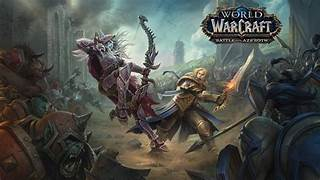
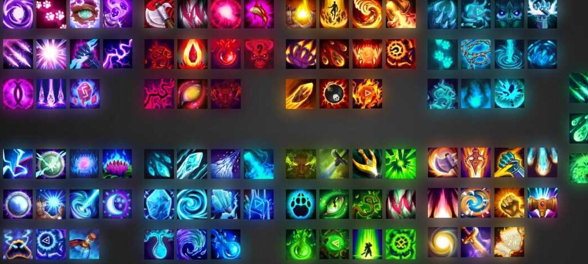
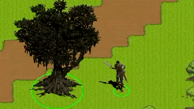
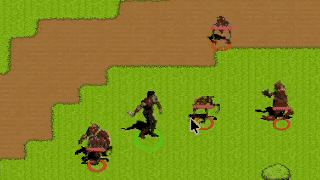
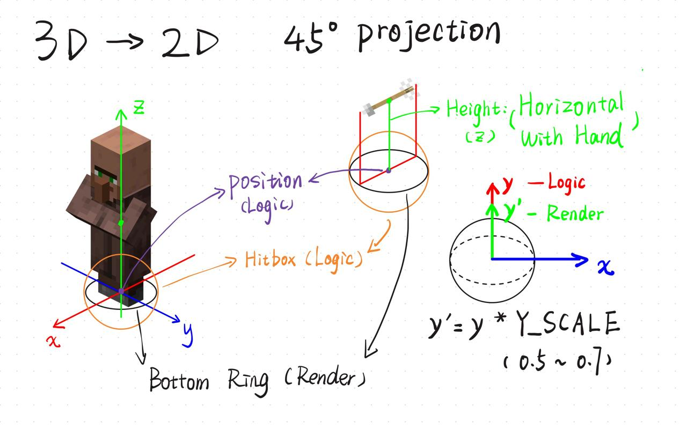

<p align="center">
  
  
  
  <a href="https://github.com/UoB-COMSM0166/2026-group-10/blob/main/LICENSE">
  
  </a>
</p>

---

<div align="center">
  <a href="https://uob-comsm0166.github.io/2026-group-10/">
    
  </a>
</div>
<p align="center">


<p align="center">
  <a href="https://uob-comsm0166.github.io/2026-group-10/"></a>
  &nbsp;
  <a href="https://your-link.com"></a>
  &nbsp;
  <a href="https://github.com/orgs/UoB-COMSM0166/projects/153"></a>
</p>

<h2 align="center">🎮 How to Play </h2>

### Play Online 
Gates of Cinder is hosted on GitHub Pages, so you can jump straight into the action without any installations!
1. Click ‘**PLAY GAME**’ button above. If it does not open, launch your browser, Chrome is recommended, and go to: https://uob-comsm0166.github.io/2026-group-10/ 
2. The game will load instantly.
3. On the main screen, select ‘Start Game’ to begin character selection, or choose ‘Intro’ for a quick overview of the game lore and controls.

### Run locally (for Development or Offline Play)
For those looking to modify the code or play offline, you can host Gates of Cinder locally:
1. Clone the repository:<p align="center">


   ```bash
   git clone https://github.com/UoB-COMSM0166/2026-group-10.git
   cd 2026-group-10/docs
   ```
2. Launch the server: Use `npx` to start a local environment:
   
   ```bash
   npx http-server -c-1 -p 8000
   ```
3. **Play:** Open Chrome and navigate to `http://localhost:8000/`


<h2 align="center">Table of Contents</h2>

<div align="center">
  
| #  | Section          | Description                                      |
|----|------------------|--------------------------------------------------|
| 0 | [Labs](#labs) | Weekly lab tasks & documentation                |
| 1 | [Introduction](#introduction) | Game overview & what makes it novel       |
| 2 | [Requirements](#requirements) | Ideation, use cases & user stories        |
| 3 | [Design](#design) | System architecture, state machine & class diagrams |
| 4 | [Implementation](#implementation) | Key technical challenges           |
| 5 | [Evaluation](#5-evaluation) | Qualitative & quantitative testing     |
| 6 | [Process](#process) | Team workflow & reflection               |
| 7 | [Conclusion](#conclusion) | Lessons learnt & future work         |
| 8 | [Contribution](#contribution) | Individual contributions         |
</div>

<h2 align="center">Group Members</h2>


<div align="center">

| Name                 | Email                 | Github Username       |
| -------------------- | --------------------- | --------------------- |
| Dhanitha Rajapaksa   | we25139@bristol.ac.uk | dhanitha-26           |
| Cenarius Lu          | ig25518@bristol.ac.uk | Shadow-Song           |
| Rajmugundhan Nagappan| je25549@bristol.ac.uk | Rajmugundhan2002-tech |
| Ayush Raizada        | ff25412@bristol.ac.uk | Raizada8              |
| James Crossley       | qe25280@bristol.ac.uk | jamescr1              |
| Jinhao Han           | bt25224@bristol.ac.uk | memoryzea             |

</div>


<p align="center">

<h2 align="center">File Structure</h2>

```
project/
├── index.html ← Entry point — controls script load order
├── Main.js ← Main entry point for the game logic
├── README.md ← You are here — main project documentation
├── struct.md 
├── css/
│   └── style.css 
├── data/
│   ├── Hero/ ← JSON data for heros 
│   │  
│   └── Map/ ← JSON data for maps  
│      
├── docs/ 
├── images/ ← images and gif for README.md
│ 
├── js/
│   
├── src/
│   ├── Game.js ← Main game class
│   ├── GameManager.js ← Game manager class
│   ├── UI.js ← User interface logic
│   ├── Entity/
│   │   ├── Entity.js ← Base entity class
│   │   ├── Skill/ 
│   │   │   ├── Archmage.js ← Archmage skill logic
│   │   │   ├── Buff.js ← Buff logic
│   │   │   ├── Skill.js ← Base skill class
│   │   │   └── SkillEntity.js ← Skill entity logic
│   │   └── Unit/
│   │       ├── Hero.js ← Hero unit logic
│   │       ├── Objective.js ← Objective unit logic
│   │       ├── Unit.js ← Base unit class
│   │       └── Enemy/
│   │           ├── Enemy.js ← Base enemy class
│   │           └── Undead.js ← Undead enemy logic
│   ├── Towerdefense/
│   │   ├── Bullet.js ← Bullet logic
│   │   ├── Enemy.js ← Tower defense enemy logic
│   │   ├── Path.js ← Path logic
│   │   └── Tower.js ← Tower logic
│   └── World/
│       ├── Clock.js ← Game clock logic
│       ├── Controller.js ← Game controller logic
│       ├── EventEmitter.js ← Event emitter logic
│       ├── Render.js ← Rendering logic
│       └── World.js ← World logic
├── videos/
│   
└── weeklyupdates/
```

<h3 align="center">Feature Priority</h2>

|Priority Rank - High to Low|System / Features|Time Taken|
|-|-|-|
|HIGHEST|Hero - Implement the stats screen funcitons of Hero system.|14%|
|HIGHER|Enemy - Design the emeny behavior.|13%|
|HIGH|Buff & Equip - Implement the Buff and Equipment functions, which effect the stats screen.|15%|
|MID|Skill - Design the skill tree. And implement the active skills with buff, projectile or target entity.|15%|
|LOW|Controll & Manager - Get the input from p5 libary and apply it to hero controll. Implement the game loop manager.|15%|
|LOWER|Turrent & UI - Design the turrent. And create a UI system.|14%|
|LOWEST|Boss - Design the Boss with active skills. Test the game.|14%|


## 1. Introduction
Gates of Cinder is a combination of tower defense and RPG elements designed to create an engaging gameplay experience. The game takes place in an ancient forest, where the Corona Tree provides life energy to all living beings. However, an army of undead has risen to destroy the tree.

The player must defend the tree by choosing one of three heroes to fight against waves of enemies, culminating in a final boss battle. Players must also strategically place towers and use hero abilities effectively to manage incoming enemy waves. Each enemy follows a fixed path toward the Corona Tree.

A unique twist in the game is that both the objective (the tree) and the hero’s life are interconnected—if either is defeated, the game ends.

There are three heroes to choose from: Warrior, Mage, and Engineer, each offering unique abilities. The Warrior excels in close combat, the Mage specializes in long-range spells, and the Engineer relies on machines and technology.

The game features a retro art style and encourages players to adapt their strategies, making each level both challenging and rewarding.


## 3. Requirements 

**3.1. Ideation Process** 

In the early stages of our project, we began by exploring what inspired us. Each team member brought one or two games to an in-person meeting, sharing what captivated them whilst considering the practical constraints of developing from scratch. After an initial round of ideas shared via our team group chat, we met to pitch specific inspirations. This resulted in a split between three very distinct genres: tower defence, RPG, and arcade. 

After analysing the strengths of each, the team identified a unique opportunity to create a hybrid mechanic. Rather than replicating existing titles, we decided to integrate the management strategy of _Kingdom Rush_ with the hero-centric mechanics of Diablo 2. Tower defence games offered proven engagement through strategic placement and resource management, whilst action RPGs provided the visceral satisfaction of character progression and skill-based combat.

With this direction established, we divided the research effort. Each team member investigated specific game rules, dynamics, and development challenges to ensure our hybrid concept remained feasible within our technical constraints and timeline. 
#### 3.2. Game Mechanics 
The game mechanics draw from the energy of two famous games Like Kingdom Rush and League of Legends where the player must defend the objective using towers and use RPG elements.The player must choose  the correct towers and heroes to deal enemies effectively. The game is in a pixelated art style and the story takes place in a forest to defeat the final boss.

<table width="100%">
  <tr>
    <th align="center" width="50%">Kingdom Rush — Strategy Tower Defence</th>
    <th align="center" width="50%">League of Legends — RPG Combat</th>
  </tr>
  <tr>
    <td align="center">
      
    </td>
    <td align="center">
      
    </td>
  </tr>
</table>


###  3.3. UI/UX inspiration
Our game UI is deeply inspired by diablo game which suits our game title and overall game.The hero's design is inspired by World of Warcraft. The skill icons are taken  from a fantasy RPG icon asserts pack from Unreal Engine Market
<p align="center">

| Diablo | Warcraft | Icons |
|--------|----------|-------|
|  |  |  |

</p>


---

### Stakeholders - Onion Model


<div align="center">

*Figure 1*  
Onion Model of the System

</div>

---

### Game ideas and analysis

| Game                    | Game Description                                                                                                                                                                                                                                                                                                                              | Twist Potential                                                                                                                                                                                                                      | Implementation Challenges                                                                                                                                                                                     |
| ----------------------- | --------------------------------------------------------------------------------------------------------------------------------------------------------------------------------------------------------------------------------------------------------------------------------------------------------------------------------------------- | ------------------------------------------------------------------------------------------------------------------------------------------------------------------------------------------------------------------------------------ | ------------------------------------------------------------------------------------------------------------------------------------------------------------------------------------------------------------- |
| **Super Mario**         | Classic side-scrolling platformer where players jump on enemies, collect coins and power-ups, and reach the end flag.                                                                                                                                                                                                                         | • Power-ups transform Mario into different forms with unique abilities <br>• Hidden blocks, warp zones, and secret areas <br>• Progressive level design that teaches mechanics through gameplay                                      | • Collision detection and sprite management <br>• Jump physics consistency <br>• Level design iteration and pacing <br>• Differentiation from generic platformer                                              |
| **Smashy Road: Wanted** | Top-down driving game where players escape police by hijacking new vehicles when destroyed. The longer you survive, the more aggressive the pursuit becomes.                                                                                                                                                                                  | • Wanted level escalates from police to SWAT to tanks to helicopters <br>• Vehicle types with different speed and durability stats <br>• Safe zones where wanted level decreases if player hides                                     | • Adaptive AI pathfinding with escalating aggression <br>• Vehicle collision physics and damage system <br>• Map generation with obstacles <br>• Smooth hijacking transitions                                 |
| **Airplane Survival**   | Top-down plane game where players steer to dodge homing missiles. Survive longer to unlock faster planes and earn higher scores.                                                                                                                                                                                                              | • Missiles with different behaviours like fast, slow, or cluster splits <br>• Bonus points for making missiles collide <br>• Terrain obstacles that block missiles <br>• Unlockable planes with different speeds                     | • Missile homing AI balancing difficulty <br>• Collision detection for missile interactions <br>• Score-based unlock progression <br>• Visual and audio feedback systems                                      |
| **Tank Trouble**        | Top-down maze combat where players fire bouncing shells to destroy opponents while avoiding their own ricochets.                                                                                                                                                                                                                              | • Maze walls regenerate on timers forcing position changes <br>• Arena shrinks over time for closer combat <br>• Energy system where firing consumes regenerating resource <br>• Directional shields and terrain effects             | • Bounce physics for shell reflections <br>• Safe maze regeneration without trapping players <br>• Multiplayer input handling <br>• Wall regeneration preview system                                          |
| **Kingdom Rush**        | Kingdom Rush is a fixed-path tower defence game where players strategically place and upgrade towers along enemy routes to survive waves. What makes it interesting is the tower upgrade tree system where each tower branches into specialised forms, plus the addition of a player-controlled hero unit that adds an active tactical layer. | • Towers branch into specialised upgrade paths <br>• Combine adjacent towers into hybrid forms <br>• Enemies evolve if they survive too long <br>• Player-controlled hero unit with abilities                                        | • Enemy pathfinding along set routes <br>• Tower upgrade tree logic and UI <br>• Wave spawning with difficulty scaling <br>• Balance across multiple tower types                                              |
| **Frogger**             | Frogger is a classic grid-based navigation game where players guide frogs across roads with moving cars and rivers with moving logs to reach lily pads safely. The game's appeal lies in its simple timing-based challenge and clear visual feedback on the grid.                                                                             | • Frog evolution system unlocking new forms with abilities <br>• Dynamic lanes that speed up, reverse, or spawn safe zones <br>• Competitive multiplayer with coin collection <br>• Extended maps with complex obstacle patterns     | • Grid-based movement and timing <br>• Pattern synchronisation for moving obstacles <br>• Lane speed variation and balancing <br>• Precise collision detection                                                |
| **Crossy Road**         | Endless arcade hopper where players navigate freeways, railways, and rivers whilst avoiding cars and collecting custom characters.                                                                                                                                                                                                            | • Player moves forward in direction cars are travelling <br>• Adaptive environment transitions between road types <br>• Character unlocks with different abilities <br>• Procedurally generated obstacles with increasing complexity | • Designing varied objects within frontend constraints <br>• Programming mechanics for multiple object types <br>• Generating adaptive environments with smooth transitions <br>• Obstacle difficulty scaling |
| **Pong**                | Pong is one of the earliest arcade games where two players control paddles to deflect a ball back and forth.                                                                                                                                                                                                                                  | • Ball modifiers like splits, gravity changes, or curve or spin <br>• Paddle upgrade options, sizes, shapes, or abilities <br>• Environmental hazards like moving obstacles or portal zones                                             | • Ball physics with consistent bounce angles <br>• Paddle collision detection and response <br>• AI opponent balancing for single-player                                                                    |
| **Breakout**            | Breakout is a single-player brick-breaking game where players control a paddle to bounce a ball upwards to destroy rows of bricks.                                                                                                                                                                                                            | • Brick types requiring multiple hits or special conditions <br>• Power-ups dropped from destroyed bricks <br>• Dynamic brick layouts that move or regenerate                                                                      | • Ball physics and angle calculations <br>• Brick collision detection and destruction                                                                                                                        |

**Early Stage Design**

By Week 3, we had translated these ideas into a paper prototype during the workshop. Testing sessions were positive, particularly regarding the different player roles we designed. With the fundamental mechanics validated, we moved forward to develop sprites and assets for digital prototyping, which would allow us to test the gameplay loop more thoroughly.

## Epics and User stories

Through the process of creating epics, user stories and acceptance requirements, we obtained a greater awareness of the range of stakeholders our game has. We also developed a deeper understanding of the context that our game exists in.

By creating epics, we learned of the different sub-categories of users our game may have, such as users with visual impairments and users with other disabilities. An increased awareness of the importance of the different categories of developers involved in the game, such as ‘front-end developers’ and ‘back-end developers’ was also acquired.

Creating user stories permitted us to obtain a better insight into the perspective of the user of our game and what features they might value in our game. As a result of this process, a greater appreciation of the reasons why users might highly value certain features of the game, such as a dynamic strategic combat system or progressive map experience, was developed.

The process of producing acceptance criteria helped to give precise, actionable data to the team with regards to how a specific feature, or aspect of the game, should be implemented. Generating acceptance criteria also provided the team with measurable criteria against which we could measure the success of our sprints and general game development.

By considering the plethora of stakeholders around our game, we gained a better understanding of the diverse range of people who may have interests in our game and the importance of considering these people when making decisions regarding the development of our game.


| Epic | Description | User Stories | Acceptance Criteria |
|------|-------------|-------------|---------------------|
| EPIC 1 – Core Defense Gameplay | The player must defend the Ancient Tree from waves of undead enemies. | As a player, I want enemies to move toward the Ancient Tree, so that I must defend it. <br> As a player, I want enemies to damage the Ancient Tree on contact, so that there is a clear loss condition. <br> As a player, I want to attack enemies, so that I can stop them from reaching the tree. | Enemies follow predefined paths toward the Ancient Tree. <br> Enemy collision with the tree reduces its health. <br> Player attacks register hits consistently and reduce enemy health. <br> Game ends when the Ancient Tree health reaches zero. |
| EPIC 2 – Enemy Waves & Boss System | The game progresses through waves of enemies, culminating in powerful boss encounters. | As a player, I want enemies to spawn in waves, so that gameplay escalates over time. <br> As a player, I want a boss at the end of each round, so that I face a major challenge. <br> As a player, I want bosses to have unique attack patterns, so that combat feels varied. <br> As an Engineer player, I want bosses to target the Ancient Tree after destroying turrets, so that my gameplay has distinct risks. | Waves spawn enemies at fixed intervals and locations. <br> Boss spawns after all minions in a wave are defeated. <br> Boss has multiple attack behaviours. <br> Boss targeting logic changes depending on player class. |
| EPIC 3 – Hero Class System | Players choose and control unique hero classes with different mechanics. | As a player, I want to choose between Warrior, Mage, and Engineer, so that I can play different styles. <br> As a player, I want each class to have unique abilities, so that gameplay feels distinct. | Player selects class before gameplay begins. <br> Each class has unique stats, abilities, and mechanics. <br> Class systems are independent and modular. |
| EPIC 4 – Warrior Mechanics | The Warrior uses melee combat and rage-based abilities. | As a Warrior, I want different weapon types, so that my combat style changes. <br> As a Warrior, I want to generate rage through attacks, so that I can use powerful skills. <br> As a Warrior, I want rage to decay over time, so that I must stay aggressive. <br> As a Warrior, I want to upgrade equipment using gold, so that I become stronger. | Weapons (longsword, rapier, battle axe) affect abilities. <br> Rage increases on attack and decreases over time. <br> Rage resets on death or respawn. <br> Equipment upgrades increase stats. |
| EPIC 5 – Mage Mechanics | The Mage uses a flexible skill system powered by mana. | As a Mage, I want to combine Ice, Fire, and Lightning skills, so that I can customise my build. <br> As a Mage, I want mana to regenerate over time, so that I can continuously cast spells. <br> As a Mage, I want to spend gold on skills, so that I improve abilities instead of equipment. | Skill combinations are selectable and usable in gameplay. <br> Mana regenerates over time and resets on respawn. <br> Skills consume mana when cast. <br> Gold is used for skill learning and upgrades only. |
| EPIC 6 – Engineer & Turret System | The Engineer defends using turrets instead of a direct character. | As an Engineer, I want to place turrets, so that they automatically attack enemies. <br> As an Engineer, I want a limit on turret count, so that I must plan placement. <br> As an Engineer, I want to upgrade turrets using wood, so that they become stronger. <br> As an Engineer, I want permanent blueprint upgrades using gold, so that I progress over time. | Turrets can be placed anywhere except restricted zones. <br> Total turret count is capped. <br> Wood is gained only from enemy kills. <br> Turrets attack enemies automatically. <br> Blueprint upgrades persist across gameplay. |
| EPIC 7 – Progression & Resources | Players gain rewards and improve their abilities over time. | As a player, I want to gain experience from enemies, so that I can level up. <br> As a player, I want to earn gold, so that I can upgrade my character. <br> As a player, I want class-specific uses for gold, so that progression feels unique. <br> As an Engineer, I want to gain wood, so that I can build and upgrade turrets. | XP is awarded on enemy defeat and triggers level-ups. <br> Level-ups grant skill points. <br> Gold is awarded consistently from enemies. <br> Resource usage differs per class. |
| EPIC 8 – Ancient Tree System | The Ancient Tree acts as the core objective and life system. | As a player, I want the Ancient Tree to have health, so that I must protect it. <br> As a player, I want to repair the tree using gold, so that I can recover from damage. <br> As a player, I want the tree to revive me at a cost, so that death has consequences. | Tree health decreases when enemies reach it. <br> Gold can be spent to restore tree health. <br> Player death triggers a respawn timer. <br> Tree health is reduced upon player revival. |
| EPIC 9 – Game States & Win/Lose Conditions | The game clearly defines victory and defeat conditions. | As a player, I want to win after defeating all waves, so that I feel rewarded. <br> As a player, I want to lose when the tree is destroyed, so that failure is clear. <br> As a player, I want to respawn after death, so that I can continue playing. | Game ends in victory when all enemies are defeated. <br> Game ends in defeat when tree health reaches zero. <br> Respawn system includes a timer and penalty. <br> UI clearly communicates game state changes. |
| EPIC 10 – Technical Architecture & Scalability | The system is modular and maintainable for future expansion. | As a developer, I want modular systems, so that features are easy to maintain. <br> As a developer, I want class systems separated, so that balancing is easier. <br> As a developer, I want scalable enemy and wave systems, so that new content can be added easily. | Systems separated (Combat, AI, Resources, UI, Classes). <br> Clear update loop and system interactions. <br> Data-driven configs for enemies, waves, and abilities. <br> New classes or enemies can be added without rewriting core systems.|

---
### Usecase Diagram

The use case diagram illustrates the interaction of player with our game Gates of cinder.It illustrates the game lore,hero selection,difficulty level and various aspects of the game.It also defines the gameflow and objectives of the game.The below table summarizes above diagram.

<p align="center">
  <table>
    <tr>
      <th>Category</th>
      <th>Use Cases</th>
    </tr>
    <tr>
      <td>Pre-Game Actions</td>
      <td>Start Game, View Lore, Select Hero (Hugo Fortis), Select Difficulty</td>
    </tr>
    <tr>
      <td>Core Gameplay</td>
      <td>Enter Battle (Play Game), Kill Enemies, Defend Corona Terrae</td>
    </tr>
    <tr>
      <td>Combat & Skills</td>
      <td>Use Hero Abilities, Build/Place Towers (Engineer Only)</td>
    </tr>
    <tr>
      <td>Progression</td>
      <td>Earn XP, Level Up (Spend Skill Points)</td>
    </tr>
    <tr>
      <td>Resources</td>
      <td>Earn Gold & Wood</td>
    </tr>
    <tr>
      <td>Upgrades</td>
      <td>Upgrade Skills / Equipment, Turret Blueprints</td>
    </tr>
    <tr>
      <td>Maintenance</td>
      <td>Repair Corona Terrae</td>
    </tr>
    <tr>
      <td>Outcomes</td>
      <td>Win Game (All Waves Cleared), Lose Game (Corona Terrae Destroyed)</td>
    </tr>
  </table>
</p>

---

### **Prototyping** 

<table align="center" width="80%" style="margin: auto; text-align: center;">
  <!-- ROW 1 -->
  <tr>
    <td width="50%" style="padding: 10px;">
      
    </td>
    <td width="50%" style="padding: 10px; vertical-align: middle;">
      <h3>Prototype 1: Frogger</h3>
      <p>
        A classic 1980s arcade game in which the player controls a frog attempting to cross a busy road and a hazardous river. The goal is to safely guide the frog to its home while avoiding traffic and moving dangers.
      </p>
    </td>
  </tr>

  <!-- ROW 2 -->
  <tr>
    <td width="50%" style="padding: 10px;">
      
    </td>
    <td width="50%" style="padding: 10px; vertical-align: middle;">
      <h3>Prototype 2: Tower Defence RPG</h3>
      <p>
        A hybrid of tower defence and role playing mechanics, where the player must protect a magical tree from waves of enemies. Players can cast spells, use special abilities, and purchase upgrades from an in game store to strengthen their defences.
      </p>
    </td>
  </tr>
</table>

**Initial Sketch** 


**Testing Feedback** 

- 15% ~750 words
- Early stages design. Ideation process. How did you decide as a team what to develop? Use case diagrams, user stories. 

### Design

- 15% ~750 words 
- System architecture. Class diagrams, behavioural diagrams. 
#### Menu Navigation Class Diagram

The above class diagrams demonstrate the game's menu system and class structure.`Sketch.js` acts as a controller class. It maintains a reference to the current `activeScene` and delegates behaviour to the active scene. Since the different scene classes share common behaviour and state, they were conceptually grouped under an abstract Scene type. Although an abstract Scene class was not explicitly implemented in the code,  this conceptual model of an abstract Scene 'type' provided a common interface which facilitated polymorphic behaviour in practice, thus enabling `Sketch.js` to treat all scenes uniformly.

Since buttons only exist within a scene, a composition relationship exists between the `Button` class and `Scene` class. The `Button` class encapsulates all logic relating to a menu UI element that a user can interact with, such as click detection and associated actions triggered by user clicks. This encapsulation facilitated modularity, contributing to a more understandable and maintainable codebase. 
#### Scene-switching Sequence Diagram


The above sequence diagram illustrates the flow of the game's menu scenes and how user button clicks cause scene-switching to occur. The process of scene-switching is initiated when the user clicks a `button` on one of the menu screens; this causes the `mousePressed()` function in `sketch.js` to run. This function delegates the click event to the `mousePressed()` method of the current `activeScene`.

`activeScene` then iterates through all of its buttons, calling the `wasIClicked()` function for each one. If the `wasIClicked()` function verifies that this button was indeed the one the user clicked, it will invoke its `onClick()` callback function that was passed to the button during the button's creation. Since the `onClick()` method is stored within the button that invokes it, it is represented in the sequence diagram by an arrow from the button pointing back to itself (a self-call).

## STATE MACHINE DIAGRAM

<p align="center">
  
</p>


### Implementation

**Base System**

This project uses OOP to implement features such as Entity and Unit. The Entity class is used to implement the movement functionality of movable objects in the game, and the Unit class is used to implement features such as unit health and survival status.

**Challenge 1: Multithreading**

The game's logic and front-end are completely separate and run independently in two different threads. The front-end is the entry point for the game instance; upon startup, a new thread is created, and the game logic runs looped on this new thread.

The game logic runs on the Worker thread, maintaining a tick rate of 60 and handling entity movement, damage calculations, etc. This logic doesn't handle any input or output processing; it only receives messages from the main thread and calls relevant functions to modify the current state.

The game frontend handles UI, sound effects, rendering, and hardware input. UI, sound effects, and rendering output require obtaining the current game state from the Worker thread, such as hero health and the position of each entity. The main thread requests snapshots of the game state from the Worker thread at a certain rate to update the output. The input part receives hardware input from the mouse and keyboard and converts it into commands that the Worker thread can understand.
<p align="center">
  
</p>
<p align="center"><em>INPUT FROM USER TO MOVE HERO</em>

<p align="center">
  
</p>
<p align="center"><em>RENDERING OF ENEMIES</em>
  
**Challenge 2: Skills and Buffs**

Each hero possesses multiple skills, which players can change using the skill book system. Based on hotkey bindings, skill types include A, Q, W, E, R, and passive skills. Each skill is a subclass of the Skill class and has mana cost and cooldown time, among other things. Most skills generate skill entities that can move and trigger hit detection. When a hit is detected, a callback function within the skill is executed, which may deal damage or apply debuffs.

<p align="center">
  
</p>
<p align="center"><em>SKILLS</em>

#### Other Challenges:

#### Spatial Mapping and Rendering Logic

To bridge the gap between 3D logic and 2D rendering, we implemented a 45 degree projection system that translates spatial coordinates into a visual perspective. We defined the game world using a standard $x, y, z$ coordinate system for logic and collisions, but applied a scaling factor between 0.5 and 0.7 to the $y$ axis to create the rendered $y'$ depth. This compression ensures that circular hitboxes appear as ellipses on screen, providing the player with a clear sense of depth and grounding. To handle verticality, we treated the $z$ axis as a direct vertical offset. This separation of logic and render allowed us to maintain simplified circular collision detection while visually representing complex height changes, such as a character jumping or holding an item aloft. The result is a cohesive 2.5D environment where the character sprites and their shadows remain mathematically aligned with the underlying physics grid.

**UI**

We've attempted to replicate the Dota 2 UI in this game. The UI updates in real time based on snapshots obtained from Worker threads, containing information such as the target's health, hero's health and mana, and the status of various skills.

Pressing the B key opens the skill book window. Opening the skill book pauses the game and disables keyboard and mouse input. Players select or upgrade skills by clicking within the skill book window.

**Event Emitter**

In the game logic section, GameManager creates an event emitter to implement an event driven system. When an event needs to be listened to at a certain location, the emitter's `on` function is called, specifying the event name to be listened to and the event to be emitted. When an event needs to be emitted, the emitter's `emit` function is called, and a payload is sent.


## 5. Evaluation

This week, we invited other team members to try out the newly released version of our game. The overall gameplay response was largely positive, though a few issues were flagged along with a number of helpful suggestions and ideas shared throughout the session. The feedback gathered proved to be invaluable in helping us to better understand how players interact with the game and where improvements can be made. To obtain a well-rounded understanding of our game, we conducted several evaluation methods, including **Think Aloud Evaluation**, **NASA-TLX for workload assessment**, and the **System Usability Scale (SUS)**. These methods allowed us to assess different dimensions of the player experience, from usability and cognitive workload to overall satisfaction and interface design. 

### 5a. Qualitative Evaluation

<p align="center">
  
  <br>
  <em>Figure 1</em><br>
  One of our participants evaluating the game
</p>

**Think Aloud**

Given its proven track record in Human Computer Interaction (Nielsen et al., 2002; Joe et al., 2015), the Think Aloud technique was deemed the most suitable qualitative approach for exploring player perceptions of the initial level design, difficulty, and core game concept.


<div align="center">

*Figure 1*  
Summary of Think Aloud Evaluation

</div>

**Methodology:**

A group of 6 participants (**N = 6**), made up of friends and classmates with differing levels of gaming experience, took part in the session and were asked to play the game for around 10-15 minutes. Throughout the gameplay, they were encouraged to verbalise their thoughts and reactions as they occurred, providing realtime commentary on their experience. With their permission, responses were captured using audio recordings, enabling us to analyse the feedback and draw out a number of recurring themes, with a particular focus on instances of confusion and engagement. The recurring themes were organised into a Thematic Map (see Figure 1 above), with the table below addressing each identified focus area, alongside some additional themes drawn from the map.

**Key Observations and Reactions:**

| Focus Area | Issue Identified | Solution |
|---|---|---|
| **Player Control** | 1. Lack of health and mana indicators. <br> 2. Current status of each skill, including remaining cooldown times, is unclear.  | 1. Health and mana bars added to the bottom of the screen. <br> 2. Cooldown indicators made more prominent and easier to read. <br> 3. Enemy health now displayed above each enemy. |
| **Game Instructions & Clarity** | 1. The absence of an instruction page makes it challenging for players to familiarise themselves with the game's controls, spells, hero mechanics, and other core elements. <br> 2. Players feel buttons are not responsive <br> 3. Lack of information on the objective/goal <br> 4. Unaware of how skill works| 1. Add an instruction page accessible by pressing "Esc". <br> 2. Introduced a tutorial screen that players must read through before proceeding, ensuring that they have a thorough understanding of the game's core mechanics and objectives prior to gameplay. <br> 3. Add a clearer objective health indicator in the bottom-left corner. <br> 4. Real-time feedback to clarify objectives. <br> 5. Enable tooltip box on-hover in the game action bar and skill shop.|
| **Difficulty** | 1. Game offers no difficulty settings. <br> 2. Enemy waves progress at a pace that many players found overwhelming. | 1. Add difficulty options, giving players the ability to choose between Easy, Medium, and Hard before beginning the game. <br> 2. Wave speed adjusted in-line with difficulty.|
| **Player Movement & Sounds** | 1. Movement felt sluggish <br> 2. Add music to the main game not just the Front-end| 1. Adjusted the hero's movement speed values. <br> 2. Added music.|

<table>
  	<tr>
    <td align="center" width="33%">
      
    </td>

   <td align="center" width="33%">
      
    </td>
</table>
<div align="center">

*Figure 1*  
Added game action bar and store tooltips to provide clear, concise information on skills and abilities, including cooldown, target type, mana cost, range, and a brief description.
</div>

**Outcome:**

The implemented improvements showed clear results during follow-up testing, with players demonstrating greater confidence and notably less confusion while navigating the game. Usability and overall gameplay experience were meaningfully enhanced as a result. The use of Think-Aloud provided deeper insights into player concerns, helping the team address issues more effectively. However, we remain mindful that social desirability bias may have influenced some participants responses.


### 5b. Quantitative Evaluations

To provide a quantitative counterpoint to our qualitative findings, we tasked ten participants (**N=10**) to play under both Easy and Hard conditions within a within-subjects framework. This allowed for an immediate assessment of workload via the **NASA Task Load Index (NASA-TLX)** and usability via the **System Usability Scale (SUS)** at the end of each session. We specifically tracked fluctuations in six specific dimensions of exertion: Mental, Physical and Temporal Demand, alongside Performance, Effort, and Frustration using the NASA-TLX. The resulting SUS scores were then compared to the established industry benchmark of 68, which serves as the baseline for acceptable functional usability. Any performance variations between the two modes were then analysed for statistical significance using the Wilcoxon signed-rank test (**α=0.05**).

**NASA-TLX: Workload Comparison**

**Individual Scores by Difficulty Level**


<p align="center">
  Figure 1. NASA-TLX participants' scores (Easy Mode).
</p>


<p align="center">
  Figure 2. NASA-TLX participants' scores (Hard Mode).
</p>


**Observation:**
The data clearly highlights that **Easy Mode** resulted in a **lower overall workload** and **reduced frustration** for the players. The most notable observation, however, was that **Hard Mode** involved **heightened mental demand** and **effort**, which players felt more acutely during boss fights.

**Average Scores Comparison**


<p align="center">
  Figure 3. Mean NASA-TLX scores (N=10) by workload factor for Easy and Hard settings.
</p>

As shown in the bar chart, players experienced a significant surge in mental strain and effort when playing in Hard Mode. Interestingly, this increase in demand was accompanied by a slight decline in performance scores, indicating that participants perceived themselves as less effective.

**Radar Profile**


<p align="center">

<p align="center">
  Figure 4. NASA TLX - Multi-dimensional Workload Comparison: Easy vs. Hard Mode Workload profile
</p>


**Interpretation:**
The cognitively demanding experience characterised by Mental Demand and Effort reaching 73.0 and 74.0 respectively, aligns with our intention to scale the game’s difficulty. However, Frustration surged by over 22 points to a peak of 78.5, an important consideration for future iterations is balancing this high-pressure gameplay and rising frustration. 

**SUS: System Usability Scores**
The System Usability Scale (SUS) is a quick and robust tool for assessing the perceived usability of a system. It provides a reliable benchmark that allows for meaningful comparison against established industry standards.

The final SUS scores were calculated using the following standardised process:

For each question, the raw rating (1–5) on the Likert scale was first converted into a score ranging from 0 to 4:
- Odd-numbered questions: Rating – 1
- Even-numbered questions: 5 – Rating

The ten contribution scores were then summed (resulting in a total between 0 and 40). This sum was finally multiplied by 2.5 to produce the SUS score on a scale of 0 to 100.

**Easy Mode**


<p align="center">

<p align="center">
  Table 1. SUS responses (Easy Mode)
</p>

**Hard Mode**


<p align="center">

<p align="center">
  Table 2. SUS responses (Hard Mode)
</p>

**Chart**


<p align="center">

<p align="center">
  Figure 1. Comparison of SUS scores (Easy vs Hard Mode)
</p>

**Interpretation:**

An SUS score of around 68 is widely regarded as average usability. In this study, Easy Mode achieved a mean score of 73.25, while Hard Mode scored 67.5. This places the overall usability of the game at an average level, with Easy Mode approaching good usability. Participants found Easy Mode straightforward to learn, intuitive to use, and generally user-friendly. Importantly, the increase in difficulty had only a modest impact on perceived usability. Players remained able to understand and engage with the core mechanics effectively in both versions. Although Hard Mode fell slightly below the average benchmark, this was anticipated given the greater complexity and cognitive demands.


### Process 

**Tools & Methods**

We used different tools to achieve a variety of purposes.

**Code & Test**

We used **JetBrains WebStorm** as the IDE mainly. The main system construction and front-end implementation are all done on this platform. We tested our game on **Safari** and Google Chrome. In terms of team collaboration, we have a **GitHub** repository to store code from various places. We assign different tasks to many people, and different parts of the code are uploaded to different **Git branches**, which are then merged by Cenarius.

For information on the techniques and implementation methods used in writing code please refer to the **Implementation** section.

**Art assets**

Our game is set in a fantasy world similar to ***World of Warcraft***, which is the source of our art style. We first had **Google Gemini** generate a pixelated image as the overall look of the hero and background, and then used **PerfectPixel** to pixelate it completely. Next, we use **Pixelmator Pro** to perform some pixel modifications and overall color adjustments on the image. For example, **Gemini** generated a hero profile for us, which we then fully pixelated using **PerfectPixel** and imported into **Pixelmator Pro** for color grading. Additionally, we need a black-and-white version of the hero profile with closed eyes to represent the hero's dead state, so we use the brush tool in **Pixelmator Pro** to modify the eyes and adjust the overall color.


> Creating Hero Death Profile Using Pixelmator Pro.

For the animation, we manually copied sprite textures from some older games using **Aseprite**. After obtaining some keyframes, we manually modified the textures, such as replacing their clothing or colors. In short, we only obtained the animation and skeleton textures from other games. For example, most of the hero's animations came from ***Persona 2*** because that game used a free-view top-down perspective, which matched our game visual design, so we didn't need to make many changes to the textures.


> Using Aseprite to create Animation.

**Sound Asserts
**
> To be completed...

## Unfinished Work

**Skill Effects**

We didn't design overly complex skill mechanics. We only implemented most skills that produce skill entity trajectories and skills that affect oneself. Mechanics like Rubick stealing skills or Invoker combining elemental skills were not implemented.

**Create our own art assets**

Since the team members are not good at art, we had to find suitable art assets from multiple sources and modify them.

**Infinite Mode**

Theoretically, this kind of game could be played as a roguelike, but we didn't. The reason is that we didn't design a large number of enemy minions and their skills. Therefore, we didn't design a related random generation algorithm.

**Path Finding**

We didn't include a pathfinding system in the map. The presence of enemy bosses makes it difficult to design obstacles on the map (most action game boss battles take place in open areas, unless the boss has terrain related mechanics. Therefore, a pathfinding system is unnecessary.

**RPG Level system**

Heroes can be upgraded by acquiring and spending gold, rather than through experience points as in traditional RPGs. Because each skill only has two levels, most skill upgrades result in mechanic-based rather than numerical improvements. Therefore, experience points become useless once a hero has maxed out all their skills. That's why we've eliminated the experience point system.


### Conclusion
**Reflecting on the Project as a Whole**

Looking back, developing Gates of Cinder took us through the entire process of creating a game from scratch. We started with just an idea and gradually worked through planning, designing systems, coding, and testing. One thing that became obvious quite quickly was how connected everything is. Features like the event system, combat mechanics, and wave spawning didn’t exist independently they relied on each other to function properly. Because of this, progress often depended on other parts being finished first, which sometimes slowed us down but also showed how important coordination is in a project like this.

Having a clear overall idea of what we wanted the game to be also made a big difference. Early on, we agreed that Gates of Cinder would combine tower defence with RPG style hero mechanics. That helped guide a lot of our decisions later. Whenever we disagreed on features or priorities, we could go back to that original idea and decide what actually fit the game.

**Lessons Learnt**

One of the biggest lessons we learned was about managing scope. At the start, we had a lot of ideas and wanted to include as many features as possible things like a shop system, skill tree, multiple heroes, extra maps, and an inventory system. In the end, this turned out to be too much for the time we had. Some of these features were started but never fully finished. If we were to do it again, we would focus much more on a smaller set of core features and make sure those are fully complete before adding anything extra.

Communication was another important factor. We used WhatsApp, Microsoft Teams, and a Kanban board to keep track of progress and tasks. This helped everyone stay on the same page and made it easier to see what still needed to be done. Without that, it’s likely we would have wasted time or ended up duplicating work.

**Challenges Faced**

The main challenge we faced was trying to balance what we wanted to achieve with what we could realistically complete. Early in the project, we were quite ambitious and began working on several features at once. However, as the deadline got closer, it became clear that we wouldn’t be able to finish everything to a good standard. Features like the shop system, hero selection (Archmage, Ranger, and Warrior), and the skill tree were all partially implemented but not fully completed. This showed us that incomplete features can actually be a problem, as they take time to develop but don’t fully add to the final product.

Future Work

If we had more time, the first thing we would focus on would be adding more enemies and maps. The way the game is currently structured makes this relatively straightforward, as enemy data is stored in JSON files and behaviours are handled in separate classes. This means new content could be added without major changes to the existing systems. Adding more variety would make the game more interesting and improve replayability.

After that, it would make sense to finish the systems we already started, such as the shop and full hero selection. Since the groundwork for these features is already there, completing them would be a logical next step and would significantly improve the overall experience.

### Contribution to Development Process

<div align="center">


| Contributor              | Contribution Weighting |
|--------------------------|--------|
| Jinhao Han              | 1.0    |
| Cenarius Lu             | 1.0    |
| Dhanitha Rajapaksa      | 1.0    |
| James Crossley          | 1.0    |
| Rajmugundhan Nagappan   | 1.0    |
| Ayush Raizada           | 1.0    |

</div>

<div align="center">

**Table 1**
Team Contributions
</div>

### References
1.
2.
3.

### Additional Marks

You can delete this section in your own repo, it's just here for information. in addition to the marks above, we will be marking you on the following two points:

- **Quality** of report writing, presentation, use of figures and visual material (5% of report grade) 
  - Please write in a clear concise manner suitable for an interested layperson. Write as if this repo was publicly available.
- **Documentation** of code (5% of report grade)
  - Organise your code so that it could easily be picked up by another team in the future and developed further.
  - Is your repo clearly organised? Is code well commented throughout?
