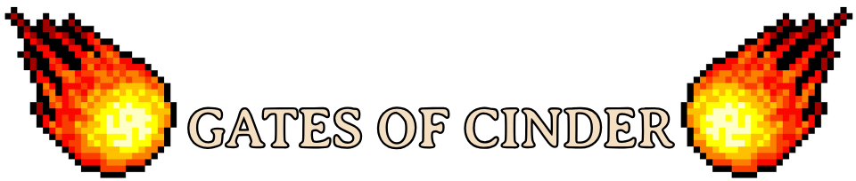
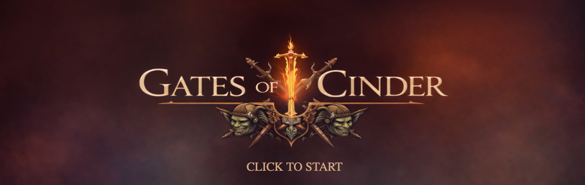
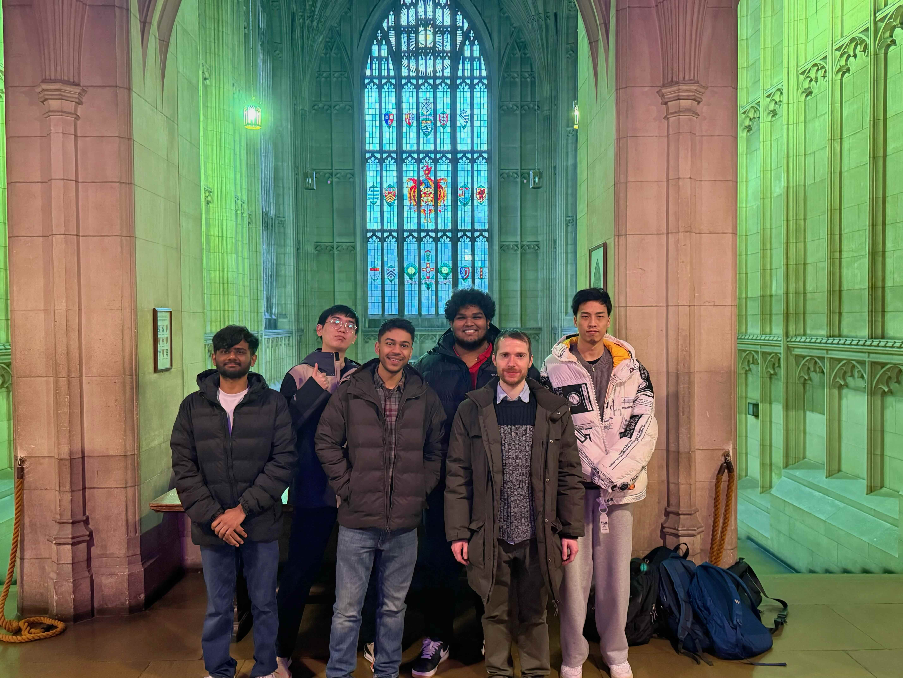
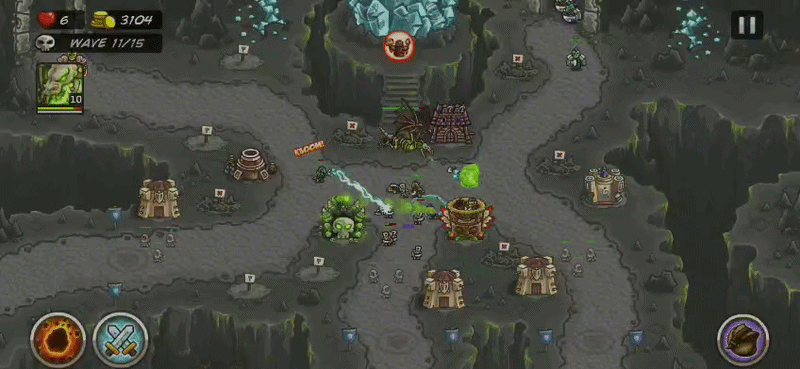
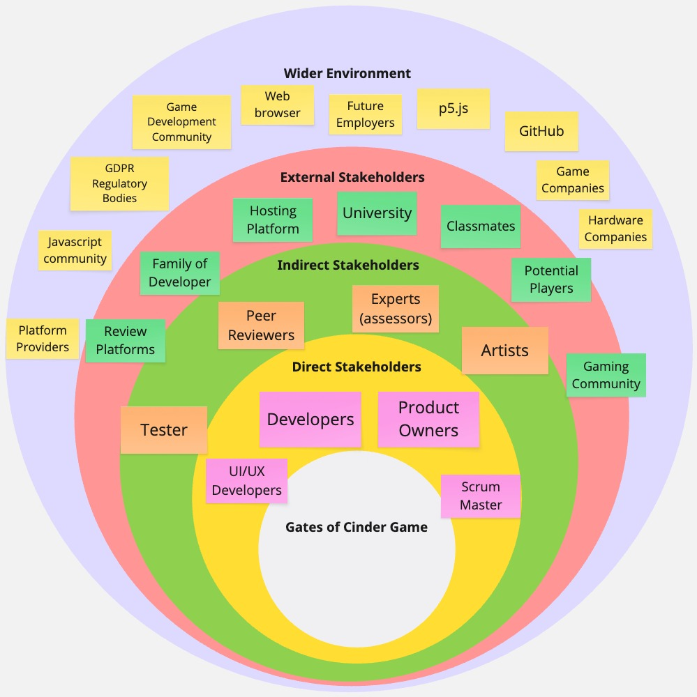
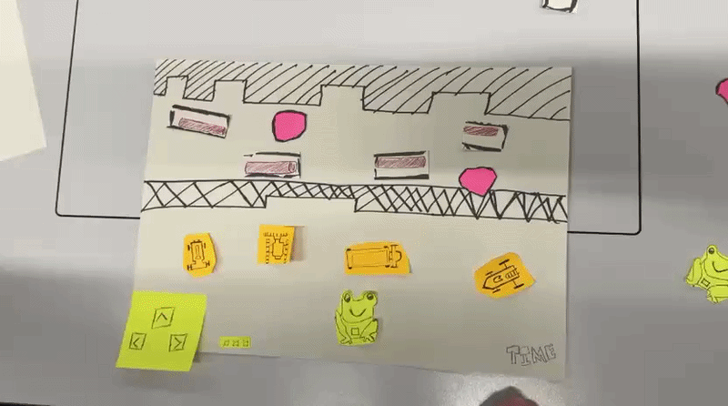
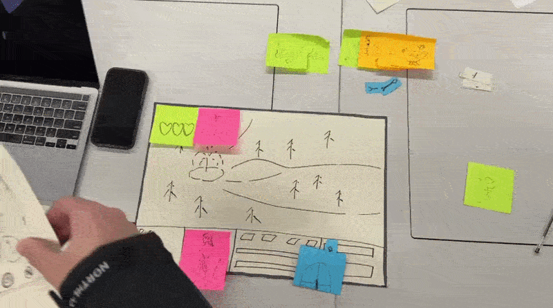
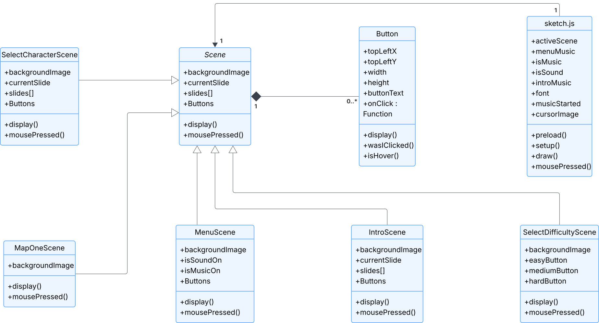
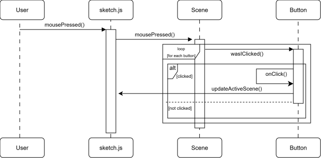

<p align="center">
  
  
  
</p>

[](https://uob-comsm0166.github.io/2026-group-10/)

<p align="center">
  <a href="https://uob-comsm0166.github.io/2026-group-10/"></a>
  &nbsp;
  <a href="https://your-link.com"></a>
  &nbsp;
  <a href="https://github.com/orgs/UoB-COMSM0166/projects/153"></a>
</p>


<h2 align="center">Table of Contents</h2>

<div align="center">
  
| #  | Section          | Description                                      |
|----|------------------|--------------------------------------------------|
| 0 | [Labs](#labs) | Weekly lab tasks & documentation                |
| 1 | [Introduction](#introduction) | Game overview & what makes it novel       |
| 2 | [Requirements](#requirements) | Ideation, use cases & user stories        |
| 3 | [Design](#design) | System architecture, state machine & class diagrams |
| 4 | [Implementation](#implementation) | Key technical challenges           |
| 5 | [Evaluation](#evaluation) | Qualitative & quantitative testing     |
| 6 | [Process](#process) | Team workflow & reflection               |
| 7 | [Conclusion](#conclusion) | Lessons learnt & future work         |
| 8 | [Contribution](#contribution) | Individual contributions         |
</div>

<h2 align="center">Group Members</h2>


<div align="center">

| Name                 | Email                 | Github Username       |
| -------------------- | --------------------- | --------------------- |
| Dhanitha Rajapaksa   | we25139@bristol.ac.uk | dhanitha-26           |
| Cenarius Lu          | ig25518@bristol.ac.uk | Shadow-Song           |
| Rajmugundhan Nagappan| je25549@bristol.ac.uk | Rajmugundhan2002-tech |
| Ayush Raizada        | ff25412@bristol.ac.uk | Raizada8              |
| James Crossley       | qe25280@bristol.ac.uk | jamescr1              |
| Jinhao Han           | bt25224@bristol.ac.uk | memoryzea             |

</div>


<div align="center">
  
  | Name                  | Role(s)                                           | Contribution                                                                                                                             | % |
| --------------------- | ------------------------------------------------- | ---------------------------------------------------------------------------------------------------------------------------------------- | -------------- |
| Jinhao Han            | Co-developer, Assets, Game Lore                   | Designed tower defence aspects, including enemy design, and contributed to system design.                                                | 1.0     |
| Cenarius Lu           | Lead Developer, System Architecture, Game Lore    | Designed core mechanics and system architecture. Developed heroes, their abilities, and implemented health bar and RPG elements.         | 1.0     |
| Dhanitha Rajapaksa    | Integration Development, Co-developer, Report     | Integrated front end and back end components, ensuring system cohesion. Contributed to development and assisted with the project report. | 1.0     |
| James Crossley        | Frontend Development, Assets, Audio, Co-developer | Developed the frontend interface and handled audio design, and assisted with the project report.                                         | 1.0     |
| Rajmugundhan Nagappan | Report, Assets, Game Lore                         | Contributed to report writing, asset creation, and game lore development.                                                                | 1.0   |
| Ayush Raizada         | Report Writer, Project Manager                    | Coordinated the team, managed communication and workflow, and contributed to the project report.                                         | 1.0     |

</div>


<h2 align="center">File Structure</h2>

```
project/
├── index.html ← Entry point — controls script load order
├── Main.js ← Main entry point for the game logic
├── README.md ← You are here — main project documentation
├── struct.md 
├── css/
│   └── style.css 
├── data/
│   ├── Hero/ ← JSON data for heros 
│   │  
│   └── Map/ ← JSON data for maps  
│      
├── docs/ 
├── images/ ← images and gif for README.md
│ 
├── js/
│   
├── src/
│   ├── Game.js ← Main game class
│   ├── GameManager.js ← Game manager class
│   ├── UI.js ← User interface logic
│   ├── Entity/
│   │   ├── Entity.js ← Base entity class
│   │   ├── Skill/ 
│   │   │   ├── Archmage.js ← Archmage skill logic
│   │   │   ├── Buff.js ← Buff logic
│   │   │   ├── Skill.js ← Base skill class
│   │   │   └── SkillEntity.js ← Skill entity logic
│   │   └── Unit/
│   │       ├── Hero.js ← Hero unit logic
│   │       ├── Objective.js ← Objective unit logic
│   │       ├── Unit.js ← Base unit class
│   │       └── Enemy/
│   │           ├── Enemy.js ← Base enemy class
│   │           └── Undead.js ← Undead enemy logic
│   ├── Towerdefense/
│   │   ├── Bullet.js ← Bullet logic
│   │   ├── Enemy.js ← Tower defense enemy logic
│   │   ├── Path.js ← Path logic
│   │   └── Tower.js ← Tower logic
│   └── World/
│       ├── Clock.js ← Game clock logic
│       ├── Controller.js ← Game controller logic
│       ├── EventEmitter.js ← Event emitter logic
│       ├── Render.js ← Rendering logic
│       └── World.js ← World logic
├── videos/
│   
└── weeklyupdates/
```

<h3 align="center">Feature Priority</h2>

|Priority Rank - High to Low|System / Features|Time Taken|
|-|-|-|
|HIGHEST|Hero - Implement the stats screen funcitons of Hero system.|14%|
|HIGHER|Enemy - Design the emeny behavior.|13%|
|HIGH|Buff & Equip - Implement the Buff and Equipment functions, which effect the stats screen.|15%|
|MID|Skill - Design the skill tree. And implement the active skills with buff, projectile or target entity.|15%|
|LOW|Controll & Manager - Get the input from p5 libary and apply it to hero controll. Implement the game loop manager.|15%|
|LOWER|Turrent & UI - Design the turrent. And create a UI system.|14%|
|LOWEST|Boss - Design the Boss with active skills. Test the game.|14%|


## 1. Introduction

The gates of cinder is combines the tower defense and RPG aspects to bring the game alive.The game takes place within a ancient forest where corona tree provides the life energy to all the beings in the forest.But an army of undead has risen to destroy the tree .So the player must defend the tree by choosing one of three heros to attack the waves of enemies and final boss.player must also choose and place towers in correct position and heroes abilities to manage enemy waves.Each enemy follows fixed path towards corona tree.The twist is that both objective and heroes lives is tied together,if one of them is defeated the game ends.There are three heroes to choose from:Warrior,mage and engineer,each offering unique abilities.warrior excels in close combat while Mage has high range and spell abilities and engineer rely on their machines .The game is in retro art style .The game encourages players to adapt their strategies making each level challenging and rewarding.

## 3. Requirements 

**3.1. Ideation Process** 

In the early stages of our project, we began by exploring what inspired us. Each team member brought one or two games to an in-person meeting, sharing what captivated them whilst considering the practical constraints of developing from scratch. After an initial round of ideas shared via our team group chat, we met to pitch specific inspirations. This resulted in a split between three very distinct genres: tower defence, RPG, and arcade. 

After analysing the strengths of each, the team identified a unique opportunity to create a hybrid mechanic. Rather than replicating existing titles, we decided to integrate the management strategy of _Kingdom Rush_ with the hero-centric mechanics of Diablo 2. Tower defence games offered proven engagement through strategic placement and resource management, whilst action RPGs provided the visceral satisfaction of character progression and skill-based combat.

With this direction established, we divided the research effort. Each team member investigated specific game rules, dynamics, and development challenges to ensure our hybrid concept remained feasible within our technical constraints and timeline. 
#### 3.2. Game Mechanics 
The game mechanics draw from the energy of two famous games Like Kingdom Rush and League of Legends where the player must defend the objective using towers and use RPG elements.The player must choose  the correct towers and heroes to deal enemies effectively. The game is in a pixelated art style and the story takes place in a forest the defeat the final boss.

<table width="100%">
  <tr>
    <th align="center" width="50%">Kingdom Rush — Strategy Tower Defence</th>
    <th align="center" width="50%">League of Legends — RPG Combat</th>
  </tr>
  <tr>
    <td align="center">
      
    </td>
    <td align="center">
      
    </td>
  </tr>
</table>


---


### Stakeholders - Onion Model



<div align="center">

*Figure 1*  
Onion Model of the System

</div>

---

### Game ideas and analysis

| Game                    | Game Description                                                                                                                                                                                                                                                                                                                              | Twist Potential                                                                                                                                                                                                                      | Implementation Challenges                                                                                                                                                                                     |
| ----------------------- | --------------------------------------------------------------------------------------------------------------------------------------------------------------------------------------------------------------------------------------------------------------------------------------------------------------------------------------------- | ------------------------------------------------------------------------------------------------------------------------------------------------------------------------------------------------------------------------------------ | ------------------------------------------------------------------------------------------------------------------------------------------------------------------------------------------------------------- |
| **Super Mario**         | Classic side-scrolling platformer where players jump on enemies, collect coins and power-ups, and reach the end flag.                                                                                                                                                                                                                         | • Power-ups transform Mario into different forms with unique abilities <br>• Hidden blocks, warp zones, and secret areas <br>• Progressive level design that teaches mechanics through gameplay                                      | • Collision detection and sprite management <br>• Jump physics consistency <br>• Level design iteration and pacing <br>• Differentiation from generic platformer                                              |
| **Smashy Road: Wanted** | Top-down driving game where players escape police by hijacking new vehicles when destroyed. The longer you survive, the more aggressive the pursuit becomes.                                                                                                                                                                                  | • Wanted level escalates from police to SWAT to tanks to helicopters <br>• Vehicle types with different speed and durability stats <br>• Safe zones where wanted level decreases if player hides                                     | • Adaptive AI pathfinding with escalating aggression <br>• Vehicle collision physics and damage system <br>• Map generation with obstacles <br>• Smooth hijacking transitions                                 |
| **Airplane Survival**   | Top-down plane game where players steer to dodge homing missiles. Survive longer to unlock faster planes and earn higher scores.                                                                                                                                                                                                              | • Missiles with different behaviours like fast, slow, or cluster splits <br>• Bonus points for making missiles collide <br>• Terrain obstacles that block missiles <br>• Unlockable planes with different speeds                     | • Missile homing AI balancing difficulty <br>• Collision detection for missile interactions <br>• Score-based unlock progression <br>• Visual and audio feedback systems                                      |
| **Tank Trouble**        | Top-down maze combat where players fire bouncing shells to destroy opponents while avoiding their own ricochets.                                                                                                                                                                                                                              | • Maze walls regenerate on timers forcing position changes <br>• Arena shrinks over time for closer combat <br>• Energy system where firing consumes regenerating resource <br>• Directional shields and terrain effects             | • Bounce physics for shell reflections <br>• Safe maze regeneration without trapping players <br>• Multiplayer input handling <br>• Wall regeneration preview system                                          |
| **Kingdom Rush**        | Kingdom Rush is a fixed-path tower defence game where players strategically place and upgrade towers along enemy routes to survive waves. What makes it interesting is the tower upgrade tree system where each tower branches into specialised forms, plus the addition of a player-controlled hero unit that adds an active tactical layer. | • Towers branch into specialised upgrade paths <br>• Combine adjacent towers into hybrid forms <br>• Enemies evolve if they survive too long <br>• Player-controlled hero unit with abilities                                        | • Enemy pathfinding along set routes <br>• Tower upgrade tree logic and UI <br>• Wave spawning with difficulty scaling <br>• Balance across multiple tower types                                              |
| **Frogger**             | Frogger is a classic grid-based navigation game where players guide frogs across roads with moving cars and rivers with moving logs to reach lily pads safely. The game's appeal lies in its simple timing-based challenge and clear visual feedback on the grid.                                                                             | • Frog evolution system unlocking new forms with abilities <br>• Dynamic lanes that speed up, reverse, or spawn safe zones <br>• Competitive multiplayer with coin collection <br>• Extended maps with complex obstacle patterns     | • Grid-based movement and timing <br>• Pattern synchronisation for moving obstacles <br>• Lane speed variation and balancing <br>• Precise collision detection                                                |
| **Crossy Road**         | Endless arcade hopper where players navigate freeways, railways, and rivers whilst avoiding cars and collecting custom characters.                                                                                                                                                                                                            | • Player moves forward in direction cars are travelling <br>• Adaptive environment transitions between road types <br>• Character unlocks with different abilities <br>• Procedurally generated obstacles with increasing complexity | • Designing varied objects within frontend constraints <br>• Programming mechanics for multiple object types <br>• Generating adaptive environments with smooth transitions <br>• Obstacle difficulty scaling |
| **Pong**                | Pong is one of the earliest arcade games where two players control paddles to deflect a ball back and forth.                                                                                                                                                                                                                                  | • Ball modifiers like splits, gravity changes, or curve or spin <br>• Paddle upgrade options, sizes, shapes, or abilities <br>• Environmental hazards like moving obstacles or portal zones                                             | • Ball physics with consistent bounce angles <br>• Paddle collision detection and response <br>• AI opponent balancing for single-player                                                                    |
| **Breakout**            | Breakout is a single-player brick-breaking game where players control a paddle to bounce a ball upwards to destroy rows of bricks.                                                                                                                                                                                                            | • Brick types requiring multiple hits or special conditions <br>• Power-ups dropped from destroyed bricks <br>• Dynamic brick layouts that move or regenerate                                                                      | • Ball physics and angle calculations <br>• Brick collision detection and destruction                                                                                                                        |

**Early Stage Design**

By Week 3, we had translated these ideas into a paper prototype during the workshop. Testing sessions were positive, particularly regarding the different player roles we designed. With the fundamental mechanics validated, we moved forward to develop sprites and assets for digital prototyping, which would allow us to test the gameplay loop more thoroughly.

## Epics and User stories

Through the process of creating epics, user stories and acceptance requirements, we obtained a greater awareness of the range of stakeholders our game has. We also developed a deeper understanding of the context that our game exists in.

By creating epics, we learned of the different sub-categories of users our game may have, such as users with visual impairments and users with other disabilities. An increased awareness of the importance of the different categories of developers involved in the game, such as ‘front-end developers’ and ‘back-end developers’ was also acquired.

Creating user stories permitted us to obtain a better insight into the perspective of the user of our game and what features they might value in our game. As a result of this process, a greater appreciation of the reasons why users might highly value certain features of the game, such as a dynamic strategic combat system or progressive map experience, was developed.

The process of producing acceptance criteria helped to give precise, actionable data to the team with regards to how a specific feature, or aspect of the game, should be implemented. Generating acceptance criteria also provided the team with measurable criteria against which we could measure the success of our sprints and general game development.

By considering the plethora of stakeholders around our game, we gained a better understanding of the diverse range of people who may have interests in our game and the importance of considering these people when making decisions regarding the development of our game.

| **Epics** | **User Stories** | **Acceptance Criteria** |
|-----------|------------------|--------------------------|
| Varied and exciting gameplay experience | As a casual gamer, I want the game to have a variety of tools available to me so that the game is interesting and holds my attention | Given that I am playing on a map in the game, when I choose which tower to construct, then I should be able to choose from at least two different types of towers |
| Progressive Map Experience | As a passionate gamer, I want to be able to progress from one map to the next map as if the game is a progressive story so that the game feels exciting and fulfilling | Given that I am playing the game, when I have successfully completed the first map, then I should be able to play on a second map which is different to the first |
| Dynamic Strategic Combat System | As a gamer, I want to have to adapt my strategy to account for different enemies, so that I am rewarded for strategic planning and tactical tower placement | Given that I am playing a map, when combating against the enemy I should fight against two different types of enemy with different maximum health attributes |

| Epic | Description | User Stories | Acceptance Criteria |
|------|-------------|-------------|---------------------|
| EPIC 1 – Core Defense Gameplay | The player must defend the Ancient Tree from waves of undead enemies. | As a player, I want enemies to move toward the Ancient Tree, so that I must defend it. <br> As a player, I want enemies to damage the Ancient Tree on contact, so that there is a clear loss condition. <br> As a player, I want to attack enemies, so that I can stop them from reaching the tree. | Enemies follow predefined paths toward the Ancient Tree. <br> Enemy collision with the tree reduces its health. <br> Player attacks register hits consistently and reduce enemy health. <br> Game ends when the Ancient Tree health reaches zero. |
| EPIC 2 – Enemy Waves & Boss System | The game progresses through waves of enemies, culminating in powerful boss encounters. | As a player, I want enemies to spawn in waves, so that gameplay escalates over time. <br> As a player, I want a boss at the end of each round, so that I face a major challenge. <br> As a player, I want bosses to have unique attack patterns, so that combat feels varied. <br> As an Engineer player, I want bosses to target the Ancient Tree after destroying turrets, so that my gameplay has distinct risks. | Waves spawn enemies at fixed intervals and locations. <br> Boss spawns after all minions in a wave are defeated. <br> Boss has multiple attack behaviours. <br> Boss targeting logic changes depending on player class. |
| EPIC 3 – Hero Class System | Players choose and control unique hero classes with different mechanics. | As a player, I want to choose between Warrior, Mage, and Engineer, so that I can play different styles. <br> As a player, I want each class to have unique abilities, so that gameplay feels distinct. | Player selects class before gameplay begins. <br> Each class has unique stats, abilities, and mechanics. <br> Class systems are independent and modular. |
| EPIC 4 – Warrior Mechanics | The Warrior uses melee combat and rage-based abilities. | As a Warrior, I want different weapon types, so that my combat style changes. <br> As a Warrior, I want to generate rage through attacks, so that I can use powerful skills. <br> As a Warrior, I want rage to decay over time, so that I must stay aggressive. <br> As a Warrior, I want to upgrade equipment using gold, so that I become stronger. | Weapons (longsword, rapier, battle axe) affect abilities. <br> Rage increases on attack and decreases over time. <br> Rage resets on death or respawn. <br> Equipment upgrades increase stats. |
| EPIC 5 – Mage Mechanics | The Mage uses a flexible skill system powered by mana. | As a Mage, I want to combine Ice, Fire, and Lightning skills, so that I can customise my build. <br> As a Mage, I want mana to regenerate over time, so that I can continuously cast spells. <br> As a Mage, I want to spend gold on skills, so that I improve abilities instead of equipment. | Skill combinations are selectable and usable in gameplay. <br> Mana regenerates over time and resets on respawn. <br> Skills consume mana when cast. <br> Gold is used for skill learning and upgrades only. |
| EPIC 6 – Engineer & Turret System | The Engineer defends using turrets instead of a direct character. | As an Engineer, I want to place turrets, so that they automatically attack enemies. <br> As an Engineer, I want a limit on turret count, so that I must plan placement. <br> As an Engineer, I want to upgrade turrets using wood, so that they become stronger. <br> As an Engineer, I want permanent blueprint upgrades using gold, so that I progress over time. | Turrets can be placed anywhere except restricted zones. <br> Total turret count is capped. <br> Wood is gained only from enemy kills. <br> Turrets attack enemies automatically. <br> Blueprint upgrades persist across gameplay. |
| EPIC 7 – Progression & Resources | Players gain rewards and improve their abilities over time. | As a player, I want to gain experience from enemies, so that I can level up. <br> As a player, I want to earn gold, so that I can upgrade my character. <br> As a player, I want class-specific uses for gold, so that progression feels unique. <br> As an Engineer, I want to gain wood, so that I can build and upgrade turrets. | XP is awarded on enemy defeat and triggers level-ups. <br> Level-ups grant skill points. <br> Gold is awarded consistently from enemies. <br> Resource usage differs per class. |
| EPIC 8 – Ancient Tree System | The Ancient Tree acts as the core objective and life system. | As a player, I want the Ancient Tree to have health, so that I must protect it. <br> As a player, I want to repair the tree using gold, so that I can recover from damage. <br> As a player, I want the tree to revive me at a cost, so that death has consequences. | Tree health decreases when enemies reach it. <br> Gold can be spent to restore tree health. <br> Player death triggers a respawn timer. <br> Tree health is reduced upon player revival. |
| EPIC 9 – Game States & Win/Lose Conditions | The game clearly defines victory and defeat conditions. | As a player, I want to win after defeating all waves, so that I feel rewarded. <br> As a player, I want to lose when the tree is destroyed, so that failure is clear. <br> As a player, I want to respawn after death, so that I can continue playing. | Game ends in victory when all enemies are defeated. <br> Game ends in defeat when tree health reaches zero. <br> Respawn system includes a timer and penalty. <br> UI clearly communicates game state changes. |
| EPIC 10 – Technical Architecture & Scalability | The system is modular and maintainable for future expansion. | As a developer, I want modular systems, so that features are easy to maintain. <br> As a developer, I want class systems separated, so that balancing is easier. <br> As a developer, I want scalable enemy and wave systems, so that new content can be added easily. | Systems separated (Combat, AI, Resources, UI, Classes). <br> Clear update loop and system interactions. <br> Data-driven configs for enemies, waves, and abilities. <br> New classes or enemies can be added without rewriting core systems. |

### **Prototyping** 

<table align="center" width="80%" style="margin: auto; text-align: center;">
  <!-- ROW 1 -->
  <tr>
    <td width="50%" style="padding: 10px;">
      
    </td>
    <td width="50%" style="padding: 10px; vertical-align: middle;">
      <h3>Prototype 1: Frogger</h3>
      <p>
        A classic 1980s arcade game in which the player controls a frog attempting to cross a busy road and a hazardous river. The goal is to safely guide the frog to its home while avoiding traffic and moving dangers.
      </p>
    </td>
  </tr>

  <!-- ROW 2 -->
  <tr>
    <td width="50%" style="padding: 10px;">
      
    </td>
    <td width="50%" style="padding: 10px; vertical-align: middle;">
      <h3>Prototype 2: Tower Defence RPG</h3>
      <p>
        A hybrid of tower defence and role playing mechanics, where the player must protect a magical tree from waves of enemies. Players can cast spells, use special abilities, and purchase upgrades from an in game store to strengthen their defences.
      </p>
    </td>
  </tr>
</table>


**Testing Feedback** 

- 15% ~750 words
- Early stages design. Ideation process. How did you decide as a team what to develop? Use case diagrams, user stories. 

### Design

- 15% ~750 words 
- System architecture. Class diagrams, behavioural diagrams. 
#### Menu Navigation Class Diagram

The above class diagrams demonstrate the game's menu system and class structure.`Sketch.js` acts as a controller class. It maintains a reference to the current `activeScene` and delegates behaviour to the active scene. Since the different scene classes share common behaviour and state, they were conceptually grouped under an abstract Scene type. Although an abstract Scene class was not explicitly implemented in the code,  this conceptual model of an abstract Scene 'type' provided a common interface which facilitated polymorphic behaviour in practice, thus enabling `Sketch.js` to treat all scenes uniformly.

Since buttons only exist within a scene, a composition relationship exists between the `Button` class and `Scene` class. The `Button` class encapsulates all logic relating to a menu UI element that a user can interact with, such as click detection and associated actions triggered by user clicks. This encapsulation facilitated modularity, contributing to a more understandable and maintainable codebase. 
#### Scene-switching Sequence Diagram


The above sequence diagram illustrates the flow of the game's menu scenes and how user button clicks cause scene-switching to occur. The process of scene-switching is initiated when the user clicks a `button` on one of the menu screens; this causes the `mousePressed()` function in `sketch.js` to run. This function delegates the click event to the `mousePressed()` method of the current `activeScene`.

`activeScene` then iterates through all of its buttons, calling the `wasIClicked()` function for each one. If the `wasIClicked()` function verifies that this button was indeed the one the user clicked, it will invoke its `onClick()` callback function that was passed to the button during the button's creation. Since the `onClick()` method is stored within the button that invokes it, it is represented in the sequence diagram by an arrow from the button pointing back to itself (a self-call).

### Implementation

- 15% ~750 words

- Describe implementation of your game, in particular highlighting the TWO areas of *technical challenge* in developing your game. 

### Evaluation

- 15% ~750 words

- One qualitative evaluation (of your choice) 

- One quantitative evaluation (of your choice) 

- Description of how code was tested. 

### Process 

- 15% ~750 words

- Teamwork. How did you work together, what tools and methods did you use? Did you define team roles? Reflection on how you worked together. Be honest, we want to hear about what didn't work as well as what did work, and importantly how your team adapted throughout the project.

### Conclusion

- 10% ~500 words

- Reflect on the project as a whole. Lessons learnt. Reflect on challenges. Future work, describe both immediate next steps for your current game and also what you would potentially do if you had chance to develop a sequel.

### Contribution Statement

- Provide a table of everyone's contribution, which *may* be used to weight individual grades. We expect that the contribution will be split evenly across team-members in most cases. Please let us know as soon as possible if there are any issues with teamwork as soon as they are apparent and we will do our best to help your team work harmoniously together.

### Additional Marks

You can delete this section in your own repo, it's just here for information. in addition to the marks above, we will be marking you on the following two points:

- **Quality** of report writing, presentation, use of figures and visual material (5% of report grade) 
  - Please write in a clear concise manner suitable for an interested layperson. Write as if this repo was publicly available.
- **Documentation** of code (5% of report grade)
  - Organise your code so that it could easily be picked up by another team in the future and developed further.
  - Is your repo clearly organised? Is code well commented throughout?
