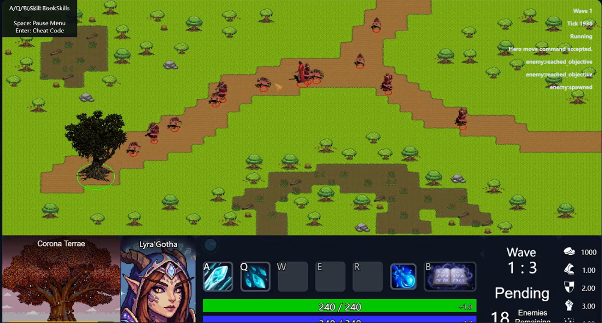
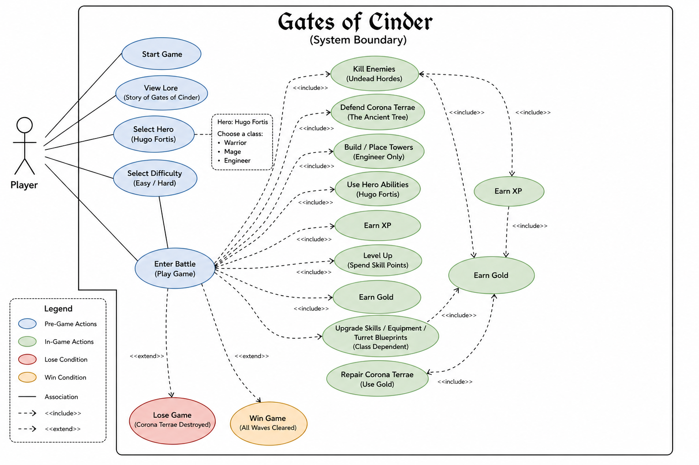

<p align="center">
  
  
  
  <a href="https://github.com/UoB-COMSM0166/2026-group-10/blob/main/LICENSE">
  
  </a>
</p>

---

<div align="center">
  <a href="https://uob-comsm0166.github.io/2026-group-10/">
    
  </a>
</div>
<p align="center">


<p align="center">
  <a href="https://uob-comsm0166.github.io/2026-group-10/"></a>
  &nbsp;
  <a href="https://your-link.com"></a>
  &nbsp;
  <a href="https://github.com/orgs/UoB-COMSM0166/projects/153"></a>
</p>
<p align="center">
  <a href="videos/CinderVideo.mp4">
    
  </a>
</p>
<h1 align="center">🎮 How to Play </h1>

### Play Online 
Gates of Cinder is hosted on GitHub Pages, so you can jump straight into the action without any installations!
1. Click ‘**PLAY GAME**’ button above. If it does not open, launch your browser, Chrome is recommended, and go to: https://uob-comsm0166.github.io/2026-group-10/ 
2. The game will load instantly.
3. On the main screen, select ‘Start Game’ to begin character selection, or choose ‘Intro’ for a quick overview of the game lore and controls.

### Run locally (for Development or Offline Play)
For those looking to modify the code or play offline, you can host Gates of Cinder locally:
1. Clone the repository:<p align="center">


   ```bash
   git clone https://github.com/UoB-COMSM0166/2026-group-10.git
   cd 2026-group-10/docs
   ```
2. Launch the server: Use `npx` to start a local environment:
   
   ```bash
   npx http-server -c-1 -p 8000
   ```
3. **Play:** Open Chrome and navigate to `http://localhost:8000/`


<h1 align="center">Table of Contents</h1>

<div align="center">

| #  | Section | Description |
|----|---------|-------------|
| 0 | [Introduction](#introduction) | Game overview and key idea |
| 1 | [Requirements](#requirements) | Ideation, use cases and user stories |
| 2 | [Design](#design) | System architecture, state machine & class diagrams |
| 3 | [Implementation](#implementation) | Key technical work and challenges |
| 4 | [Evaluation](#evaluation) | Qualitative and quantitative testing |
| 5 | [Testing](#testing) | Testing strategy and results |
| 6 | [Process](#process) | Team workflow and reflection |
| 7 | [Conclusion](#conclusion) | Lessons learnt and future work |
| 8 | [Sustainability](#sustainability-ethics-and-accessibility) | Responsible design considerations |
| 9 | [Contribution](#contribution) | Individual contributions |
</div>

<h1 id="group-members" align="center">Group Members</h1>


<div align="center">

| Name                 | Email                 | Github Username       |
| -------------------- | --------------------- | --------------------- |
| Dhanitha Rajapaksa   | we25139@bristol.ac.uk | dhanitha-26           |
| Cenarius Lu          | ig25518@bristol.ac.uk | Shadow-Song           |
| Rajmugundhan Nagappan| je25549@bristol.ac.uk | Rajmugundhan2002-tech |
| Ayush Raizada        | ff25412@bristol.ac.uk | Raizada8              |
| James Crossley       | qe25280@bristol.ac.uk | jamescr1              |
| Jinhao Han           | bt25224@bristol.ac.uk | memoryzea             |

</div>

<h1 id="repository-structure" align="center">Repository Structure</h1>

```
project/
├── index.html ← Entry point — controls script load order
├── Main.js ← Main entry point for the game logic
├── README.md ← You are here — main project documentation
├── struct.md 
├── css/
│   └── style.css 
├── data/
│   ├── Hero/ ← JSON data for heros 
│   │  
│   └── Map/ ← JSON data for maps  
│      
├── docs/ 
├── images/ ← images and gif for README.md
│ 
├── js/
│   
├── src/
│   ├── Game.js ← Main game class
│   ├── GameManager.js ← Game manager class
│   ├── UI.js ← User interface logic
│   ├── Entity/
│   │   ├── Entity.js ← Base entity class
│   │   ├── Skill/ 
│   │   │   ├── Archmage.js ← Archmage skill logic
│   │   │   ├── Buff.js ← Buff logic
│   │   │   ├── Skill.js ← Base skill class
│   │   │   └── SkillEntity.js ← Skill entity logic
│   │   └── Unit/
│   │       ├── Hero.js ← Hero unit logic
│   │       ├── Objective.js ← Objective unit logic
│   │       ├── Unit.js ← Base unit class
│   │       └── Enemy/
│   │           ├── Enemy.js ← Base enemy class
│   │           └── Undead.js ← Undead enemy logic
│   ├── Towerdefense/
│   │   ├── Bullet.js ← Bullet logic
│   │   ├── Enemy.js ← Tower defense enemy logic
│   │   ├── Path.js ← Path logic
│   │   └── Tower.js ← Tower logic
│   └── World/
│       ├── Clock.js ← Game clock logic
│       ├── Controller.js ← Game controller logic
│       ├── EventEmitter.js ← Event emitter logic
│       ├── Render.js ← Rendering logic
│       └── World.js ← World logic
├── videos/
│   
└── weeklyupdates/
```
<h1 id="introduction" align="center">Introduction</h1>

Gates of Cinder is a combination of tower defense and RPG elements designed to create an engaging gameplay experience. The game takes place in an ancient forest, where the Corona Tree provides life energy to all living beings. However, an army of undead has risen to destroy the tree.

The player must defend the tree by choosing one of three heroes to fight against waves of enemies, culminating in a final boss battle. Players must also strategically place towers and use hero abilities effectively to manage incoming enemy waves. Each enemy follows a fixed path toward the Corona Tree.

A unique twist in the game is that both the objective (the tree) and the hero’s life are interconnected—if either is defeated, the game ends.

There are three heroes to choose from: Warrior, Mage, and Engineer, each offering unique abilities. The Warrior excels in close combat, the Mage specializes in long-range spells, and the Engineer relies on machines and technology.

The game features a retro art style and encourages players to adapt their strategies, making each level both challenging and rewarding.

<h1 id="requirements" align="center">Requirements</h1>

## 3.1. Ideation Process 

In the early stages of our project, we began by exploring what inspired us. Each team member brought one or two games to an in-person meeting, sharing what captivated them whilst considering the practical constraints of developing from scratch. After an initial round of ideas shared via our team group chat, we met to pitch specific inspirations. This resulted in a split between three very distinct genres: tower defence, RPG, and arcade. 

After analysing the strengths of each, the team identified a unique opportunity to create a hybrid mechanic. Rather than replicating existing titles, we decided to integrate the management strategy of _Kingdom Rush_ with the hero-centric mechanics of Diablo 2. Tower defence games offered proven engagement through strategic placement and resource management, whilst action RPGs provided the visceral satisfaction of character progression and skill-based combat.

With this direction established, we divided the research effort. Each team member investigated specific game rules, dynamics, and development challenges to ensure our hybrid concept remained feasible within our technical constraints and timeline. 


### Game ideas and analysis

| Game                    | Game Description                                                                                                                                                                                                                                                                                                                              | Twist Potential                                                                                                                                                                                                                      | Implementation Challenges                                                                                                                                                                                     |
| ----------------------- | --------------------------------------------------------------------------------------------------------------------------------------------------------------------------------------------------------------------------------------------------------------------------------------------------------------------------------------------- | ------------------------------------------------------------------------------------------------------------------------------------------------------------------------------------------------------------------------------------ | ------------------------------------------------------------------------------------------------------------------------------------------------------------------------------------------------------------- |
| **Super Mario**         | Classic side-scrolling platformer where players jump on enemies, collect coins and power-ups, and reach the end flag.                                                                                                                                                                                                                         | • Power-ups transform Mario into different forms with unique abilities <br>• Hidden blocks, warp zones, and secret areas <br>• Progressive level design that teaches mechanics through gameplay                                      | • Collision detection and sprite management <br>• Jump physics consistency <br>• Level design iteration and pacing <br>• Differentiation from generic platformer                                              |
| **Smashy Road: Wanted** | Top-down driving game where players escape police by hijacking new vehicles when destroyed. The longer you survive, the more aggressive the pursuit becomes.                                                                                                                                                                                  | • Wanted level escalates from police to SWAT to tanks to helicopters <br>• Vehicle types with different speed and durability stats <br>• Safe zones where wanted level decreases if player hides                                     | • Adaptive AI pathfinding with escalating aggression <br>• Vehicle collision physics and damage system <br>• Map generation with obstacles <br>• Smooth hijacking transitions                                 |
| **Airplane Survival**   | Top-down plane game where players steer to dodge homing missiles. Survive longer to unlock faster planes and earn higher scores.                                                                                                                                                                                                              | • Missiles with different behaviours like fast, slow, or cluster splits <br>• Bonus points for making missiles collide <br>• Terrain obstacles that block missiles <br>• Unlockable planes with different speeds                     | • Missile homing AI balancing difficulty <br>• Collision detection for missile interactions <br>• Score-based unlock progression <br>• Visual and audio feedback systems                                      |
| **Tank Trouble**        | Top-down maze combat where players fire bouncing shells to destroy opponents while avoiding their own ricochets.                                                                                                                                                                                                                              | • Maze walls regenerate on timers forcing position changes <br>• Arena shrinks over time for closer combat <br>• Energy system where firing consumes regenerating resource <br>• Directional shields and terrain effects             | • Bounce physics for shell reflections <br>• Safe maze regeneration without trapping players <br>• Multiplayer input handling <br>• Wall regeneration preview system                                          |
| **Kingdom Rush**        | Kingdom Rush is a fixed-path tower defence game where players strategically place and upgrade towers along enemy routes to survive waves. What makes it interesting is the tower upgrade tree system where each tower branches into specialised forms, plus the addition of a player-controlled hero unit that adds an active tactical layer. | • Towers branch into specialised upgrade paths <br>• Combine adjacent towers into hybrid forms <br>• Enemies evolve if they survive too long <br>• Player-controlled hero unit with abilities                                        | • Enemy pathfinding along set routes <br>• Tower upgrade tree logic and UI <br>• Wave spawning with difficulty scaling <br>• Balance across multiple tower types                                              |
| **Frogger**             | Frogger is a classic grid-based navigation game where players guide frogs across roads with moving cars and rivers with moving logs to reach lily pads safely. The game's appeal lies in its simple timing-based challenge and clear visual feedback on the grid.                                                                             | • Frog evolution system unlocking new forms with abilities <br>• Dynamic lanes that speed up, reverse, or spawn safe zones <br>• Competitive multiplayer with coin collection <br>• Extended maps with complex obstacle patterns     | • Grid-based movement and timing <br>• Pattern synchronisation for moving obstacles <br>• Lane speed variation and balancing <br>• Precise collision detection                                                |
| **Crossy Road**         | Endless arcade hopper where players navigate freeways, railways, and rivers whilst avoiding cars and collecting custom characters.                                                                                                                                                                                                            | • Player moves forward in direction cars are travelling <br>• Adaptive environment transitions between road types <br>• Character unlocks with different abilities <br>• Procedurally generated obstacles with increasing complexity | • Designing varied objects within frontend constraints <br>• Programming mechanics for multiple object types <br>• Generating adaptive environments with smooth transitions <br>• Obstacle difficulty scaling |
| **Pong**                | Pong is one of the earliest arcade games where two players control paddles to deflect a ball back and forth.                                                                                                                                                                                                                                  | • Ball modifiers like splits, gravity changes, or curve or spin <br>• Paddle upgrade options, sizes, shapes, or abilities <br>• Environmental hazards like moving obstacles or portal zones                                             | • Ball physics with consistent bounce angles <br>• Paddle collision detection and response <br>• AI opponent balancing for single-player                                                                    |
| **Breakout**            | Breakout is a single-player brick-breaking game where players control a paddle to bounce a ball upwards to destroy rows of bricks.                                                                                                                                                                                                            | • Brick types requiring multiple hits or special conditions <br>• Power-ups dropped from destroyed bricks <br>• Dynamic brick layouts that move or regenerate                                                                      | • Ball physics and angle calculations <br>• Brick collision detection and destruction                                                                                                                        |

### **Prototyping** 

<table align="center" width="80%" style="margin: auto; text-align: center;">
  <!-- ROW 1 -->
  <tr>
    <td width="50%" style="padding: 10px;">
      
    </td>
    <td width="50%" style="padding: 10px; vertical-align: middle;">
      <h3>Prototype 1: Frogger</h3>
      <p>
        A classic 1980s arcade game in which the player controls a frog attempting to cross a busy road and a hazardous river. The goal is to safely guide the frog to its home while avoiding traffic and moving dangers.
      </p>
    </td>
  </tr>

  <!-- ROW 2 -->
  <tr>
    <td width="50%" style="padding: 10px;">
      
    </td>
    <td width="50%" style="padding: 10px; vertical-align: middle;">
      <h3>Prototype 2: Tower Defence RPG</h3>
      <p>
        A hybrid of tower defence and role playing mechanics, where the player must protect a magical tree from waves of enemies. Players can cast spells, use special abilities, and purchase upgrades from an in game store to strengthen their defences.
      </p>
    </td>
  </tr>
</table>

### Game Mechanics (merge this section (keep the gifs but merge with UI/UX into one))
The game mechanics draw from the energy of two famous games Like Kingdom Rush and League of Legends where the player must defend the objective using towers and use RPG elements.The player must choose  the correct towers and heroes to deal enemies effectively. The game is in a pixelated art style and the story takes place in a forest to defeat the final boss.

<table width="100%">
  <tr>
    <th align="center" width="50%">Kingdom Rush — Strategy Tower Defence</th>
    <th align="center" width="50%">League of Legends — RPG Combat</th>
  </tr>
  <tr>
    <td align="center">
      
    </td>
    <td align="center">
      
    </td>
  </tr>
</table>


## 3.2. Stakeholders

The stakeholder diagram tells the different groups of people and elements involved in development of our game.The first layer is the game itself,follwed by direct stakeholders,indirect stakeholders,external stake holders and wider environment which helps in binding all layers.


<div align="center">

*Figure 1*  
Onion Model of the System

</div>

## 3.3. Epics and User stories

Through the process of creating epics, user stories and acceptance requirements, we obtained a greater awareness of the range of stakeholders our game has. We also developed a deeper understanding of the context that our game exists in.

By creating epics, we learned of the different sub-categories of users our game may have, such as users with visual impairments and users with other disabilities. An increased awareness of the importance of the different categories of developers involved in the game, such as ‘front-end developers’ and ‘back-end developers’ was also acquired.

Creating user stories permitted us to obtain a better insight into the perspective of the user of our game and what features they might value in our game. As a result of this process, a greater appreciation of the reasons why users might highly value certain features of the game, such as a dynamic strategic combat system or progressive map experience, was developed.

The process of producing acceptance criteria helped to give precise, actionable data to the team with regards to how a specific feature, or aspect of the game, should be implemented. Generating acceptance criteria also provided the team with measurable criteria against which we could measure the success of our sprints and general game development.

By considering the plethora of stakeholders around our game, we gained a better understanding of the diverse range of people who may have interests in our game and the importance of considering these people when making decisions regarding the development of our game.

EPIC 1: VARIED AND EXCITING GAMEPLAY

USER STORY: As a casual gamer, I want the game to have a variety of heroes available to me so that the game is interesting for me and holds my attention
Acceptance Criteria: Given that I am playing on a map in the game, when I choose which hero to play, then I should be able to choose from different types of abilities.

EPIC 2: PROGESSIVE MAP EXPERIENCE

USER STORY: As a passionate gamer, I want to be able to progress from one map to the next map as if the game is a progressive story so that the game feels exciting and fulfilling
Acceptance criteria: Given that I am playing the game, when I have successfully completed the first map, then I should be able to play on a second map which is different to the first

EPIC 3: DYNAMIC STRATEGIC COMBAT SYSTEM

USER STORY: As a gamer, I want to have to adapt my strategy to account for different enemies, so that I am rewarded for strategic planning and tactical tower placement

EPIC 4: SCALABILITY AND READABILITY

USER STORY: As a developer,I dont want to waste time in reading the code,so the code  is commented throught so that any developer can read the code and scale the code or improve the current one so that the system need not be bulid ground up.

EPIC 5: XP SYSTEM AND GOLD

USER STORY: As a player,according to the selected hero must purchase the correct abilities and use gold gained from defeating enemies mindfully to defend the objective.If the abilties are not bought or used before hand,it becomes hard to defend the objective.

## 3.4. Use Case Diagram


The use case diagram illustrates the interaction of player with our game Gates of cinder.It illustrates the game lore,hero selection,difficulty level and various aspects of the game.It also defines the gameflow and objectives of the game.The below table summarizes above diagram.

<p align="center">
  <table>
    <tr>
      <th>Category</th>
      <th>Use Cases</th>
    </tr>
    <tr>
      <td>Pre-Game Actions</td>
      <td>Start Game, View Lore, Select Hero (Hugo Fortis), Select Difficulty</td>
    </tr>
    <tr>
      <td>Core Gameplay</td>
      <td>Enter Battle (Play Game), Kill Enemies, Defend Corona Terrae</td>
    </tr>
    <tr>
      <td>Combat & Skills</td>
      <td>Use Hero Abilities, Build/Place Towers (Engineer Only)</td>
    </tr>
    <tr>
      <td>Progression</td>
      <td>Earn XP, Level Up (Spend Skill Points)</td>
    </tr>
    <tr>
      <td>Resources</td>
      <td>Earn Gold </td>
    </tr>
    <tr>
      <td>Upgrades</td>
      <td>Upgrade Skills / Equipment, Turret Blueprints</td>
    </tr>
    <tr>
      <td>Maintenance</td>
      <td>Repair Corona Terrae</td>
    </tr>
    <tr>
      <td>Outcomes</td>
      <td>Win Game (All Waves Cleared), Lose Game (Corona Terrae Destroyed)</td>
    </tr>
  </table>
</p>


**Initial Sketch** 


<h4 align=“left">Feature Priority</h3>

|Priority Rank - High to Low|System / Features|Time Taken|
|-|-|-|
|HIGHEST|Hero - Implement the stats screen funcitons of Hero system.|14%|
|HIGHER|Enemy - Design the emeny behavior.|13%|
|HIGH|Buff & Equip - Implement the Buff and Equipment functions, which effect the stats screen.|15%|
|MID|Skill - Design the skill tree. And implement the active skills with buff, projectile or target entity.|15%|
|LOW|Controll & Manager - Get the input from p5 libary and apply it to hero controll. Implement the game loop manager.|15%|
|LOWER|Turrent & UI - Design the turrent. And create a UI system.|14%|
|LOWEST|Boss - Design the Boss with active skills. Test the game.|14%|

<h1 id="design" align="center">Design</h1>

## 4.1. System Architecture

**Communication Architecture**


This game runs on 2 processes: `Main` and `Worker`. The `Main` process is responsible for rendering, UI, input, and sound. `Worker` processes are responsible for executing the game logic.

**`Worker` Process**

A game runs on a `GameManager` instance, which have 2 tools to manage game logic: `Clock` and `EventEmitter`. `Clock` provides update functionality for game logic, such as manual updates, start, pause, and resume. `EventEmitter` is used to broadcast events between different classes. Events have an `id` and `payload`, making it easy for each instance to detect and trigger the corresponding function.

1. `GameManager` manages the map and the units and skill entities on it. Each update calculates their new positions based on their movement. Skill entities also check for collisions during each update, and if a collision occurs, the relevant hit function is called.
2. The most basic class is `Entity`. All movable objects on the map are subclasses of `Entity`. `Entity` is responsible for managing the movement of each entity and has methods such as move, stop, and sequence movement paths.
3. `Unit` is a subclass of `Entity`. `Unit` is responsible for managing the state of entities, such as health points and buff lists. Unit detects the unit's survival and applies buff lists, affecting the unit's health, movement, and other attributes.
4. `Hero` is a subclass of `Unit` and is directly managed by `GameManager`. `Hero` possess more special attributes than regular units: `Strength` and `Intelligence`. `Hero` have skills and skill books (except for `Architects`). Active skills are selected from skill books. Players can send commands to upgrade a hero's skills or attribute values, all of which require spending gold.
5. `Enemy` is a subclass of `Unit`. All `Enemy` instances are stored in a `Map`, whose keys are their `id`.  `Enemy` does not have any additional complex attribute values. Some Enemies have skill entities while alive, and most Enemies have `diecry` effects, which trigger certain effects after death (excluding providing gold, which is managed by `GameManager`).
6. `Boss` is a subclass of `Unit` and is directly managed by `GameManager`. Boss also has a skill system similar to `Hero`, but `Boss` has complete pre-cast, casting, post-cast times. Boss is a Behavior-Based Robot with a simple set of behavioral logic, reacting differently based on its distance from the player and its current health.
7. We have six different skill entities: `Missile`, `Projectile`, `Aura`, `Area`, `Guardian`, and `Tower`. Each is a subclass of `Entity` and possesses distinct attributes. `Missile` moves towards a specified unit, `Projectile` can only move in a straight line, `Aura` continuously affects other units within a certain radius, `Area` affects all units within its area, `Guardian` is a stationary entity that exists for a certain period and influences other units, and `Tower` is a `Guardian` that does not automatically expire.
8. `Skill` is a separate class. Each specific skill is a subclass of `Skill`. `Skill` is responsible for managing the casting, activation, and cooldown of skills, such as retrieving the appropriate target from the `Input` based on the skill's target type (point, unit, or vector).
9. `Buff` is a separate class. Each unit has its own list of buffs. The `GameManager` updates the duration and effects of each buff with each update. This affects the unit's attribute values and other elements, such as speed boost, armor reduction, and interval damage.

Both Buff and Skill have a callback function used to affect units or the world.

The `Worker` process only receives commands sent from the `Main` process and will not respond to other illegal commands.

**`Main` Process**

The `Main` process is responsible for UI, rendering, sound, and input. `Main` process will request a `snapshot` from `Worker`, which contains all information the UI and render require in each main loop. So the freshrate is not binding with Worker tick rate. The main process and worker processes communicate via postMessage.

**UI**

The UI will display the current game status, including hero attributes, wave information, target point attributes, boss information, etc. In some conditions, the UI will push a `Toast`, which contains some notifications about the input and game state.

**Render**

Render first reads the specified sprite, then determines which portion of the sprite to use based on the unit’s direction provided by the snapshot. Each texture is divided into eight directions; when a particular direction is detected, the corresponding sprite is rendered. During rendering, all entities are placed in a single collection and rendered in ascending order of position.y to correctly display the occlusion relationships between objects in front of and behind others under a 45-degree projection. Apart from heroes, objectives, bosses and minions, which are rendered according to fixed logic, all other entities are rendered by reading the entity’s ID and matching it against the Sprite database; the Sprite that meets the criteria will then be rendered.

## 4.2. Class Diagram

**Frontend Class Diagram**


**Architect**


**Archmage**


**Warrior**


**Backend Class Diagram**


All diagram were made using PlantUML.

## 4.3. Sequence Diagram

**Skill Cast Sequence Diagram**


**Sound**

We opened 2 tracks to play sounds: Background Music and Sound Effects. 

To reduce memory usage, the BGM system utilises MIDI files to store the music scores, which are then imported into the MIDI [https://unpkg.com/@tonejs/midi@2.0.28/build/Midi.js] library for playback. To minimise the negative impact of harsh music on players, sine waves—which are softer than triangle and square waves—are used consistently for BGM playback.

Multiple MIDI files cannot be played simultaneously on a single BGM track. Furthermore, the BGM system detects in-game events such as boss encounters, deaths and respawns, and switches to the appropriate BGM accordingly.

The sound effects are modelled on the design of the Nintendo Entertainment System, featuring two square waves, one triangle wave and one noise wave. The system then evaluates events such as the creation of a skill entity, an entity hitting a unit, and a unit’s death, playing different sound effects for each.

**Input**

`Input` uses the keyboard and mouse input interfaces provided by the `p5.js` library to handle key press events. Different keys send different commands to the Worker; for example, the right mouse button sets the target point for movement, the ‘S’ key stops command execution, and the space bar pauses the game. After a command is sent, various return status values are received. If the Worker determines that the command is valid, it triggers a corresponding effect in the game logic; if it is invalid, it responds accordingly, such as by displaying a toast notification in the `UI`.

**Execution sequence**

The menu is divided into several scenes; clicking a button allows you to navigate between the different `Scene`s. Clicking ‘Start Game’ will:

1. pass the configured hero as a parameter to the `Worker`process
2. load the required assets, initialise the `UI`, `Sound`and `Render`
3. create a new `GameManager`and send the `game:start`command

The Menu passes three parameters to Main: Hero, Category and World. Main then initialises the UI, Sound and Render, calculates the assets to be loaded into memory based on the provided parameters, and once the assets have been loaded, creates a new process, sets up a new GameManager and starts the game. During gameplay, the GameManager can be terminated using the relevant command.

Once the GameManager has been created, it will create the relevant tools (Clock and EventEmitter) and initialise the hero, target points and enemy spawn points. During this time, the GameManager will continuously update the movement status of each entity, and then enter a loop.

#### Menu Navigation Class Diagram

The above class diagrams demonstrate the game's menu system and class structure.`Sketch.js` acts as a controller class. It maintains a reference to the current `activeScene` and delegates behaviour to the active scene. Since the different scene classes share common behaviour and state, they were conceptually grouped under an abstract Scene type. Although an abstract Scene class was not explicitly implemented in the code,  this conceptual model of an abstract Scene 'type' provided a common interface which facilitated polymorphic behaviour in practice, thus enabling `Sketch.js` to treat all scenes uniformly.

Since buttons only exist within a scene, a composition relationship exists between the `Button` class and `Scene` class. The `Button` class encapsulates all logic relating to a menu UI element that a user can interact with, such as click detection and associated actions triggered by user clicks. This encapsulation facilitated modularity, contributing to a more understandable and maintainable codebase. 
#### Scene-switching Sequence Diagram


The above sequence diagram illustrates the flow of the game's menu scenes and how user button clicks cause scene-switching to occur. The process of scene-switching is initiated when the user clicks a `button` on one of the menu screens; this causes the `mousePressed()` function in `sketch.js` to run. This function delegates the click event to the `mousePressed()` method of the current `activeScene`.

`activeScene` then iterates through all of its buttons, calling the `wasIClicked()` function for each one. If the `wasIClicked()` function verifies that this button was indeed the one the user clicked, it will invoke its `onClick()` callback function that was passed to the button during the button's creation. Since the `onClick()` method is stored within the button that invokes it, it is represented in the sequence diagram by an arrow from the button pointing back to itself (a self-call).

## 4.4. State Machine
 
The following state diagram illustrates the core architectural flow of our game, mapping the transitions between primary states such as the Main Menu, Active Gameplay, and the Game Over sequence. It provides a comprehensive visual breakdown of how the hero interacts with the world and how critical mechanics, including gold accumulation, experience (XP) gain, and the death/respawn cycle, are integrated into the loop.

By tracing the logic within this diagram, one can observe the player's progression through the game environment and the intricate way various system elements interface with the core engine to create a cohesive experience.

<p align="center">
  
</p>

<h1 id="implementation" align="center">Implementation</h1>

Throughout development, we faced a number of complex technical hurdles. These key systems are explored in greater detail below.

## 5.1. **Challenge 1: Multithreading**

The game’s logic and front-end are completely decoupled and run independently on separate threads. The front-end serves as the main entry point for the game. Upon initialisation, it creates a dedicated background thread (the Worker), on which the core game logic executes in a continuous loop.

The game logic runs on this Worker thread at a fixed tick rate of 60 updates per second. It is responsible for all core simulations, including entity movement, collision detection, damage calculations, and state management. Importantly, the Worker does not handle any input or output directly. Instead, it receives messages from the main thread and executes the appropriate functions to modify the game state accordingly.

The front-end (main thread) is responsible for all user-facing operations: rendering the scene, playing sound effects, managing the user interface, and processing hardware input from the mouse and keyboard. To display the game correctly, the front-end periodically requests snapshots of the current game state from the Worker thread. These snapshots contain essential information such as the hero’s health, the position of every entity, and other dynamic elements. Meanwhile, player input is captured on the main thread, translated into structured commands, and sent to the Worker for processing.

Each game instance is managed by a `GameManager` class, which provides two essential tools: a `Clock` and an `EventEmitter`. The Clock handles timing-related functionality for the game logic, including manual updates, starting, pausing, and resuming the simulation. The `EventEmitter` enables clean communication between different parts of the codebase by broadcasting events, each consisting of an `id` and an optional `payload`. This system allows classes to listen for specific events and respond accordingly in a decoupled manner.

At the start of the programme, initialise the `Worker`process.

```JavaScript
const worker = new Worker(new URL('../Game/Worker.js', import.meta.url), { type: 'module' });
```

Communication between the main thread and the Worker is achieved using the `postMessage()` API. Commands, along with their associated payloads, are sent from the main thread to the Worker. Each command includes a unique random identifier to help track responses and ensure reliable messaging.

```JavaScript
function postCommand(command, payload = null) {
    const cheatChangeHero = parseCheatChangeHero(command);
    if (cheatChangeHero) {
        if (typeof initializeGamePresentation === 'function') {
            initializeGamePresentation(cheatChangeHero);
        }
        window.gameState.selectedCharacter = cheatChangeHero;
    }

    const requestId = `${command}:${Date.now()}:${Math.random().toString(36).slice(2, 8)}`;
    worker.postMessage({ command, payload, requestId });
    return requestId;
}
```

In the Worker, incoming messages are handled via `self.onmessage`. Once a message is received, it is processed and routed to the appropriate handler based on the command type.

```JavaScript
self.onmessage = (event) => {
    const { command, type, payload, requestId } = event.data ?? {};
    const normalizedCommand = typeof command === 'string' ? command : (typeof type === 'string' ? type : '');
    ...
}
```

Once the message has been received, it is processed, and the flow proceeds to different branches depending on the content of the command.

```javascript
function handleGameCommand(command, requestId, payload = {}) {
    if (command === 'game:start') {
		    ...
    }

    if (!requireGame(command, requestId)) {
        return;
    }

    if (command === 'game:pause') {
        ...
    }

    if (command === 'game:resume') {
        ...
    }
}
```
In summary, the steps are：

+ `Main.js: new Worker(...)` ->
+ `Main.js: postCommand()` -> 
+ `Main.js: worker.postMessage(...)` ->
+ `Worker.js: self.onmessage` ->
+ Based on the `command`, call the corresponding `handler`

**Advantages of this architecture:**
1. **Security:** The Worker only accepts a predefined set of valid commands, preventing clients from directly calling functions related to internal game logic.
2. **Performance:** By leveraging multiple threads, the game can make better use of modern multi-core processors, resulting in smoother gameplay and more efficient resource utilisation.
3. **Future-proofing:** This separation of concerns lays a strong foundation for future features such as multiplayer support, where game logic may eventually run on a dedicated server.

<p align="center">
  
</p>
<p align="center"><em>Input from user to move hero</em>

<p align="center">
  
</p>
<p align="center"><em>Rendering of enemies</em>
  
## 5.2. **Challenge 2: Skills and Buffs**

Each hero is equipped with a diverse set of abilities, which players can customise via the Skill Book system. Based on hotkey bindings, skill types include A, Q, W, E, R, and passive skills. Architecturally, every ability is a subclass of the base `Skill` class, inheriting core properties such as mana costs and cooldown timers. Most skills generate skill entities that can move and trigger hit detection. When a hit is detected, a callback function within the skill is executed, which may deal damage or apply debuffs.

```JavaScript
export class Missile extends Entity {
    ....
    hit() {
        if (this.damage) {
            this.target.takeDamage(this.damage, this.source);
        }
        if (this.effect && typeof this.effect === 'function') {
            this.effect(this.target);
        }
        this.finished = true;
    }
}
```
**The Casting Pipeline**

Once an ability identifies a valid target, it invokes the `casted` method. This function serves as the primary execution hub where the engine can instantiate a `SkillEntity`, apply a `Buff`, or modify the hero’s position.

```JavaScript
export class Stick extends Skill {
    constructor(events) {
        ...
    }

    upgrade() {
        ...
    }

    casted(target, caster) {
        ...

        const totalDamage = this.getAttackDamage(this.damage, caster);
        target.takeDamage(totalDamage, caster);
        emitWarriorAttackHit(this.events, caster, this, [target]);
        caster.restoreMP(15);

        if (!this.upgraded) {
            return;
        }

        caster.addBuff(new Buff(
            ...
        ));
    }
}
```
**Buff Mechanics and Lifecycle**

Buffs are status effects attached to units that modify their attributes, such as reducing movement speed. Most buffs are **time-limited**; once the duration expires, the buff is purged and its effects are reverted. When a unit is affected by multiple buffs with the same name, only the last buff applied will retain its effect.

```JavaScript
export default class Buff {
    constructor(...) {
        ...
    }

    onEffect(unit) {
        this.elapsed += 1;

        if (this.elapsed % this.effectPeriod === 0 && typeof this.effect === 'function') {
            this.effect(unit);
        }
    }

    clone() {
        return new Buff(
            ...
        );
    }
}
```
A buff's status is recalculated every frame to track its remaining duration and impact on the target unit. To prevent multiple units from sharing a single Buff pointer, multiple Buffs are created here to affect each unit individually.

```JavaScript
const staticFieldBuff = new Buff(
    'Static Field',
    'Affected by a charged static field.',
    'rgba(255, 255, 120, 1)',
    this.staticFieldDuration,
    () => {},
    false
);
```
Some buffs do not directly affect units; instead, they attach a token to the unit, which may be triggered by other abilities and cause additional effects.

**Architectural Evolution**

Initially, our design involved storing skill-related information in JSON files; however, we found that this severely limited the design of the skill mechanics, preventing us from creating complex systems. We therefore switched to implementing each skill as a separate class, which allows for more complex effects.

<p align="center">
  
</p>
<p align="center"><em>Skill Book</em>

<h1 id="evaluation" align="center">Evaluation</h1>

This week, we invited other team members to try out the newly released version of our game. The overall gameplay response was largely positive, though a few issues were flagged along with a number of helpful suggestions and ideas shared throughout the session. The feedback gathered proved to be invaluable in helping us to better understand how players interact with the game and where improvements can be made. To obtain a well-rounded understanding of our game, we conducted several evaluation methods, including **Think Aloud Evaluation**, **NASA-TLX for workload assessment**, and the **System Usability Scale (SUS)**. These methods allowed us to assess different dimensions of the player experience, from usability and cognitive workload to overall satisfaction and interface design. 

## 6.1. Qualitative Evaluation

<p align="center">
  
  <br>
  <em>Figure 1</em><br>
  One of our participants evaluating the game
</p>

**Think Aloud**

Given its proven track record in Human Computer Interaction (Nielsen et al., 2002; Joe et al., 2015), the Think Aloud technique was deemed the most suitable qualitative approach for exploring player perceptions of the initial level design, difficulty, and core game concept.


<div align="center">

*Figure 1*  
Summary of Think Aloud Evaluation

</div>

**Methodology:**

A group of 6 participants (**N = 6**), made up of friends and classmates with differing levels of gaming experience, took part in the session and were asked to play the game for around 10-15 minutes. Throughout the gameplay, they were encouraged to verbalise their thoughts and reactions as they occurred, providing realtime commentary on their experience. With their permission, responses were captured using audio recordings, enabling us to analyse the feedback and draw out a number of recurring themes, with a particular focus on instances of confusion and engagement. The recurring themes were organised into a Thematic Map (see Figure 1 above), with the table below addressing each identified focus area, alongside some additional themes drawn from the map.

**Key Observations and Reactions:**

| Focus Area | Issue Identified | Solution |
|---|---|---|
| **Player Control** | 1. Lack of health and mana indicators. <br> 2. Current status of each skill, including remaining cooldown times, is unclear.  | 1. Health and mana bars added to the bottom of the screen. <br> 2. Cooldown indicators made more prominent and easier to read. <br> 3. Enemy health now displayed above each enemy. |
| **Game Instructions & Clarity** | 1. The absence of an instruction page makes it challenging for players to familiarise themselves with the game's controls, spells, hero mechanics, and other core elements. <br> 2. Players feel buttons are not responsive <br> 3. Lack of information on the objective/goal <br> 4. Unaware of how skill works| 1. Add an instruction page accessible by pressing "Esc". <br> 2. Introduced a tutorial screen that players must read through before proceeding, ensuring that they have a thorough understanding of the game's core mechanics and objectives prior to gameplay. <br> 3. Add a clearer objective health indicator in the bottom-left corner. <br> 4. Real-time feedback to clarify objectives. <br> 5. Enable tooltip box on-hover in the game action bar and skill shop.|
| **Difficulty** | 1. Game offers no difficulty settings. <br> 2. Enemy waves progress at a pace that many players found overwhelming. | 1. Add difficulty options, giving players the ability to choose between Easy, Medium, and Hard before beginning the game. <br> 2. Wave speed adjusted in-line with difficulty.|
| **Player Movement & Sounds** | 1. Movement felt sluggish <br> 2. Add music to the main game not just the Front-end| 1. Adjusted the hero's movement speed values. <br> 2. Added music.|

<table>
  	<tr>
    <td align="center" width="33%">
      
    </td>

   <td align="center" width="33%">
      
    </td>
</table>
<div align="center">

*Figure 1*  
Added game action bar and store tooltips to provide clear, concise information on skills and abilities, including cooldown, target type, mana cost, range, and a brief description.
</div>

**Outcome:**

The implemented improvements showed clear results during follow-up testing, with players demonstrating greater confidence and notably less confusion while navigating the game. Usability and overall gameplay experience were meaningfully enhanced as a result. The use of Think-Aloud provided deeper insights into player concerns, helping the team address issues more effectively. However, we remain mindful that social desirability bias may have influenced some participants responses.


## 6.2. Quantitative Evaluation

To provide a quantitative counterpoint to our qualitative findings, we tasked ten participants (**N=10**) to play under both Easy and Hard conditions within a within-subjects framework. This allowed for an immediate assessment of workload via the **NASA Task Load Index (NASA-TLX)** and usability via the **System Usability Scale (SUS)** at the end of each session. We specifically tracked fluctuations in six specific dimensions of exertion: Mental, Physical and Temporal Demand, alongside Performance, Effort, and Frustration using the NASA-TLX. The resulting SUS scores were then compared to the established industry benchmark of 68, which serves as the baseline for acceptable functional usability. Any performance variations between the two modes were then analysed for statistical significance using the Wilcoxon signed-rank test (**α=0.05**).

**NASA-TLX: Workload Comparison**

**Individual Scores by Difficulty Level**


<p align="center">
  Figure 1. NASA-TLX participants' scores (Easy Mode).
</p>


<p align="center">
  Figure 2. NASA-TLX participants' scores (Hard Mode).
</p>


**Observation:**
The data clearly highlights that **Easy Mode** resulted in a **lower overall workload** and **reduced frustration** for the players. The most notable observation, however, was that **Hard Mode** involved **heightened mental demand** and **effort**, which players felt more acutely during boss fights.

**Average Scores Comparison**


<p align="center">
  Figure 3. Mean NASA-TLX scores (N=10) by workload factor for Easy and Hard settings.
</p>

As shown in the bar chart, players experienced a significant surge in mental strain and effort when playing in Hard Mode. Interestingly, this increase in demand was accompanied by a slight decline in performance scores, indicating that participants perceived themselves as less effective.

**Radar Profile**


<p align="center">

<p align="center">
  Figure 4. NASA TLX - Multi-dimensional Workload Comparison: Easy vs. Hard Mode Workload profile
</p>


**Interpretation:**
The cognitively demanding experience characterised by Mental Demand and Effort reaching 73.0 and 74.0 respectively, aligns with our intention to scale the game’s difficulty. However, Frustration surged by over 22 points to a peak of 78.5, an important consideration for future iterations is balancing this high-pressure gameplay and rising frustration. 

**SUS: System Usability Scores**
The System Usability Scale (SUS) is a quick and robust tool for assessing the perceived usability of a system. It provides a reliable benchmark that allows for meaningful comparison against established industry standards.

The final SUS scores were calculated using the following standardised process:

For each question, the raw rating (1–5) on the Likert scale was first converted into a score ranging from 0 to 4:
- Odd-numbered questions: Rating – 1
- Even-numbered questions: 5 – Rating

The ten contribution scores were then summed (resulting in a total between 0 and 40). This sum was finally multiplied by 2.5 to produce the SUS score on a scale of 0 to 100.

**Easy Mode**


<p align="center">

<p align="center">
  Table 1. SUS responses (Easy Mode)
</p>

**Hard Mode**


<p align="center">

<p align="center">
  Table 2. SUS responses (Hard Mode)
</p>

**Chart**


<p align="center">

<p align="center">
  Figure 1. Comparison of SUS scores (Easy vs Hard Mode)
</p>

**Interpretation:**

An SUS score of around 68 is widely regarded as average usability. In this study, Easy Mode achieved a mean score of 73.25, while Hard Mode scored 67.5. This places the overall usability of the game at an average level, with Easy Mode approaching good usability. Participants found Easy Mode straightforward to learn, intuitive to use, and generally user-friendly. Importantly, the increase in difficulty had only a modest impact on perceived usability. Players remained able to understand and engage with the core mechanics effectively in both versions. Although Hard Mode fell slightly below the average benchmark, this was anticipated given the greater complexity and cognitive demands.

<h1 id="testing" align="center">Testing</h1>

## 7.1. Black Box Testing

Black box testing was conducted to evaluate the external functionality of the game. This approach focuses on validating user interactions, system responses, and expected outputs based entirely on specific inputs, without examining the internal code structure.

The primary objective was to ensure that all core gameplay systems operated correctly from the player’s perspective. Test cases were structured around fundamental features, including scene transitions, hero locomotion, combat mechanics, tower construction, resource management, user interface feedback, audio triggers, and victory or defeat conditions.

#### 1. Game Scene Switching Test

| Test Case | Input | Expected Output | Observed Output | Status |
|---|---|---|---|---|
| 1.1 | Player enters Main Menu and clicks START | Game switches to Hero Selection page | Behaves as expected | Pass |
| 1.2 | Player selects Hero and confirms | Game switches to Difficulty Selection page | Behaves as expected | Pass |
| 1.3 | Player selects EASY / NORMAL / HARD difficulty | Game starts with selected difficulty | Behaves as expected | Pass |
| 1.4 | Player presses SPACE during gameplay | Game switches to Pause Screen and logic halts | Behaves as expected | Pass |
| 1.5 | Player presses SPACE again while paused | Game resumes from paused state | Behaves as expected | Pass |
| 1.6 | Player loses all HP of Corona Terrae | Game transitions to Defeat Screen | Behaves as expected | Pass |
| 1.7 | Player clears all enemy waves | Game transitions to Victory Screen | Behaves as expected | Pass |

<div align="center">

**Table 1: Game Scene Switching Test**

</div>

#### 2. Hero Control and Movement Test

| Test Case | Input | Expected Output | Observed Output | Status |
|---|---|---|---|---|
| 2.1 | Player right-clicks valid ground tile | Hero moves to selected target point | Behaves as expected | Pass |
| 2.2 | Player right-clicks unreachable location | Hero remains in valid path area | Behaves as expected | Pass |
| 2.3 | Player presses S while moving | Hero stops immediately | Behaves as expected | Pass |
| 2.4 | Player rapidly issues movement commands | Hero updates to latest valid command | Behaves as expected | Pass |
| 2.5 | Player clicks while hero is stunned | Movement command ignored until stun ends | Behaves as expected | Pass |

<div align="center">

**Table 2: Hero Control and Movement Test**

</div>

#### 3. Combat, Skills and Upgrade System Test

| Test Case | Input | Expected Output | Observed Output | Status |
|---|---|---|---|---|
| 3.1 | Hero attacks enemy unit | Enemy HP decreases | Behaves as expected | Pass |
| 3.2 | Enemy HP reaches 0 | Enemy dies and rewards granted | Behaves as expected | Pass |
| 3.3 | Player gains enough XP | Hero levels up | Behaves as expected | Pass |
| 3.4 | Player spends gold on skill upgrade | Skill level increases and gold deducted | Behaves as expected | Pass |
| 3.5 | Player activates targeted skill | Skill effect triggers on valid target | Behaves as expected | Pass |
| 3.6 | Player attempts upgrade without enough gold | Upgrade denied and toast shown | Behaves as expected | Pass |

<div align="center">

**Table 3: Combat, Skills and Upgrade System Test**

</div>

#### 4. Tower Building, Objective and Resource Test

| Test Case | Input | Expected Output | Observed Output | Status |
|---|---|---|---|---|
| 4.1 | Engineer hero builds tower on valid tile | Tower created successfully | Behaves as expected | Pass |
| 4.2 | Player attempts tower on invalid tile | Placement rejected | Behaves as expected | Pass |
| 4.3 | Enemy attacks Corona Terrae | Objective HP decreases | Behaves as expected | Pass |
| 4.4 | Player repairs Corona Terrae with resources | Objective HP restored | Behaves as expected | Pass |
| 4.5 | Player collects gold/wood rewards | Resource counters increase | Behaves as expected | Pass |

<div align="center">

**Table 4: Tower Building, Objective and Resource Test**

</div>

#### 5. UI, Visual Feedback and Audio Test

| Test Case | Input | Expected Output | Observed Output | Status |
|---|---|---|---|---|
| 5.1 | Player hovers over menu button | Button visually highlighted | Behaves as expected | Pass |
| 5.2 | Player clicks menu button | Selection sound plays | Behaves as expected | Pass |
| 5.3 | Boss appears in game | Boss BGM starts | Behaves as expected | Pass |
| 5.4 | Boss defeated | Music returns to standard BGM | Behaves as expected | Pass |
| 5.5 | Player receives invalid command | Toast notification displayed | Behaves as expected | Pass |
| 5.6 | Hero takes damage | HP UI updates immediately | Behaves as expected | Pass |

<div align="center">

**Table 5: UI, Visual Feedback and Audio Test**

</div>


#### 6. Boundary Value Analysis (BVA) Test

| Test Case | Input | Expected Output | Observed Output | Status |
|---|---|---|---|---|
| 6.1 | Hero HP = 1 and receives 1 damage | HP reaches 0 and death triggers | HP reached 0; death triggered | Pass |
| 6.2 | Hero gains healing at maximum HP | HP remains capped at max | HP capped correctly | Pass |
| 6.3 | Gold exactly equals upgrade cost | Upgrade succeeds and gold becomes 0 | Behaves as expected | Pass |
| 6.4 | Gold is 1 below upgrade cost | Upgrade denied | Behaves as expected | Pass |
| 6.5 | Player spams movement keys rapidly | Hero remains controllable without crash | Behaves as expected | Pass |
| 6.6 | No target selected for targeted skill | Skill does not cast safely | Behaves as expected | Pass |
| 6.7 | Corona Terrae HP reaches exactly 0 | Defeat state triggers immediately | Behaves as expected | Pass |

<div align="center">

**Table 6: Boundary Value Analysis Test**

</div>

<h1 id="process" align="center">Process</h1>

## 8.1. **Overview**

Our development process evolved considerably across the fourteen weeks of the project. We began with the intention of following a structured Scrum based agile methodology, but adapted toward a lighter coordination model as the project progressed. The result was a workflow that was informal in structure but consistent in communication and ultimately sufficient to deliver a complete, playable game.

## 8.2. **Methodology**

At the starting of the project, we planned two formal sprints. The first ran for two weeks and focused on establishing the core architecture, translating epics into GitHub issues, and populating the Kanban board. The second ran for three weeks and covered the majority of active feature implementation. In practice, neither sprint was executed strictly. Most team members had not worked in an agile or Scrum context previously, and under the pressure of the project timeline, we found that tracking what needed to be done was more achievable than enforcing when it had to be done. Sprint reviews and retrospectives were not conducted formally, though the Kanban board remained a useful reference for shared visibility into task status throughout.

<p align="center">
  
</p>
<p align="center">
  <em>The Kanban board was used to organise tasks, track progress, and manage the team’s workflow throughout the project</em>
</p>

<p align="center">
  
</p>
<p align="center">
  <em>GitHub was used to manage version control, and monitor the team’s development progress and collaboration</em>
</p>


## 8.3. **Communication and Meeting Cadence**

Communication was one of the stronger aspects of our process. The team met at least three times per week, either in person after scheduled sessions or remotely via Microsoft Teams. These calls included the full team — Dhanitha Rajapaksa, Rajmugundhan Nagappan, Ayush Raizada, James Crossley, Yiyuan Lu, and Jinhao Han and served as the primary forum for progress updates, integration decisions, and resolving blockers.

Between meetings, WhatsApp was used for real time coordination, quick questions, and sharing progress updates. It worked well because it was immediate, familiar, and required no additional tooling. Although our formal process frameworks were inconsistently applied, our communication habits remained reliable throughout the project, which helped compensate for weaknesses in other areas.

<p align="center">
  
</p>
<p align="center">
  <em>We used whatsapp to arrange regular in-person meetings and facilitate real-time updates on code development</em>
</p>

<p align="center">
  
</p>
<p align="center">
  <em>Microsoft Teams was used to conduct regular online meetings, enabling collaboration, discussion, and progress updates among team members</em>
</p>

## 8.4. **Tools & Methods**

**Code & Test**

We used **JetBrains WebStorm** as the IDE mainly. The main system construction and front-end implementation are all done on this platform. We tested our game on **Safari** and Google Chrome. In terms of team collaboration, we have a **GitHub** repository to store code from various places. We assign different tasks to many people, and different parts of the code are uploaded to different **Git branches**, which are then merged by Cenarius.

For information on the techniques and implementation methods used in writing code please refer to the **Implementation** section.

**Art assets**

Our game is set in a fantasy world similar to ***World of Warcraft***, which is the source of our art style. We first had **Google Gemini** generate a pixelated image as the overall look of the hero and background, and then used **PerfectPixel** to pixelate it completely. Next, we use **Pixelmator Pro** to perform some pixel modifications and overall color adjustments on the image. For example, **Gemini** generated a hero profile for us, which we then fully pixelated using **PerfectPixel** and imported into **Pixelmator Pro** for color grading. Additionally, we need a black-and-white version of the hero profile with closed eyes to represent the hero's dead state, so we use the brush tool in **Pixelmator Pro** to modify the eyes and adjust the overall color.


> Creating Hero Death Profile Using Pixelmator Pro.

For the animation, we manually copied sprite textures from some older games using **Aseprite**. After obtaining some keyframes, we manually modified the textures, such as replacing their clothing or colors. In short, we only obtained the animation and skeleton textures from other games. For example, most of the hero's animations came from ***Persona 2*** because that game used a free-view top-down perspective, which matched our game visual design, so we didn't need to make many changes to the textures.


> Using Aseprite to create Animation.

**Sound Asserts**

We use two separate audio tracks in the game: one for background music (BGM) and another for sound effects.

To keep memory usage low, the background music system relies on MIDI files to store musical data. These files are played using the Tone.js MIDI library. For a more pleasant listening experience, sine waves are used for the music, as they produce a softer sound compared to triangle or square waves.

Each BGM track can only play one MIDI file at a time. The system also responds to in-game events—such as boss fights, player death, or respawning—by automatically switching to the most appropriate background music.

**Skill Effects**

We didn't design overly complex skill mechanics. We only implemented most skills that produce skill entity trajectories and skills that affect oneself. Mechanics like Rubick stealing skills or Invoker combining elemental skills were not implemented.

**Create our own art assets**

Since the team members are not good at art, we had to find suitable art assets from multiple sources and modify them.

**Infinite Mode**

Theoretically, this kind of game could be played as a roguelike, but we didn't. The reason is that we didn't design a large number of enemy minions and their skills. Therefore, we didn't design a related random generation algorithm.

**Path Finding**

We didn't include a pathfinding system in the map. The presence of enemy bosses makes it difficult to design obstacles on the map (most action game boss battles take place in open areas, unless the boss has terrain related mechanics. Therefore, a pathfinding system is unnecessary.

**RPG Level system**

Heroes can be upgraded by acquiring and spending gold, rather than through experience points as in traditional RPGs. Because each skill only has two levels, most skill upgrades result in mechanic-based rather than numerical improvements. Therefore, experience points become useless once a hero has maxed out all their skills. That's why we've eliminated the experience point system.

<h1 id="conclusion" align="center">Conclusion</h1>

## 8.1. **Reflection**

Looking back, developing Gates of Cinder took us through the entire process of creating a game from scratch. We started with just an idea and gradually worked through planning, designing systems, coding, and testing. One thing that became obvious quite quickly was how connected everything is. Features like the event system, combat mechanics, and wave spawning didn’t exist independently they relied on each other to function properly. Because of this, progress often depended on other parts being finished first, which sometimes slowed us down but also showed how important coordination is in a project like this.

Having a clear overall idea of what we wanted the game to be also made a big difference. Early on, we agreed that Gates of Cinder would combine tower defence with RPG style hero mechanics. That helped guide a lot of our decisions later. Whenever we disagreed on features or priorities, we could go back to that original idea and decide what actually fit the game.

## 8.2. **Lessons Learnt**

One of the biggest lessons we learned was about managing scope. At the start, we had a lot of ideas and wanted to include as many features as possible things like a shop system, skill tree, multiple heroes, extra maps, and an inventory system. In the end, this turned out to be too much for the time we had. Some of these features were started but never fully finished. If we were to do it again, we would focus much more on a smaller set of core features and make sure those are fully complete before adding anything extra.

Communication was another important factor. We used WhatsApp, Microsoft Teams, and a Kanban board to keep track of progress and tasks. This helped everyone stay on the same page and made it easier to see what still needed to be done. Without that, it’s likely we would have wasted time or ended up duplicating work.

## 8.3. **Challenges Faced**

The main challenge we faced was trying to balance what we wanted to achieve with what we could realistically complete. Early in the project, we were quite ambitious and began working on several features at once. However, as the deadline got closer, it became clear that we wouldn’t be able to finish everything to a good standard. Features like the shop system, hero selection (Archmage, Ranger, and Warrior), and the skill tree were all partially implemented but not fully completed. This showed us that incomplete features can actually be a problem, as they take time to develop but don’t fully add to the final product.

## 8.4. **Future Work**

If we had more time, the first thing we would focus on would be adding more enemies and maps. The way the game is currently structured makes this relatively straightforward, as enemy data is stored in JSON files and behaviours are handled in separate classes. This means new content could be added without major changes to the existing systems. Adding more variety would make the game more interesting and improve replayability.

After that, it would make sense to finish the systems we already started, such as the shop and full hero selection. Since the groundwork for these features is already there, completing them would be a logical next step and would significantly improve the overall experience.

<h1 id="sustainability-ethics-and-accessibility" align="center">Sustainability, Ethics, and Accessibility</h1>

## **9.1. Sustainability Awareness Framework (SusAF)**

Our analysis of Gates of Cinder's broader impact is structured across three dimensions of the Sustainability Awareness Framework that were most directly influenced by our architectural and design decisions: environmental, social, and individual.

## 9.2. **Environmental**

Gates of Cinder is a fully client side browser application hosted on GitHub Pages. Following initial asset load, the game performs no further network requests and maintains no communication with external servers or third party services. This eliminates backend compute overhead entirely during active play sessions, which represents a meaningful reduction in transport and infrastructure costs compared to server dependent games.

However, we acknowledge clear inefficiencies in the current implementation. The most significant is that our Web Worker thread which handles all core game logic including collision detection, entity movement, damage calculations, and state management executes at a fixed rate of 60 ticks per second regardless of whether active gameplay is occurring. During menu navigation, hero selection, difficulty configuration, or paused states, the Worker continues processing at full capacity. This constitutes unnecessary computational load that translates directly into wasted energy consumption on the player's device. Implementing state aware tick rate throttling, reducing Worker execution frequency during non gameplay states, would be a technically straightforward optimisation and a clear priority in future development.

Our asset pipeline also loads the complete set of sprites, audio, and map data at startup. While this improves runtime performance once gameplay begins, it results in every player downloading content they may not reach within a given session. Transitioning to demand based lazy loading, combined with converting sprite assets from PNG to WebP format, would reduce both initial bandwidth requirements and active memory usage without any perceptible quality degradation.

One efficiency that emerged from an unrelated decision is our audio implementation. Background music is stored as MIDI files and synthesised at runtime using Tone.js with sine wave oscillators. MIDI files are substantially smaller than compressed audio formats, and sine wave synthesis carries a lower computational cost than square or triangle wave alternatives. This approach was chosen primarily for sound quality and memory management reasons, but it coincidentally produces a more resource efficient audio pipeline.

## 9.3. **Social**

Accessibility considerations became a development priority following our Think Aloud usability evaluation, during which several participants demonstrated significant difficulty engaging with core game mechanics. Prior to those sessions, the game provided no onboarding, no contextual guidance, and no explanation of objectives. In response, we implemented a mandatory tutorial screen presenting controls and objectives before gameplay begins, a persistent instruction page accessible via the Escape key during play, and contextual tooltip overlays on the action bar and skill shop displaying skill cooldowns, mana costs, targeting types, and functional descriptions.

Three difficulty tiers — Easy, Normal, and Hard were introduced after evaluation participants consistently reported that default enemy wave pacing exceeded comfortable engagement thresholds. This tiering ensures the game remains approachable for players without prior tower defence experience while still offering meaningful challenge to experienced players. Broadening the accessible difficulty range is a direct improvement to inclusivity.

Acknowledged gaps in the current build include the absence of a colourblind safe rendering mode, no UI scaling functionality for players with visual impairments, and no support for keyboard remapping. These represent concrete accessibility extensions that would be addressed in subsequent development iterations.

## 9.4. **Individual**

Gates of Cinder implements no form of personal data collection. The application requires no user account, integrates no analytics framework, sets no cookies, and writes nothing to local or session storage. A player's entire interaction with the game exists within browser memory and is discarded completely when the session ends. This decision was made at the outset of development, as no gameplay feature justified introducing data collection infrastructure, particularly within the context of an academic project.

Player autonomy is supported throughout the game's design. The spacebar pauses execution at any point, death results in a respawn mechanic rather than session termination, and no penalty is incurred for exiting mid-session. The game contains no streak systems, no score based social comparisons, and no engagement mechanics designed to extend session duration beyond the player's intent. These choices reflect a deliberate alignment with casual, low commitment play patterns that respect user agency and avoid the compulsive engagement loops common in commercially motivated game design.

## **9.5 Green Software Foundation Patterns**

**Patterns Present**

Avoid Tracking Unnecessary Data: No analytics, cookies, or storage mechanisms of any kind are used. All sessions remain entirely local.
Keep Request Counts Low: All assets are self-hosted. No external CDN dependencies exist beyond p5.js and Tone.js library imports.
Defer Work: The snapshot architecture ensures the Main thread only retrieves game state from the Worker on demand rather than receiving continuous data pushes.

**Identified Optimisation Opportunities**

Minimise Background Thread Work: Worker execution continues at full tick rate during paused and menu states. Suspending or reducing this would eliminate redundant CPU usage.

Serve Images in Modern Formats: Migrating sprite sheets from PNG to WebP would reduce asset payload while preserving visual fidelity.
Optimise Asset Dimensions: Several sprites are stored at resolutions exceeding their rendered display size, contributing unnecessary memory overhead.

Minify JavaScript Dependencies: Replacing development builds of p5.js and Tone.js with their minified equivalents would reduce the initial script payload delivered on first load.

<h1 id="contribution" align="center">Contribution</h1>

<div align="center">


| Contributor              | Contribution Weighting |
|--------------------------|--------|
| Jinhao Han              | 1.0    |
| Cenarius Lu             | 1.0    |
| Dhanitha Rajapaksa      | 1.0    |
| James Crossley          | 1.0    |
| Rajmugundhan Nagappan   | 1.0    |
| Ayush Raizada           | 1.0    |

</div>

<div align="center">

**Table 1**
Team Contributions
</div>

<h1 id="references" align="center">References</h1>


1. Reynolds, C.W. (1999) ‘Steering behaviors for autonomous characters’, *Game Developers Conference*, pp. 763–782.

2. Millington, I. and Funge, J. (2016) *Artificial Intelligence for Games*. 3rd edn. Boca Raton: CRC Press.

3. Unity Technologies (2026) *Animator Controller*. Unity Documentation. Available at: https://docs.unity3d.com/Manual/AnimatorControllers.html (Accessed: 27 April 2026).

4. Rabin, S. (2015) *Game AI Pro 2*. Boca Raton: CRC Press.


<h1 id="ai-statement" align="center">AI Statement</h1>

We used AI in various parts of our project.We used it places such as Generation  of images and assets for our game.

GAME ASSETS: We used Gemini to generate hero images to upload in our frontend and character selection as known of our teammates where well versed in creating arts in digital format.But we had experience in drawing it in a paper,So we drew by hand and the digital version of it given by gemini.

CODE: We used co-pilot for reference and inspiration of the logic,but no code in our game is AI generated.

REPORT: We used AI for checking grammar of the report.
