<p align="center">
  
  
  
  <a href="https://github.com/UoB-COMSM0166/2026-group-10/blob/main/LICENSE">
  
  </a>
</p>

<div align="center">
  <a href="https://uob-comsm0166.github.io/2026-group-10/">
    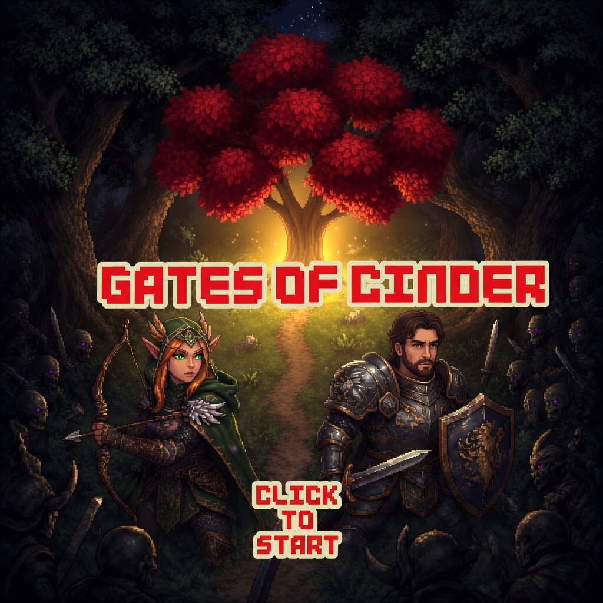
  </a>
</div>
<p align="center">

<p align="center">
  <a href="https://uob-comsm0166.github.io/2026-group-10/"></a>
  &nbsp;
  <a href="https://github.com/user-attachments/assets/e5714464-b8fa-4128-9a1e-358c666b6158"></a>
  &nbsp;
  <a href="https://github.com/orgs/UoB-COMSM0166/projects/153"></a>
</p>

https://github.com/user-attachments/assets/e5714464-b8fa-4128-9a1e-358c666b6158
<p align="center">
  <sub>
    Music: Sakura Breeze by Roa /
    https://soundcloud.com/roa_music1031 /
    License: Creative Commons — Attribution 3.0 Unported — CC BY 3.0<br>
    Free Download / Stream: https://links.al/5RD
    Music promoted by Audio Library: https://links.al/youtube
  </sub>
</p>
<h1 align="center">🎮 How to Play </h1>

### Play Online 
Gates of Cinder is hosted on GitHub Pages, so you can jump straight into the action without any installations!
1. Click ‘**PLAY GAME**’ button above. If it does not open, launch your browser, Chrome is recommended, and go to: https://uob-comsm0166.github.io/2026-group-10/ 
2. The game will load instantly.
3. On the main screen, select ‘Start Game’ to begin character selection, or choose ‘Intro’ for a quick overview of the game lore and controls.

### Run locally (for Development or Offline Play)
For those looking to modify the code or play offline, you can host Gates of Cinder locally:
1. Clone the repository:<p align="center">


   ```bash
   git clone https://github.com/UoB-COMSM0166/2026-group-10.git
   cd 2026-group-10/docs
   ```
2. Launch the server: Use `npx` to start a local environment:
   
   ```bash
   npx http-server -c-1 -p 8000
   ```
3. **Play:** Open Chrome and navigate to `http://localhost:8000/`


<h1 align="center">Table of Contents</h1>

<div align="center">

| #  | Section | Description |
|----|---------|-------------|
| 0 | [Introduction](#introduction) | Game overview and key idea |
| 1 | [Requirements](#requirements) | Ideation, use cases and user stories |
| 2 | [Design](#design) | System architecture, state machine & class diagrams |
| 3 | [Implementation](#implementation) | Key technical work and challenges |
| 4 | [Evaluation](#evaluation) | Qualitative and quantitative testing |
| 5 | [Testing](#testing) | Testing strategy and results |
| 6 | [Process](#process) | Team workflow and reflection |
| 7 | [Conclusion](#conclusion) | Lessons learnt and future work |
| 8 | [Sustainability](#sustainability-ethics-and-accessibility) | Responsible design considerations |
| 9 | [Contribution](#contribution) | Individual contributions |
</div>

<h1 id="group-members" align="center">Group Members</h1>


<div align="center">

| Name                 | Email                 | Github Username       |
| -------------------- | --------------------- | --------------------- |
| Dhanitha Rajapaksa   | we25139@bristol.ac.uk | dhanitha-26           |
| Cenarius Lu          | ig25518@bristol.ac.uk | Shadow-Song           |
| Rajmugundhan Nagappan| je25549@bristol.ac.uk | Rajmugundhan2002-tech |
| Ayush Raizada        | ff25412@bristol.ac.uk | Raizada8              |
| James Crossley       | qe25280@bristol.ac.uk | jamescr1              |
| Jinhao Han           | bt25224@bristol.ac.uk | memoryzea             |

</div>

<h1 id="repository-structure" align="center">Repository Structure</h1>

```
project/
├── index.html ← Entry point
├── README.md ← Documentation
├── docs/
├── images/ ← README assets
│ 
├── src/
│   ├── FrontEnd/
│   │   ├── Asset/
│   │   │   └── AssetSheet.js ← Assets
│   │   ├── Output/
│   │   │   ├── Render.js ← Rendering
│   │   │   ├── Sound.js ← Audio
│   │   │   └── UI.js ← UI
│   │   ├── Scenes/
│   │   │   └── SelectCharacterScene.js ← Character select
│   │   ├── Input.js ← Input
│   │   └── Main.js ← Entry
│   │
│   ├── Game/
│   │   ├── Entity/
│   │   │   ├── Skill/
│   │   │   │   ├── Archmage.js ← Archmage skills
│   │   │   │   ├── Buff.js ← Buffs
│   │   │   │   ├── Skill.js ← Base skill
│   │   │   │   ├── SkillEntity.js ← Skill entities
│   │   │   │   └── Warrior.js ← Warrior skills
│   │   │   └── Unit/
│   │   │       ├── Enemy/
│   │   │       │   └── Boss.js ← Boss
│   │   │       ├── Hero/
│   │   │       │   ├── Architect.js ← Architect
│   │   │       │   ├── Archmage.js ← Archmage
│   │   │       │   └── Warrior.js ← Warrior
│   │   │       ├── Objective.js ← Objective
│   │   │       └── Unit.js ← Base unit
│   │   │
│   │   ├── Utils/
│   │   │   ├── Clock.js ← Timing
│   │   │   └── EventEmitter.js ← Events
│   │   │
│   │   ├── World/
│   │   │   ├── Forest.js ← Map
│   │   │   └── World.js ← World
│   │   │
│   │   ├── GameManager.js ← Manager
│   │   └── Worker.js ← Backend
│   │
│   └── Library/
│       └── Tone.js ← Audio lib
│
├── videos/
└── weeklyupdates/
```
<h1 id="introduction" align="center">Introduction</h1>

**Gates of Cinder** is a browser-based game, built with the **p5.js** library, that fuses tactical tower defence with the immersive progression of an RPG. The action unfolds within an ancient forest where players must safeguard the Corona Tree, a vital life source currently under siege by a rising tide of the undead.

To defend the woodland, players choose from three distinct heroes to repel enemy waves, culminating in a final boss encounter. Success depends on the clever placement of defensive towers and the precise use of hero abilities to halt enemies as they march along fixed paths.

The game introduces a high-stakes mechanic where the hero's life and the tree's survival are bound together; if either is lost, the mission fails. Players can adapt their strategy by selecting the hero that best fits their playstyle:

- **The Warrior:** A powerhouse in close-quarters combat.
- **The Mage:** A specialist in devastating long-range spells.
- **The Engineer:** A tactical expert who utilises advanced machinery and technology.

With its retro visual style and a **Diablo-inspired user interface**, Gates of Cinder challenges players to constantly refine their tactics, making every victory feel earned and every level uniquely rewarding.

<h1 id="requirements" align="center">Requirements</h1>

## 3.1. Ideation Process 

In the early stages of our project, we began by exploring what inspired us. Each team member brought one or two games to an in-person meeting, sharing what captivated them whilst considering the practical constraints of developing from scratch. After an initial round of ideas shared via our team group chat, we met to pitch specific inspirations. This resulted in a split between three very distinct genres: tower defence, RPG, and arcade. 

After analysing the strengths of each, the team identified a unique opportunity to create a hybrid mechanic. Rather than replicating existing titles, we decided to integrate the management strategy of _Kingdom Rush_ with the hero-centric mechanics of Diablo 2. Tower defence games offered proven engagement through strategic placement and resource management, whilst action RPGs provided the visceral satisfaction of character progression and skill-based combat.

With this direction established, we divided the research effort. Each team member investigated specific game rules, dynamics, and development challenges to ensure our hybrid concept remained feasible within our technical constraints and timeline. 

<table width="100%">
  <tr>
    <th align="center" width="50%">Kingdom Rush - Strategy Tower Defence</th>
    <th align="center" width="50%">League of Legends - RPG Combat</th>
  </tr>
  <tr>
    <td align="center">
      
    </td>
    <td align="center">
      
    </td>
  </tr>
</table>


#### **Paper Prototypes** 

<table align="center" width="80%" style="margin: auto; text-align: center;">
  <!-- ROW 1 -->
  <tr>
    <td width="50%" style="padding: 10px;">
      
    </td>
    <td width="50%" style="padding: 10px; vertical-align: middle;">
      <h3>Prototype 1: Frogger</h3>
      <p>
        A classic 1980s arcade game in which the player controls a frog attempting to cross a busy road and a hazardous river. The goal is to safely guide the frog to its home while avoiding traffic and moving dangers.
      </p>
    </td>
  </tr>

  <!-- ROW 2 -->
  <tr>
    <td width="50%" style="padding: 10px;">
      
    </td>
    <td width="50%" style="padding: 10px; vertical-align: middle;">
      <h3>Prototype 2: Tower Defence RPG</h3>
      <p>
        A hybrid of tower defence and role playing mechanics, where the player must protect a magical tree from waves of enemies. Players can cast spells, use special abilities, and purchase upgrades from an in game store to strengthen their defences.
      </p>
    </td>
  </tr>
</table>

#### **Initial Design Sketches** 
Once we had finalised the core RPG mechanics, we moved straight into sketching the layout for the UI, mapping out the health and mana globes, the skill bar, and the map. We also drafted designs for the character view, currency system, and wave tracker, focusing on a Diablo-inspired aesthetic to keep all the vital stats and progression markers easy to read during the chaos of combat.

<table align="center" width="80%" style="margin: auto; text-align: center;">
  <tr>
    <td align="center">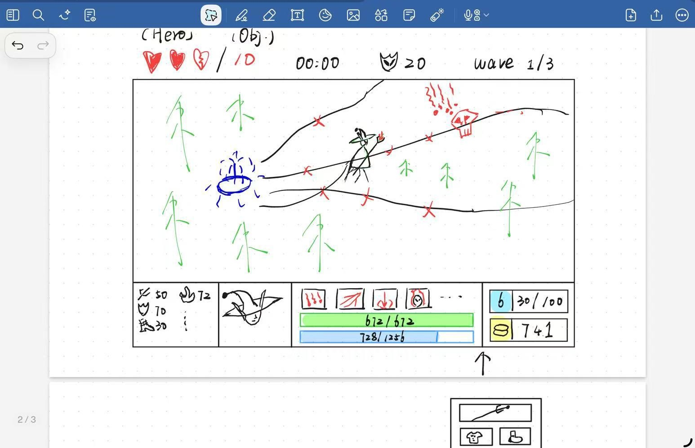 </td>
  </tr>
  <tr>
    <td align="center">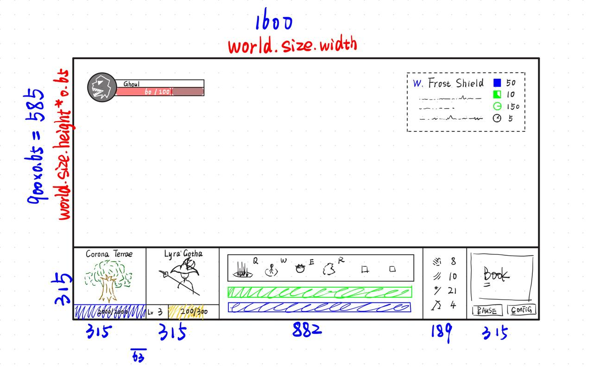</td>
  </tr>
</table>

## 3.2. Stakeholders
The stakeholder diagram below organises the groups involved in our project into rings, starting from the core game and moving outwards.


<div align="center">

Onion Model of the System

</div>

At the core is the Gates of Cinder Game, surrounded by direct stakeholders such as the developers, product owners, UI/UX designers, and the Scrum Master. These individuals focus on building the game according to best practices while ensuring that the product owners vision aligns with technical delivery.

The next ring contains indirect stakeholders, including testers, peer reviewers, and experts acting as assessors. Their role is to provide the feedback necessary for the team to refine the gameplay and fix bugs during the development process. Beyond this, external stakeholders such as the university, classmates, and hosting platforms provide the infrastructure and final validation for the project.

Finally, the wider environment encompasses the broader technical and legal landscape, including p5.js, GitHub, and regulatory bodies like GDPR. These elements influence the project's long-term viability and professional standards, which we must consider to satisfy future employers. 

## 3.3. Epics and User stories

Through the process of creating epics, user stories and acceptance requirements, we obtained a greater awareness of the range of stakeholders our game has. We also developed a deeper understanding of the context that our game exists in.

By creating epics, we learned of the different sub-categories of users our game may have, such as users with visual impairments and users with other disabilities. An increased awareness of the importance of the different categories of developers involved in the game, such as ‘front-end developers’ and ‘back-end developers’ was also acquired.

Creating user stories permitted us to obtain a better insight into the perspective of the user of our game and what features they might value in our game. As a result of this process, a greater appreciation of the reasons why users might highly value certain features of the game, such as a dynamic strategic combat system or progressive map experience, was developed.

The process of producing acceptance criteria helped to give precise, actionable data to the team with regards to how a specific feature, or aspect of the game, should be implemented. Generating acceptance criteria also provided the team with measurable criteria against which we could measure the success of our sprints and general game development.

By considering the plethora of stakeholders around our game, we gained a better understanding of the diverse range of people who may have interests in our game and the importance of considering these people when making decisions regarding the development of our game.

**Epic 1:** Varied and exciting gameplay

>**User Story:** As a casual gamer, I want the game to have a variety of heroes available to me so that the game is interesting for me and holds my attention
Acceptance Criteria: Given that I am playing on a map in the game, when I choose which hero to play, then I should be able to choose from different types of abilities.

**Epic 2:** Progressive map experience

>**User Story:** As a passionate gamer, I want to be able to progress from one map to the next map as if the game is a progressive story so that the game feels exciting and fulfilling
Acceptance criteria: Given that I am playing the game, when I have successfully completed the first map, then I should be able to play on a second map which is different to the first

**Epic 3:** Dynamic strategic combat system

>**User Story:** As a gamer, I want to have to adapt my strategy to account for different enemies, so that I am rewarded for strategic planning and tactical tower placement

**Epic 4:** Scalability and readability

>**User Story:** As a developer,I dont want to waste time in reading the code, so the code  is commented throught so that any developer can read the code and scale the code or improve the current one so that the system need not be bulid ground up.

**Epic 5:** XP system and gold

>**User Story:** As a player,according to the selected hero must purchase the correct abilities and use gold gained from defeating enemies mindfully to defend the objective.If the abilties are not bought or used before hand,it becomes hard to defend the objective.

## 3.4. Use Case Diagram

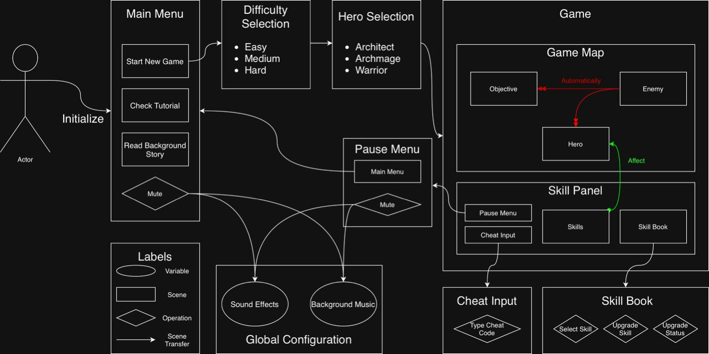

The use case diagram outlines the primary ways a player interacts with the game, ranging from engaging with the lore to selecting a hero and choosing a difficulty level. It maps out the essential game flow and core objectives, detailing how players navigate through various features. The table below provides a concise summary of the interactions shown in the diagram.

<table align="center" width="80%" style="margin: auto; text-align: center;">
    <tr>
      <th>Category</th>
      <th>Use Cases</th>
    </tr>
    <tr>
      <td>Pre-Game Actions</td>
      <td>Start Game, View Lore, Select Hero (Hugo Fortis), Select Difficulty</td>
    </tr>
    <tr>
      <td>Core Gameplay</td>
      <td>Enter Battle (Play Game), Kill Enemies, Defend Corona Terrae</td>
    </tr>
    <tr>
      <td>Combat & Skills</td>
      <td>Use Hero Abilities, Build/Place Towers (Engineer Only)</td>
    </tr>
    <tr>
      <td>Progression</td>
      <td>Earn XP, Level Up (Spend Skill Points)</td>
    </tr>
    <tr>
      <td>Resources</td>
      <td>Earn Gold </td>
    </tr>
    <tr>
      <td>Upgrades</td>
      <td>Upgrade Skills / Equipment, Turret Blueprints</td>
    </tr>
    <tr>
      <td>Maintenance</td>
      <td>Repair Corona Terrae</td>
    </tr>
    <tr>
      <td>Outcomes</td>
      <td>Win Game (All Waves Cleared), Lose Game (Corona Terrae Destroyed)</td>
    </tr>
</table>

<h4 align=“left">Feature Priority</h3>

|Priority Rank - High to Low|System / Features|Time Taken|
|-|-|-|
|HIGHEST|Hero - Implement the stats screen funcitons of Hero system.|14%|
|HIGHER|Enemy - Design the emeny behavior.|13%|
|HIGH|Buff & Equip - Implement the Buff and Equipment functions, which effect the stats screen.|15%|
|MID|Skill - Design the skill tree. And implement the active skills with buff, projectile or target entity.|15%|
|LOW|Controll & Manager - Get the input from p5 libary and apply it to hero controll. Implement the game loop manager.|15%|
|LOWER|Turrent & UI - Design the turrent. And create a UI system.|14%|
|LOWEST|Boss - Design the Boss with active skills. Test the game.|14%|

<h1 id="design" align="center">Design</h1>


## 4.1. System Architecture

The technical foundation of Gates of Cinder is built upon a dual-process model that separates the `Main` thread from a dedicated `Worker` thread. This division ensures that the game remains responsive and maintains a high frame rate, as the visual processing is decoupled from the complex logic updates.

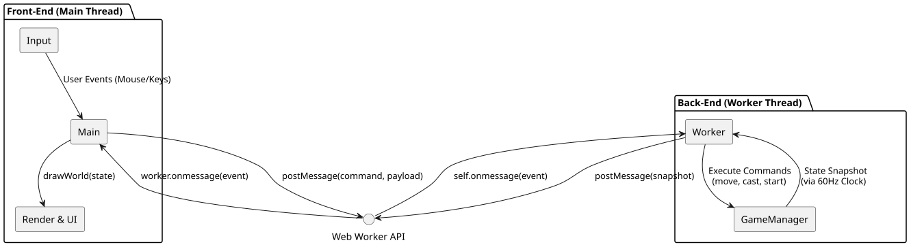

Our development was guided by three central concepts:
- Asynchronous Processing: Separating heavy game logic into a Worker thread to keep the Main thread responsive for rendering and input.
- Encapsulation: Each entity and system, from buffs to skill entities, manages its own state and specific internal logic.
- Inheritance and Reusability: A strict class hierarchy allows for shared movement and combat logic across heroes, minions, and bosses.

#### Core System Components

The overall architecture is built upon four key subsystems that work together to deliver the gameplay experience:

1. **Worker Process (Game Logic)**  
   Contains the core simulation and runs independently of the rendering loop. It is managed by the `GameManager`, which coordinates the game clock and event system.  
   - Handles all entity updates, movement, collision detection, and skill resolution.  
   - Manages the class hierarchy including `Entity`, `Unit`, `Hero`, `Enemy`, and `Boss`.  
   - Processes skills, buffs, and their effects on each game tick.

2. **Entity System**  
   A hierarchical object-oriented structure built around the base `Entity` class.  
   - All movable objects inherit from `Entity`, which provides movement and pathing capabilities.  
   - `Unit` extends `Entity` with health, survival logic, and buff management.  
   - Specialised subclasses (`Hero`, `Enemy`, `Boss`) introduce distinct attributes and behaviours while reusing common functionality.

3. **Skill and Buff System**  
   Two independent but complementary systems that modify the game world:  
   - `Skill` classes manage casting logic, cooldowns, and target acquisition.  
   - Six specialised `SkillEntity` types (`Missile`, `Projectile`, `Aura`, `Area`, `Guardian`, `Tower`) handle different forms of skill delivery.  
   - `Buff` instances are applied to units and updated each tick to alter attributes such as speed, armour, and health over time.

4. **Rendering and Visuals**  
   Responsible for all user-facing elements, including rendering, UI, audio, and input handling.  
   - Requests lightweight snapshots from the `Worker` each frame, decoupling the rendering frame rate from the simulation tick rate.  
   - Handles sprite rendering with directional animations and correct depth sorting for the 45-degree projection.  
   - Displays real-time information through the UI and provides toast notifications for important game events.

**Sound**

The audio system consists of two separate tracks: Background Music and Sound Effects.

To optimise memory usage, the Background Music system uses MIDI files to store musical scores. These files are loaded into the Tone.js MIDI library for playback. To create a gentler listening experience, sine waves are used exclusively for BGM, as they produce a softer tone compared to triangle or square waves.

Only one MIDI track can play at any time. The system automatically detects key in-game events such as boss encounters, player deaths, and respawns, and switches to the appropriate background track accordingly.

Sound effects follow a retro style inspired by the Nintendo Entertainment System, utilising two square waves, one triangle wave, and one noise channel. The system monitors game events such as skill entity creation, collisions with units, and unit deaths, and plays the corresponding sound effect for each.

**Input**
The `Input` system captures keyboard and mouse events through the `p5.js` library. Player inputs are translated into commands and sent to the `Worker` process. Examples include right-clicking to set a movement target point, pressing the ‘S’ key to stop current actions, and using the space bar to pause the game.

After each command is sent, the `Worker` returns a status response. Valid commands are executed within the game logic, while invalid ones trigger appropriate feedback, such as toast notifications displayed by the `UI`.

**Execution Sequence**
The game menu is organised into multiple scenes, allowing players to navigate by clicking buttons. When the player clicks ‘Start Game’, the following sequence occurs:

1. The selected hero configuration is passed to the `Worker` process.
2. Required assets are loaded and the `UI`, `Sound`, and `Render` systems are initialised.
3. A new `GameManager` instance is created and the `game:start` command is issued.

The Menu passes three parameters to the Main process: `Hero`, `Category`, and `World`. The Main process then initialises the `UI`, `Sound`, and `Render` modules, calculates the necessary assets to load, and once loading is complete, creates the `Worker` process, instantiates the `GameManager`, and starts the game.

During gameplay, the `GameManager` can be terminated using a dedicated command. Once created, the `GameManager` initialises its core tools (`Clock` and `EventEmitter`) and sets up the hero, target points, and enemy spawn locations. It then begins continuously updating the position and status of all entities and enters the main game loop.

## 4.2. Class Diagrams

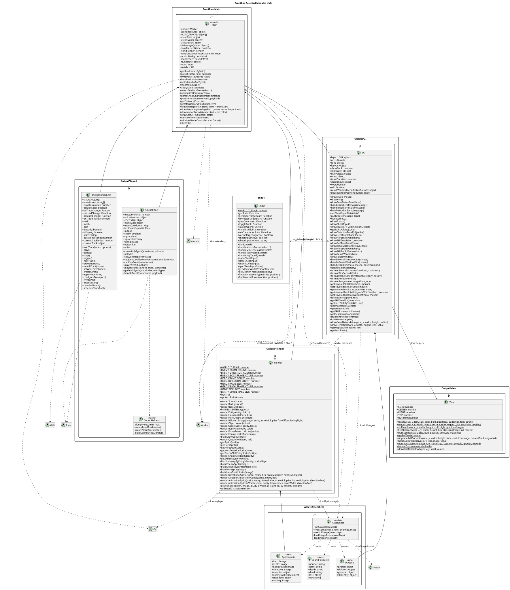
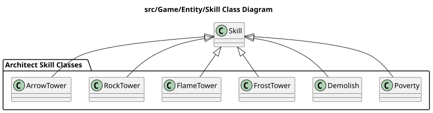
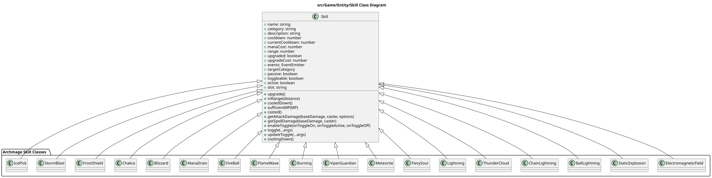
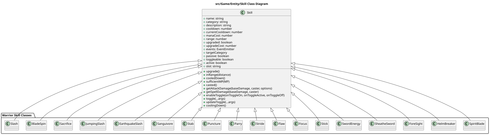
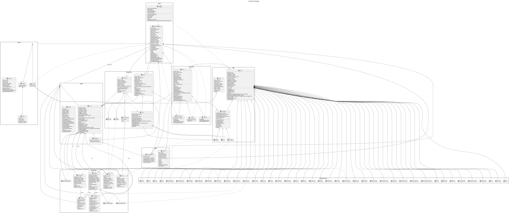

**All diagram were made using PlantUML.**

## 4.3. Sequence Diagram

**Skill Cast Sequence Diagram**

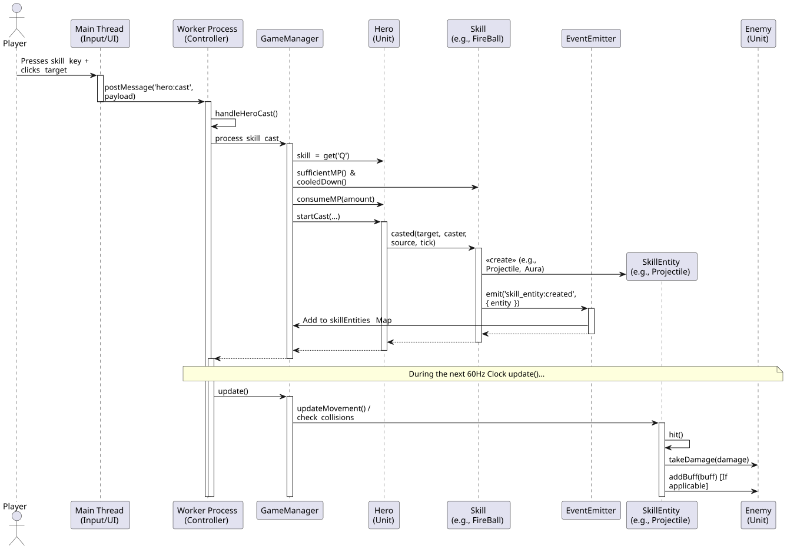

#### Menu Navigation Class Diagram

The above class diagrams demonstrate the game's menu system and class structure.`Sketch.js` acts as a controller class. It maintains a reference to the current `activeScene` and delegates behaviour to the active scene. Since the different scene classes share common behaviour and state, they were conceptually grouped under an abstract Scene type. Although an abstract Scene class was not explicitly implemented in the code,  this conceptual model of an abstract Scene 'type' provided a common interface which facilitated polymorphic behaviour in practice, thus enabling `Sketch.js` to treat all scenes uniformly.

Since buttons only exist within a scene, a composition relationship exists between the `Button` class and `Scene` class. The `Button` class encapsulates all logic relating to a menu UI element that a user can interact with, such as click detection and associated actions triggered by user clicks. This encapsulation facilitated modularity, contributing to a more understandable and maintainable codebase. 
#### Scene-switching Sequence Diagram


The above sequence diagram illustrates the flow of the game's menu scenes and how user button clicks cause scene-switching to occur. The process of scene-switching is initiated when the user clicks a `button` on one of the menu screens; this causes the `mousePressed()` function in `sketch.js` to run. This function delegates the click event to the `mousePressed()` method of the current `activeScene`.

`activeScene` then iterates through all of its buttons, calling the `wasIClicked()` function for each one. If the `wasIClicked()` function verifies that this button was indeed the one the user clicked, it will invoke its `onClick()` callback function that was passed to the button during the button's creation. Since the `onClick()` method is stored within the button that invokes it, it is represented in the sequence diagram by an arrow from the button pointing back to itself (a self-call).

## 4.4. State Machine
 
The following state diagram illustrates the core architectural flow of our game, mapping the transitions between primary states such as the Main Menu, Active Gameplay, and the Game Over sequence. It provides a comprehensive visual breakdown of how the hero interacts with the world and how critical mechanics, including gold accumulation, experience (XP) gain, and the death/respawn cycle, are integrated into the loop.

By tracing the logic within this diagram, one can observe the player's progression through the game environment and the intricate way various system elements interface with the core engine to create a cohesive experience.

<p align="center">
  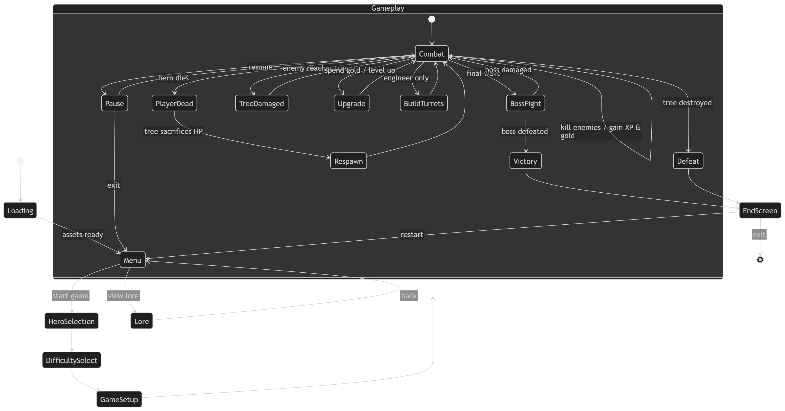
</p>

<h1 id="implementation" align="center">Implementation</h1>

Throughout development, we faced a number of complex technical hurdles. These key systems are explored in greater detail below.

## 5.1. **Challenge 1: Multithreading**

The game’s logic and front-end are completely decoupled and run independently on separate threads. The front-end serves as the main entry point for the game. Upon initialisation, it creates a dedicated background thread (the Worker), on which the core game logic executes in a continuous loop.

The game logic runs on this Worker thread at a fixed tick rate of 60 updates per second. It is responsible for all core simulations, including entity movement, collision detection, damage calculations, and state management. Importantly, the Worker does not handle any input or output directly. Instead, it receives messages from the main thread and executes the appropriate functions to modify the game state accordingly.

The front-end (main thread) is responsible for all user facing operations: rendering the scene, playing sound effects, managing the user interface, and processing hardware input from the mouse and keyboard. To display the game correctly, the front-end periodically requests snapshots of the current game state from the Worker thread. These snapshots contain essential information such as the hero’s health, the position of every entity, and other dynamic elements. Meanwhile, player input is captured on the main thread, translated into structured commands, and sent to the Worker for processing.

Each game instance is managed by a `GameManager` class, which provides two essential tools: a `Clock` and an `EventEmitter`. The Clock handles timing-related functionality for the game logic, including manual updates, starting, pausing, and resuming the simulation. The `EventEmitter` enables clean communication between different parts of the codebase by broadcasting events, each consisting of an `id` and an optional `payload`. This system allows classes to listen for specific events and respond accordingly in a decoupled manner.

At the start of the programme, initialise the `Worker`process.

```JavaScript
const worker = new Worker(new URL('../Game/Worker.js', import.meta.url), { type: 'module' });
```

Communication between the main thread and the Worker is achieved using the `postMessage()` API. Commands, along with their associated payloads, are sent from the main thread to the Worker. Each command includes a unique random identifier to help track responses and ensure reliable messaging.

```JavaScript
function postCommand(command, payload = null) {
    const cheatChangeHero = parseCheatChangeHero(command);
    if (cheatChangeHero) {
        if (typeof initializeGamePresentation === 'function') {
            initializeGamePresentation(cheatChangeHero);
        }
        window.gameState.selectedCharacter = cheatChangeHero;
    }

    const requestId = `${command}:${Date.now()}:${Math.random().toString(36).slice(2, 8)}`;
    worker.postMessage({ command, payload, requestId });
    return requestId;
}
```

In the Worker, incoming messages are handled via `self.onmessage`. Once a message is received, it is processed and routed to the appropriate handler based on the command type.

```JavaScript
self.onmessage = (event) => {
    const { command, type, payload, requestId } = event.data ?? {};
    const normalizedCommand = typeof command === 'string' ? command : (typeof type === 'string' ? type : '');
    ...
}
```

Once the message has been received, it is processed, and the flow proceeds to different branches depending on the content of the command.

```javascript
function handleGameCommand(command, requestId, payload = {}) {
    if (command === 'game:start') {
		    ...
    }

    if (!requireGame(command, requestId)) {
        return;
    }

    if (command === 'game:pause') {
        ...
    }

    if (command === 'game:resume') {
        ...
    }
}
```
In summary, the steps are：

+ `Main.js: new Worker(...)` ->
+ `Main.js: postCommand()` -> 
+ `Main.js: worker.postMessage(...)` ->
+ `Worker.js: self.onmessage` ->
+ Based on the `command`, call the corresponding `handler`

**Advantages of this architecture:**
1. **Security:** The Worker only accepts a predefined set of valid commands, preventing clients from directly calling functions related to internal game logic.
2. **Performance:** By leveraging multiple threads, the game can make better use of modern multi-core processors, resulting in smoother gameplay and more efficient resource utilisation.
3. **Future-proofing:** This separation of concerns lays a strong foundation for future features such as multiplayer support, where game logic may eventually run on a dedicated server.

<p align="center">
  
</p>
<p align="center"><em>Input from user to move hero</em>

<p align="center">
  
</p>
<p align="center"><em>Rendering of enemies</em>
  
## 5.2. **Challenge 2: Skills and Buffs**

Each hero is equipped with a diverse set of abilities, which players can customise via the Skill Book system. Based on hotkey bindings, skill types include A, Q, W, E, R, and passive skills. Architecturally, every ability is a subclass of the base `Skill` class, inheriting core properties such as mana costs and cooldown timers. Most skills generate skill entities that can move and trigger hit detection. When a hit is detected, a callback function within the skill is executed, which may deal damage or apply debuffs.

```JavaScript
export class Missile extends Entity {
    ....
    hit() {
        if (this.damage) {
            this.target.takeDamage(this.damage, this.source);
        }
        if (this.effect && typeof this.effect === 'function') {
            this.effect(this.target);
        }
        this.finished = true;
    }
}
```
**The Casting Pipeline**

Once an ability identifies a valid target, it invokes the `casted` method. This function serves as the primary execution hub where the engine can instantiate a `SkillEntity`, apply a `Buff`, or modify the hero’s position.

```JavaScript
export class Stick extends Skill {
    constructor(events) {
        ...
    }

    upgrade() {
        ...
    }

    casted(target, caster) {
        ...

        const totalDamage = this.getAttackDamage(this.damage, caster);
        target.takeDamage(totalDamage, caster);
        emitWarriorAttackHit(this.events, caster, this, [target]);
        caster.restoreMP(15);

        if (!this.upgraded) {
            return;
        }

        caster.addBuff(new Buff(
            ...
        ));
    }
}
```
**Buff Mechanics and Lifecycle**

Buffs are status effects attached to units that modify their attributes, such as reducing movement speed. Most buffs are **time-limited**; once the duration expires, the buff is purged and its effects are reverted. When a unit is affected by multiple buffs with the same name, only the last buff applied will retain its effect.

```JavaScript
export default class Buff {
    constructor(...) {
        ...
    }

    onEffect(unit) {
        this.elapsed += 1;

        if (this.elapsed % this.effectPeriod === 0 && typeof this.effect === 'function') {
            this.effect(unit);
        }
    }

    clone() {
        return new Buff(
            ...
        );
    }
}
```
A buff's status is recalculated every frame to track its remaining duration and impact on the target unit. To prevent multiple units from sharing a single Buff pointer, multiple Buffs are created here to affect each unit individually.

```JavaScript
const staticFieldBuff = new Buff(
    'Static Field',
    'Affected by a charged static field.',
    'rgba(255, 255, 120, 1)',
    this.staticFieldDuration,
    () => {},
    false
);
```
Some buffs do not directly affect units; instead, they attach a token to the unit, which may be triggered by other abilities and cause additional effects.

**Architectural Evolution**

Initially, our design involved storing skill-related information in JSON files; however, we found that this severely limited the design of the skill mechanics, preventing us from creating complex systems. We therefore switched to implementing each skill as a separate class, which allows for more complex effects.

<p align="center">
  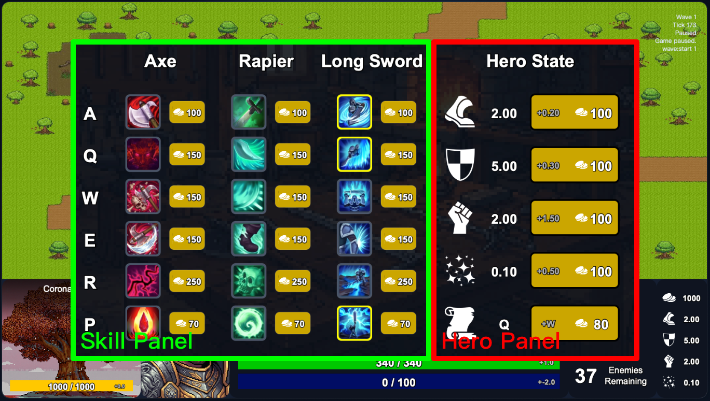
</p>
<p align="center"><em>Skill Book</em>

<h1 id="evaluation" align="center">Evaluation</h1>

This week, we invited other team members to try out the newly released version of our game. The overall gameplay response was largely positive, though a few issues were flagged along with a number of helpful suggestions and ideas shared throughout the session. The feedback gathered proved to be invaluable in helping us to better understand how players interact with the game and where improvements can be made. To obtain a well-rounded understanding of our game, we conducted several evaluation methods, including **Think Aloud Evaluation**, **NASA-TLX for workload assessment**, and the **System Usability Scale (SUS)**. These methods allowed us to assess different dimensions of the player experience, from usability and cognitive workload to overall satisfaction and interface design. 

## 6.1. Qualitative Evaluation

<p align="center">
  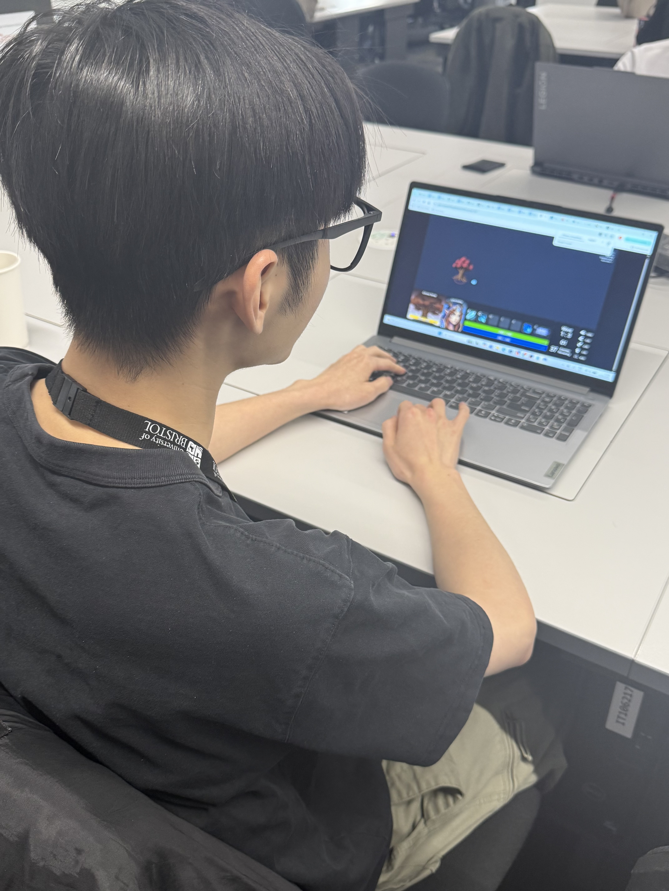
  <br>
  One of our participants evaluating the game
</p>

**Think Aloud**

Given its proven track record in Human Computer Interaction (Nielsen et al., 2002; Joe et al., 2015), the Think Aloud technique was deemed the most suitable qualitative approach for exploring player perceptions of the initial level design, difficulty, and core game concept.

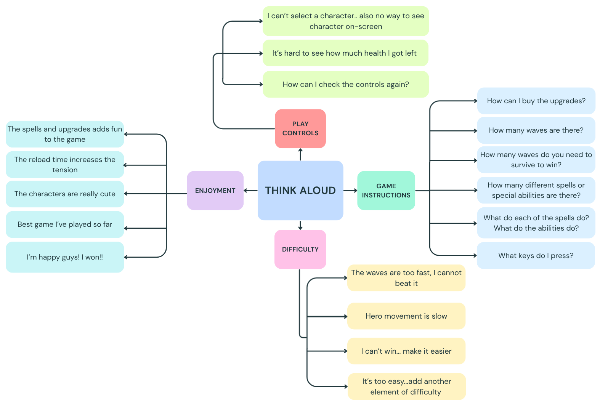
<div align="center">

Summary of Think Aloud Evaluation

</div>

**Methodology:**

A group of 6 participants (**N = 6**), made up of friends and classmates with differing levels of gaming experience, took part in the session and were asked to play the game for around 10-15 minutes. Throughout the gameplay, they were encouraged to verbalise their thoughts and reactions as they occurred, providing realtime commentary on their experience. With their permission, responses were captured using audio recordings, enabling us to analyse the feedback and draw out a number of recurring themes, with a particular focus on instances of confusion and engagement. The recurring themes were organised into a Thematic Map (see Figure 1 above), with the table below addressing each identified focus area, alongside some additional themes drawn from the map.

**Key Observations and Reactions:**

| Focus Area | Issue Identified | Solution |
|---|---|---|
| **Player Control** | 1. Lack of health and mana indicators. <br> 2. Current status of each skill, including remaining cooldown times, is unclear.  | 1. Health and mana bars added to the bottom of the screen. <br> 2. Cooldown indicators made more prominent and easier to read. <br> 3. Enemy health now displayed above each enemy. |
| **Game Instructions & Clarity** | 1. The absence of an instruction page makes it challenging for players to familiarise themselves with the game's controls, spells, hero mechanics, and other core elements. <br> 2. Players feel buttons are not responsive <br> 3. Lack of information on the objective/goal <br> 4. Unaware of how skill works| 1. Add an instruction page accessible by pressing "Esc". <br> 2. Introduced a tutorial screen that players must read through before proceeding, ensuring that they have a thorough understanding of the game's core mechanics and objectives prior to gameplay. <br> 3. Add a clearer objective health indicator in the bottom-left corner. <br> 4. Real-time feedback to clarify objectives. <br> 5. Enable tooltip box on-hover in the game action bar and skill shop.|
| **Difficulty** | 1. Game offers no difficulty settings. <br> 2. Enemy waves progress at a pace that many players found overwhelming. | 1. Add difficulty options, giving players the ability to choose between Easy, Medium, and Hard before beginning the game. <br> 2. Wave speed adjusted in-line with difficulty.|
| **Player Movement & Sounds** | 1. Movement felt sluggish <br> 2. Add music to the main game not just the Front-end| 1. Adjusted the hero's movement speed values. <br> 2. Added music.|

<table>
  	<tr>
    <td align="center" width="33%">
      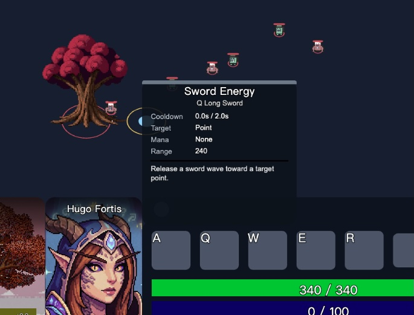
    </td>

   <td align="center" width="33%">
      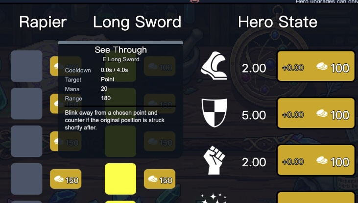
    </td>
</table>
<div align="center">

Added game action bar and store tooltips to provide clear, concise information on skills and abilities, including cooldown, target type, mana cost, range, and a brief description.
</div>

**Outcome:**

The implemented improvements showed clear results during follow-up testing, with players demonstrating greater confidence and notably less confusion while navigating the game. Usability and overall gameplay experience were meaningfully enhanced as a result. The use of Think-Aloud provided deeper insights into player concerns, helping the team address issues more effectively. However, we remain mindful that social desirability bias may have influenced some participants responses.


## 6.2. Quantitative Evaluation

To provide a quantitative counterpoint to our qualitative findings, we tasked ten participants (**N=10**) to play under both Easy and Hard conditions within a within-subjects framework. This allowed for an immediate assessment of workload via the **NASA Task Load Index (NASA-TLX)** and usability via the **System Usability Scale (SUS)** at the end of each session. We specifically tracked fluctuations in six specific dimensions of exertion: Mental, Physical and Temporal Demand, alongside Performance, Effort, and Frustration using the NASA-TLX. The resulting SUS scores were then compared to the established industry benchmark of 68, which serves as the baseline for acceptable functional usability. Any performance variations between the two modes were then analysed for statistical significance using the Wilcoxon signed-rank test (**α=0.05**).

**NASA-TLX: Workload Comparison**

**Individual Scores by Difficulty Level**

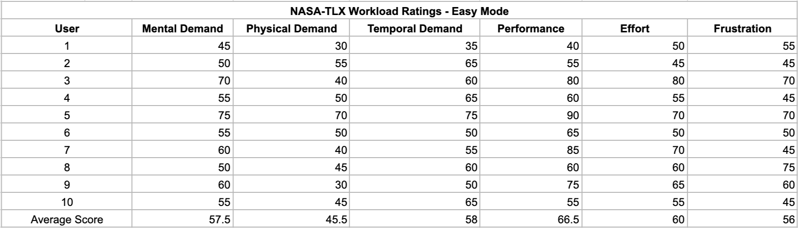
<p align="center">
  NASA-TLX participants' scores (Easy Mode).
</p>

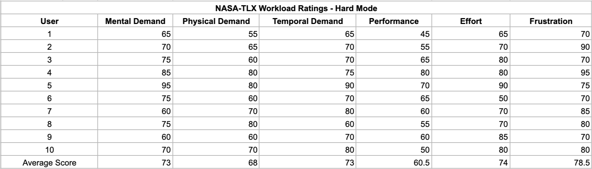
<p align="center">
  NASA-TLX participants' scores (Hard Mode).
</p>


**Observation:**
The data clearly highlights that **Easy Mode** resulted in a **lower overall workload** and **reduced frustration** for the players. The most notable observation, however, was that **Hard Mode** involved **heightened mental demand** and **effort**, which players felt more acutely during boss fights.

**Average Scores Comparison**

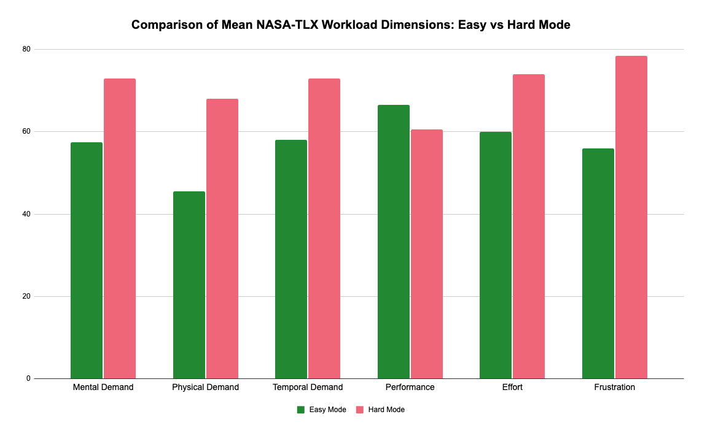
<p align="center">
  Mean NASA-TLX scores (N=10) by workload factor for Easy and Hard settings.
</p>

As shown in the bar chart, players experienced a significant surge in mental strain and effort when playing in Hard Mode. Interestingly, this increase in demand was accompanied by a slight decline in performance scores, indicating that participants perceived themselves as less effective.

**Radar Profile**

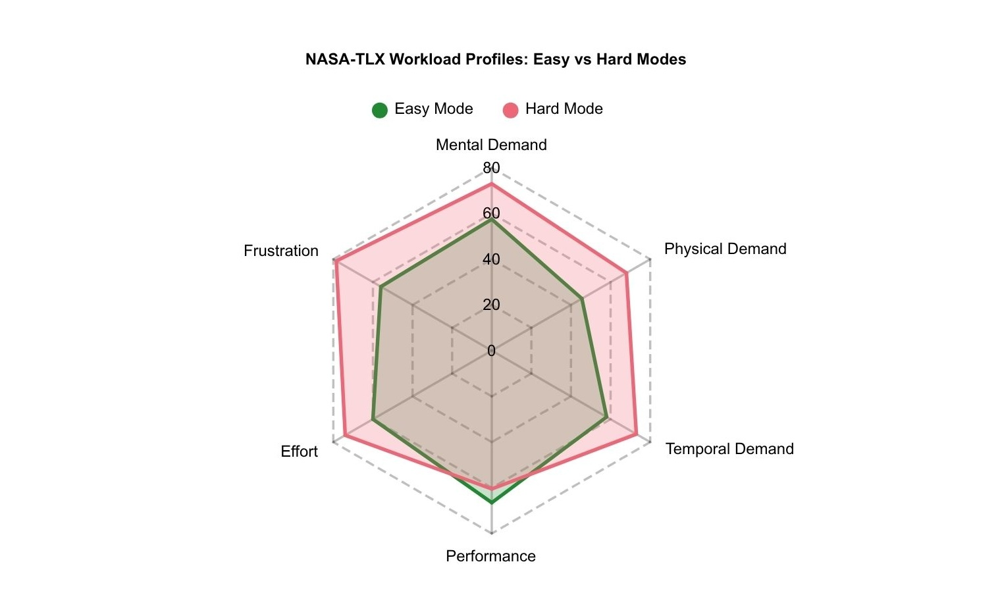
<p align="center">

<p align="center">
  NASA TLX - Multi-dimensional Workload Comparison: Easy vs. Hard Mode Workload profile
</p>


**Interpretation:**
The cognitively demanding experience characterised by Mental Demand and Effort reaching 73.0 and 74.0 respectively, aligns with our intention to scale the game’s difficulty. However, Frustration surged by over 22 points to a peak of 78.5, an important consideration for future iterations is balancing this high-pressure gameplay and rising frustration. 

**SUS: System Usability Scores**
The System Usability Scale (SUS) is a quick and robust tool for assessing the perceived usability of a system. It provides a reliable benchmark that allows for meaningful comparison against established industry standards.

The final SUS scores were calculated using the following standardised process:

For each question, the raw rating (1–5) on the Likert scale was first converted into a score ranging from 0 to 4:
- Odd-numbered questions: Rating – 1
- Even-numbered questions: 5 – Rating

The ten contribution scores were then summed (resulting in a total between 0 and 40). This sum was finally multiplied by 2.5 to produce the SUS score on a scale of 0 to 100.

**Easy Mode**

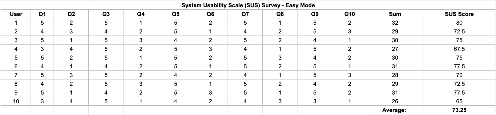
<p align="center">

<p align="center">
  SUS responses (Easy Mode)
</p>

**Hard Mode**

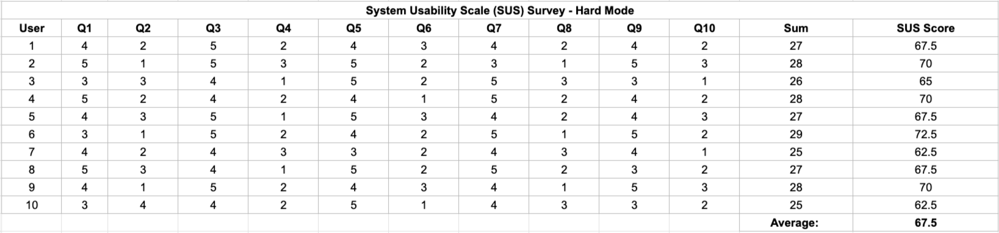
<p align="center">

<p align="center">
  SUS responses (Hard Mode)
</p>

**Chart**

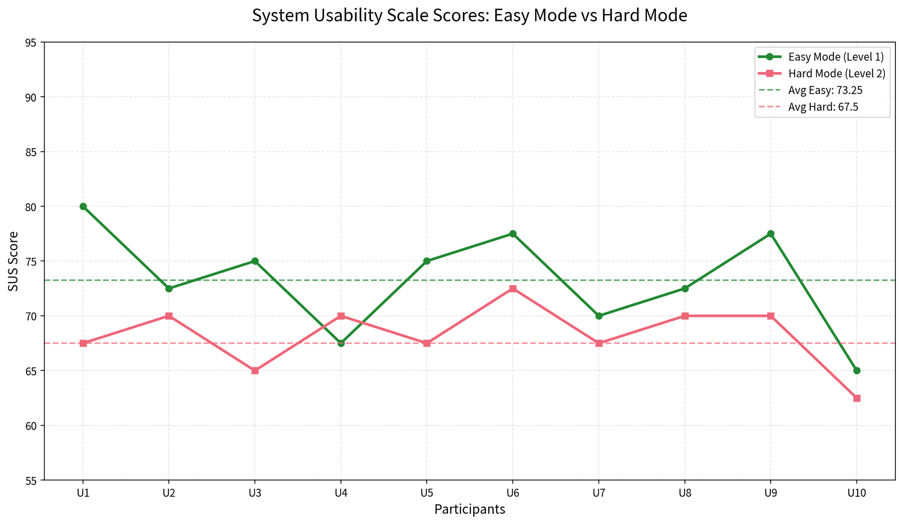
<p align="center">

<p align="center">
  Comparison of SUS scores (Easy vs Hard Mode)
</p>

**Interpretation:**

An SUS score of around 68 is widely regarded as average usability. In this study, Easy Mode achieved a mean score of 73.25, while Hard Mode scored 67.5. This places the overall usability of the game at an average level, with Easy Mode approaching good usability. Participants found Easy Mode straightforward to learn, intuitive to use, and generally user-friendly. Importantly, the increase in difficulty had only a modest impact on perceived usability. Players remained able to understand and engage with the core mechanics effectively in both versions. Although Hard Mode fell slightly below the average benchmark, this was anticipated given the greater complexity and cognitive demands.

<h1 id="testing" align="center">Testing</h1>

## 7.1. Black Box Testing

Black box testing was conducted to evaluate the external functionality of the game. This approach focuses on validating user interactions, system responses, and expected outputs based entirely on specific inputs, without examining the internal code structure.

The primary objective was to ensure that all core gameplay systems operated correctly from the player’s perspective. Test cases were structured around fundamental features, including scene transitions, hero locomotion, combat mechanics, tower construction, resource management, user interface feedback, audio triggers, and victory or defeat conditions.

#### 1. Game Scene Switching Test

| Test Case | Input | Expected Output | Observed Output | Status |
|---|---|---|---|---|
| 1.1 | Player enters Main Menu and clicks START | Game switches to Hero Selection page | Behaves as expected | Pass |
| 1.2 | Player selects Hero and confirms | Game switches to Difficulty Selection page | Behaves as expected | Pass |
| 1.3 | Player selects EASY / NORMAL / HARD difficulty | Game starts with selected difficulty | Behaves as expected | Pass |
| 1.4 | Player presses SPACE during gameplay | Game switches to Pause Screen and logic halts | Behaves as expected | Pass |
| 1.5 | Player presses SPACE again while paused | Game resumes from paused state | Behaves as expected | Pass |
| 1.6 | Player loses all HP of Corona Terrae | Game transitions to Defeat Screen | Behaves as expected | Pass |
| 1.7 | Player clears all enemy waves | Game transitions to Victory Screen | Behaves as expected | Pass |

<div align="center">

**Game Scene Switching Test**

</div>

#### 2. Hero Control and Movement Test

| Test Case | Input | Expected Output | Observed Output | Status |
|---|---|---|---|---|
| 2.1 | Player right-clicks valid ground tile | Hero moves to selected target point | Behaves as expected | Pass |
| 2.2 | Player right-clicks unreachable location | Hero remains in valid path area | Behaves as expected | Pass |
| 2.3 | Player presses S while moving | Hero stops immediately | Behaves as expected | Pass |
| 2.4 | Player rapidly issues movement commands | Hero updates to latest valid command | Behaves as expected | Pass |
| 2.5 | Player clicks while hero is stunned | Movement command ignored until stun ends | Behaves as expected | Pass |

<div align="center">

**Hero Control and Movement Test**

</div>

#### 3. Combat, Skills and Upgrade System Test

| Test Case | Input | Expected Output | Observed Output | Status |
|---|---|---|---|---|
| 3.1 | Hero attacks enemy unit | Enemy HP decreases | Behaves as expected | Pass |
| 3.2 | Enemy HP reaches 0 | Enemy dies and rewards granted | Behaves as expected | Pass |
| 3.3 | Player gains enough XP | Hero levels up | Behaves as expected | Pass |
| 3.4 | Player spends gold on skill upgrade | Skill level increases and gold deducted | Behaves as expected | Pass |
| 3.5 | Player activates targeted skill | Skill effect triggers on valid target | Behaves as expected | Pass |
| 3.6 | Player attempts upgrade without enough gold | Upgrade denied and toast shown | Behaves as expected | Pass |

<div align="center">

**Combat, Skills and Upgrade System Test**

</div>

#### 4. Tower Building, Objective and Resource Test

| Test Case | Input | Expected Output | Observed Output | Status |
|---|---|---|---|---|
| 4.1 | Engineer hero builds tower on valid tile | Tower created successfully | Behaves as expected | Pass |
| 4.2 | Player attempts tower on invalid tile | Placement rejected | Behaves as expected | Pass |
| 4.3 | Enemy attacks Corona Terrae | Objective HP decreases | Behaves as expected | Pass |
| 4.4 | Player repairs Corona Terrae with resources | Objective HP restored | Behaves as expected | Pass |
| 4.5 | Player collects gold/wood rewards | Resource counters increase | Behaves as expected | Pass |

<div align="center">

**Tower Building, Objective and Resource Test**

</div>

#### 5. UI, Visual Feedback and Audio Test

| Test Case | Input | Expected Output | Observed Output | Status |
|---|---|---|---|---|
| 5.1 | Player hovers over menu button | Button visually highlighted | Behaves as expected | Pass |
| 5.2 | Player clicks menu button | Selection sound plays | Behaves as expected | Pass |
| 5.3 | Boss appears in game | Boss BGM starts | Behaves as expected | Pass |
| 5.4 | Boss defeated | Music returns to standard BGM | Behaves as expected | Pass |
| 5.5 | Player receives invalid command | Toast notification displayed | Behaves as expected | Pass |
| 5.6 | Hero takes damage | HP UI updates immediately | Behaves as expected | Pass |

<div align="center">

**UI, Visual Feedback and Audio Test**

</div>


#### 6. Boundary Value Analysis (BVA) Test

| Test Case | Input | Expected Output | Observed Output | Status |
|---|---|---|---|---|
| 6.1 | Hero HP = 1 and receives 1 damage | HP reaches 0 and death triggers | HP reached 0; death triggered | Pass |
| 6.2 | Hero gains healing at maximum HP | HP remains capped at max | HP capped correctly | Pass |
| 6.3 | Gold exactly equals upgrade cost | Upgrade succeeds and gold becomes 0 | Behaves as expected | Pass |
| 6.4 | Gold is 1 below upgrade cost | Upgrade denied | Behaves as expected | Pass |
| 6.5 | Player spams movement keys rapidly | Hero remains controllable without crash | Behaves as expected | Pass |
| 6.6 | No target selected for targeted skill | Skill does not cast safely | Behaves as expected | Pass |
| 6.7 | Corona Terrae HP reaches exactly 0 | Defeat state triggers immediately | Behaves as expected | Pass |

<div align="center">

**Boundary Value Analysis Test**

</div>

<h1 id="process" align="center">Process</h1>

## 8.1. **Overview**

Our development process evolved considerably across the fourteen weeks of the project. We began with the intention of following a structured Scrum based agile methodology, but adapted toward a lighter coordination model as the project progressed. The result was a workflow that was informal in structure but consistent in communication and ultimately sufficient to deliver a complete, playable game.

## 8.2. **Methodology**

Throughout the entire project, we maintained a **Kanban board** to provide shared visibility into task status. We deployed **Agile methodologies** by planning two formal sprints to structure our development. The first sprint, lasting two weeks, focused on establishing the core architecture, translating our epics into GitHub issues, and populating the Kanban board. The second sprint spanned three weeks and covered the majority of feature implementation.

While our formal process frameworks were not always strictly executed due to the team's initial lack of experience with **Scrum**, our commitment to **Agile** principles remained. We found that the **Kanban** board served as an essential reference point, ensuring that tracking work was achievable even as we adapted to the project's timeline.

**The Kanban Workflow**
The board served as a central repository for all tasks, categorised into the following stages to maintain a clear workflow:

<div align="center">
  
| Task      | Description                                                                 |
|-------------|-----------------------------------------------------------------------------|
| Backlog     | General list of features and requirements not yet assigned to a timeframe. |
| To Do       | Specific tasks selected for the current development cycle.                 |
| In Progress | Items currently being implemented by team members.                         |
| Review      | Finished work awaiting verification or code refinement.                    |
| Done        | Fully integrated and functional components.                                |
  
</div>
 

<p align="center">
  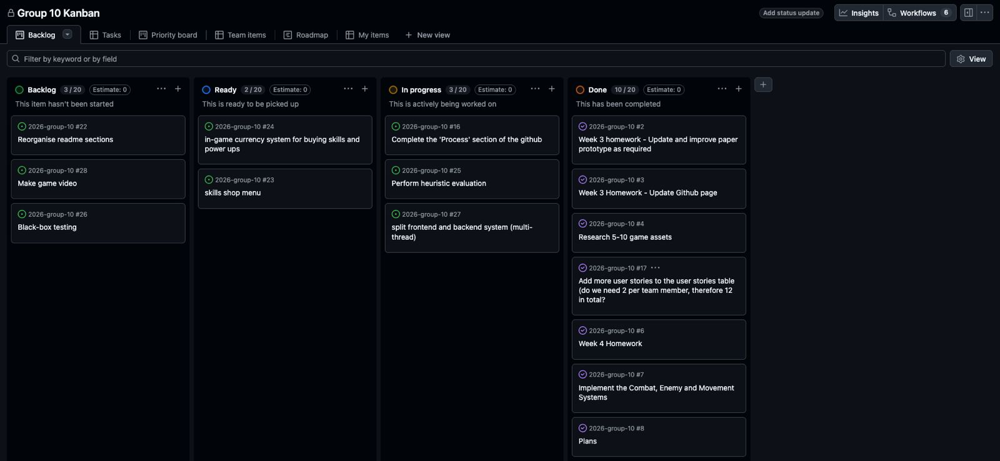
</p>
<p align="center">
  <em>The Kanban board was used to organise tasks, track progress, and manage the team’s workflow throughout the project</em>
</p>

<p align="center">
  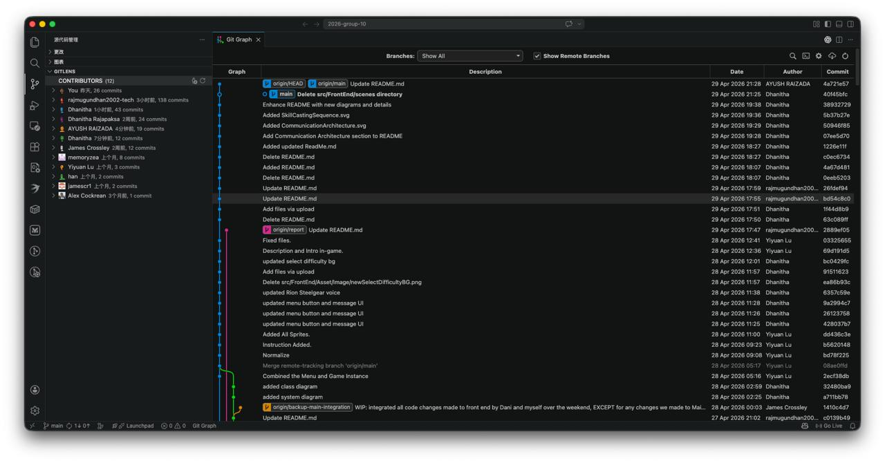
</p>
<p align="center">
  <em>GitHub was used to manage version control, and monitor the team’s development progress and collaboration</em>
</p>


## 8.3. **Communication and Meeting Cadence**

Communication was a significant strength within our process, underpinned by a consistent and reliable meeting schedule. The team convened at least three times weekly, utilising a hybrid approach of in-person sessions following scheduled labs and remote calls via Microsoft Teams. These gatherings served as the primary forum for sharing progress updates, making critical integration decisions, and resolving technical blockers.

To complement these structured meetings, we used WhatsApp for real-time coordination and rapid problem-solving. This platform proved effective due to its immediacy and familiarity, requiring no additional technical overhead. While formal process frameworks were applied inconsistently, our disciplined communication habits remained a constant, effectively compensating for weaknesses in other areas of the project.

<p align="center">
  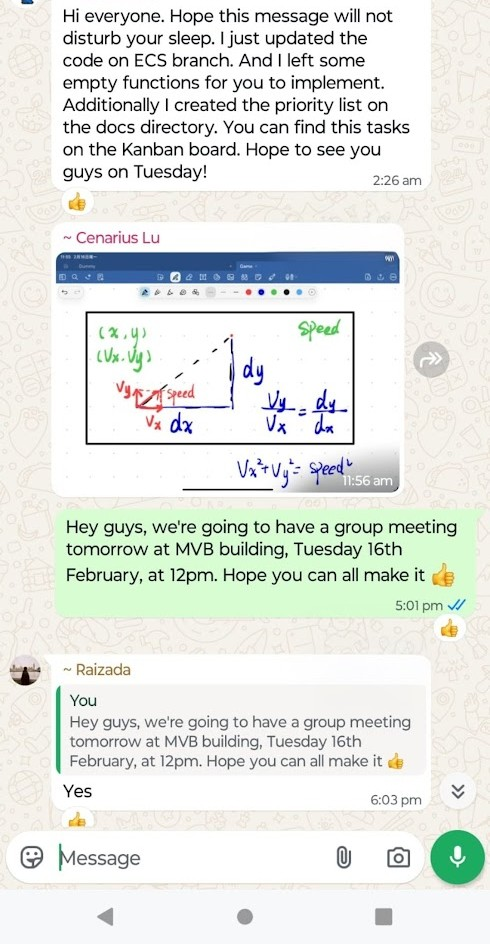
</p>
<p align="center">
  <em>We used whatsapp to arrange regular in-person meetings and facilitate real time updates on code development</em>
</p>

<p align="center">
  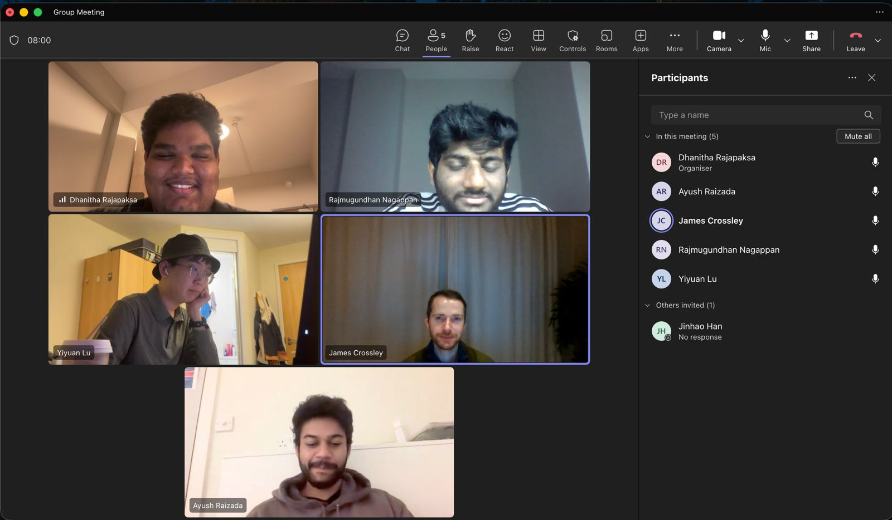
</p>
<p align="center">
  <em>Microsoft Teams was used to conduct regular online meetings, enabling collaboration, discussion, and progress updates among team members</em>
</p>

## 8.4. **Tools & Methods**


Our primary development environment was **JetBrains WebStorm**, which hosted the core system construction and front-end implementation. To ensure cross-platform compatibility, we tested the game extensively on **Safari** and **Google Chrome**. Team collaboration was facilitated through a **GitHub** repository, where we managed various work streams using Git branches. Tasks were assigned to individual team members, with all code eventually merged into the main branch to maintain a stable build.

For detailed information regarding the techniques and implementation methods used during development, please refer to the **Implementation section**.

**Art assets**
The game’s aesthetic is inspired by the fantasy setting of **World of Warcraft**. To achieve this look, we employed a multi-stage pipeline:

- **Generation:** We used **Google Gemini** to generate initial character profiles and background concepts.

- **Stylisation:** These images were processed through **PerfectPixel** to achieve a consistent pixel-art effect.

- **Refinement:** We utilised **Pixelmator Pro** for final colour grading and manual adjustments.

This workflow allowed us to create varied assets, such as hero profiles. For instance, once a hero was generated and pixelated, we used **Pixelmator Pro** to manually edit specific details, such as creating a black-and-white 'death state' version by modifying the eyes with the brush tool and adjusting the overall colour palette.


> Creating Hero Death Profile Using Pixelmator Pro.

To develop our animations, we used **Aseprite** to manually capture sprite textures from legacy titles. Once the essential keyframes were established, we modified the textures by altering clothing details and colour palettes. This approach allowed us to utilise existing animation skeletons as a foundation for our original characters. For instance, the majority of the hero's movement cycles were derived from **Diablo 2**, as its top-down perspective matched perfectly with our visual design, necessitating only minimal adjustments to the base textures.


> Using Aseprite to create Animation.

**Sound Asserts**

In our design choice, we separated the audio into two distinct tracks: one for background music (BGM) and another for sound effects. To keep memory usage low, the BGM system relies on MIDI files to store musical data, which are played via the Tone.js MIDI library. We chose to use sine waves to provide a softer and more pleasant listening experience than triangle or square waves. As part of our dynamic environment, the system detects in-game events like boss fights or player deaths to automatically switch to the most appropriate track.


**Skill Effects**

We prioritised gameplay clarity by focusing on skills that produce entity trajectories or affect the hero directly. In our design choice, we avoided overly complex mechanics, such as combining elemental skills or stealing abilities, to ensure the combat remained balanced. This allowed us to refine the core interactions and maintain a robust technical implementation.

**Asset Creation**

As part of our asset creation process, we took a hybrid approach where we sourced foundational textures and manually adjusted the colours and details to ensure a cohesive look across the game world. In our design choice, we used the software **Tiled** to construct the forest map, allowing us to assemble these modified assets into a structured environment. This process enabled us to create a unique visual style despite our limited background in digital art.

<p align="center">
  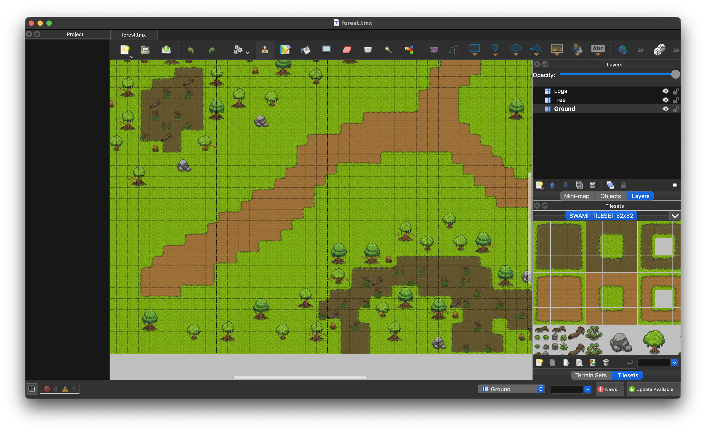
</p>

<h1 id="conclusion" align="center">Conclusion</h1>

## 8.1. **Reflection**

Looking back, developing Gates of Cinder took us through the entire process of creating a game from scratch. We started with just an idea and gradually worked through planning, designing systems, coding, and testing. One thing that became obvious quite quickly was how connected everything is. Features like the event system, combat mechanics, and wave spawning didn’t exist independently they relied on each other to function properly. Because of this, progress often depended on other parts being finished first, which sometimes slowed us down but also showed how important coordination is in a project like this.

Having a clear overall idea of what we wanted the game to be also made a big difference. Early on, we agreed that Gates of Cinder would combine tower defence with RPG style hero mechanics. That helped guide a lot of our decisions later. Whenever we disagreed on features or priorities, we could go back to that original idea and decide what actually fit the game.

## 8.2. **Lessons Learnt**

One of the biggest lessons we learned was about managing scope. At the start, we had a lot of ideas and wanted to include as many features as possible things like a shop system, skill tree, multiple heroes, extra maps, and an inventory system. In the end, this turned out to be too much for the time we had. Some of these features were started but never fully finished. If we were to do it again, we would focus much more on a smaller set of core features and make sure those are fully complete before adding anything extra.

Communication was another important factor. We used WhatsApp, Microsoft Teams, and a Kanban board to keep track of progress and tasks. This helped everyone stay on the same page and made it easier to see what still needed to be done. Without that, it’s likely we would have wasted time or ended up duplicating work.

## 8.3. **Challenges Faced**

The main challenge we faced was trying to balance what we wanted to achieve with what we could realistically complete. Early in the project, we were quite ambitious and began working on several features at once. However, as the deadline got closer, it became clear that we wouldn’t be able to finish everything to a good standard. Features like the shop system, hero selection (Archmage, Ranger, and Warrior), and the skill tree were all partially implemented but not fully completed. This showed us that incomplete features can actually be a problem, as they take time to develop but don’t fully add to the final product.

## 8.4. **Future Work**

If we had more time, the first thing we would focus on would be adding more enemies and maps. The way the game is currently structured makes this relatively straightforward, as enemy data is stored in JSON files and behaviours are handled in separate classes. This means new content could be added without major changes to the existing systems. Adding more variety would make the game more interesting and improve replayability.

After that, it would make sense to finish the systems we already started, such as the shop and full hero selection. Since the groundwork for these features is already there, completing them would be a logical next step and would significantly improve the overall experience.

<h1 id="sustainability-ethics-and-accessibility" align="center">Sustainability, Ethics, and Accessibility</h1>

## 9.1 Sustainability Awareness Framework (SusAF)

The impact of *Gates of Cinder* has been looked at using three main areas of the Sustainability Awareness Framework: environmental, social, and individual. These were chosen because they are the parts most affected by how the game was designed and built. The idea is to reflect on how our design decisions can affect sustainability in a simple and realistic way.

---

## 9.2 Environmental

Gates of Cinder is a fully client side browser game hosted on GitHub Pages so once the game has loaded, it does not make any network requests and does not communicate with any external servers. This means there is no backend running while the game is being played, which helps reduce energy usage compared to games that constantly rely on server communication.

But there are still a few inefficiencies in the current version.

One main issue is the Web Worker that runs the game logic, including movement, collisions, and damage calculations. At the moment, it runs continuously at 60 ticks per second, even when the game is paused or the player is in menus. This leads to unnecessary CPU usage and wastes energy on the user’s device. A simple improvement would be to reduce or pause the tick rate when the game is not actively being played.

Another issue is how assets are loaded. All sprites, audio, and map data are currently loaded at the start of the game. This does help performance during gameplay, but it also means players download everything even if they never reach certain parts. A better approach would be lazy loading, where assets are only loaded when needed during play.

Also, the game currently uses PNG images. These could be changed to WebP format, which would reduce file size and memory usage without really affecting how the game looks.

One positive part of the system is the audio. The game uses MIDI files with Tone.js to generate sound using sine waves. MIDI files are much smaller than normal audio files, and sine waves are simple for the system to generate, so this makes the audio system quite efficient overall.


## 9.3 Social

Accessibility became more important after doing Think Aloud testing with users. During these tests, some players said they found the game confusing at the start because there were no proper instructions.

To improve this, a few changes were made. A tutorial screen was added at the beginning to explain the controls and main objectives. There is also an instruction page that can be opened while playing, and tooltips were added to explain abilities, cooldowns, and other gameplay features.

Another improvement was the addition of difficulty levels: Easy, Normal, and Hard. Before this change, many users felt the game was too hard at the beginning. Adding difficulty options now makes it more suitable for beginners while still keeping it challenging for experienced players.

There are still some missing features that could improve accessibility further. The game does not currently support colourblind mode, UI scaling, or keyboard remapping. These would help more players and should be added in future updates if possible.


## 9.4 Individual

The game does not collect any personal data at all. It does not require users to sign in, does not use cookies, and does not store any information either locally or externally. Everything only exists while the game is running and is deleted when the browser is closed.

This keeps the system simple and avoids any privacy concerns.

The game also tries to give players full control over their experience. It can be paused at any time, and if the player dies, they can respawn instead of restarting everything. There is also no punishment for leaving the game early.

The game does not include features like streaks, rankings, or leaderboards and was done on purpose so that players do not feel pressured to keep playing longer than they want as it  makes the experience more relaxed and casual.


## 9.5 Green Software Foundation Patterns

### Patterns Used

- The game does not collect or track any user data  
- It uses very low network usage after loading  
- Most work is done locally in the browser instead of relying on servers  

### Possible Improvements

- The Web Worker could be improved by reducing activity when the game is paused or inactive  
- Images could be changed from PNG to WebP to reduce file sizes  
- Some game assets could be resized so they are not larger than needed  
- Minified versions of libraries like p5.js and Tone.js could be used to improve loading speed  


<h1 id="contribution" align="center">Contribution</h1>

<div align="center">


| Contributor              | Contribution Weighting |
|--------------------------|--------|
| Jinhao Han              | 1.0    |
| Cenarius Lu             | 1.0    |
| Dhanitha Rajapaksa      | 1.0    |
| James Crossley          | 1.0    |
| Rajmugundhan Nagappan   | 1.0    |
| Ayush Raizada           | 1.0    |

</div>

<div align="center">

Team Contributions
</div>

<h1 id="references" align="center">References</h1>


1. Reynolds, C.W. (1999) ‘Steering behaviors for autonomous characters’, *Game Developers Conference*, pp. 763–782.

2. Millington, I. and Funge, J. (2016) *Artificial Intelligence for Games*. 3rd edn. Boca Raton: CRC Press.

3. Unity Technologies (2026) *Animator Controller*. Unity Documentation. Available at: https://docs.unity3d.com/Manual/AnimatorControllers.html (Accessed: 27 April 2026).

4. Rabin, S. (2015) *Game AI Pro 2*. Boca Raton: CRC Press.


<h1 id="ai-statement" align="center">AI Statement</h1>

We integrated AI across several project stages to enhance our workflow and supplement our technical skills:

- **Visual Assets:** As the team lacked digital artists, we used Gemini to transform our hand-drawn paper sketches into the final digital hero images for the character selection screen and frontend.

- **Software Development:** We utilised GitHub Copilot as a reference for logical structures, syntax refinement, and improving code readability; however, the core mechanics, integration, and debugging were executed entirely by the team.

- **Version Control:** AI was used as a technical resource to debug queries regarding version control workflows. This included assistance with managing pull requests, resolving merge requests, and establishing effective branching strategies to maintain a stable repository.

- **Translation:** To ensure a smooth collaborative process within our team, we used AI for translation, ensuring that technical ideas were shared clearly among all members.
