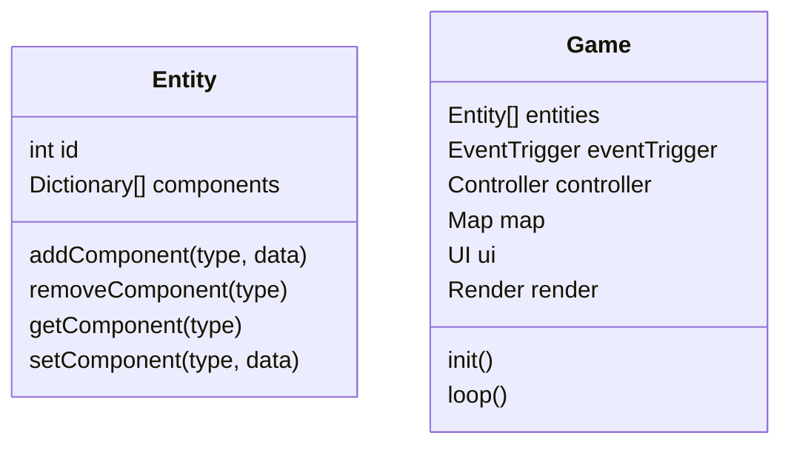

```mermaid
    classDiagram

    class Entity {
        int id
        Dictionary[] components

        addComponent(type, data)
        removeComponent(type)
        getComponent(type)
        setComponent(type, data)
    }

    class Game {
        Entity[] entities
        EventTrigger eventTrigger
        Controller controller
        Map map
        UI ui
        Render render

        init()
        loop()
    }
```
